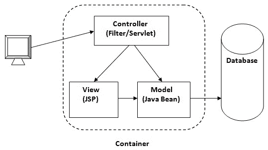

# 模型 1 和模型 2 架构

> 原文：<https://www.javatpoint.com/model-1-and-model-2-mvc-architecture>

1.  [模型 1 和模型 2 (MVC)架构](#)
2.  [模型 1 架构](#m1)
3.  [模型 2 (MVC)架构](#m2)

在开发 web 应用程序之前，我们需要对设计模型有所了解。有两种编程模型(设计模型)

1.  模型 1 架构
2.  模型 2 架构

* * *

### 模型 1 架构

Servlet 和 JSP 是开发 web 应用程序的主要技术。

**Servlet** 被认为优于 CGI。Servlet 技术不创建进程，而是创建线程来处理请求。与进程相比，创建线程的优势在于它不分配单独的内存区域。因此，servlet 可以轻松处理许多后续请求。

**Servlet 技术中的问题**如果任何设计代码被修改，Servlet 需要重新编译。它不提供关注分离。表示和业务逻辑混淆了。

**JSP** 克服了 Servlet 几乎所有的问题。它提供了更好的关注点分离，现在表示和业务逻辑可以很容易地分离。如果修改了 JSP 页面，就不需要重新部署应用程序。JSP 为使用 JavaBean、定制标签和 JSTL 开发 web 应用程序提供了支持，这样我们就可以将业务逻辑从 JSP 中分离出来，从而更容易测试和调试。

如上图所示，有一张图片显示了 model1 架构的流程。

1.  浏览器发送对 JSP 页面的请求
2.  JSP 访问 Java Bean 并调用业务逻辑
3.  Java Bean 连接到数据库并获取/保存数据
4.  响应被发送到浏览器，浏览器由 JSP 生成

### 模型 1 架构的优势

*   简单快速地开发网络应用程序

### 模型 1 架构的缺点

*   **导航控制是分散的**，因为每一页都包含确定下一页的逻辑。如果其他页面引用的 JSP 页面名称被更改，我们需要在所有导致维护问题的页面中进行更改。
*   **耗时**你需要花更多的时间在 JSP 中开发自定义标签。所以我们不需要使用 scriptlet 标签。
*   **难以扩展**小应用更好，大应用不行。

### 模型 2 架构

模型 2 基于 MVC(模型视图控制器)设计模式。MVC 设计模式由模型、视图和控制器三个模块组成。

**模型**模型表示应用程序的状态(数据)和业务逻辑。

**视图**视图模块负责显示数据，即表示演示。

**控制器**控制器模块充当视图和模型之间的接口。它拦截所有请求，即接收模型/视图的输入和命令，以进行相应的更改。

### 模型 2 架构的优势

*   **导航控制集中**现在只有控制器包含确定下一页的逻辑。
*   **易于维护**
*   **易于扩展**
*   **易于测试**
*   **更好的关注点分离**

### 模型 2 架构的缺点

*   我们需要自己编写控制器代码。如果我们更改控制器代码，我们需要重新编译类并重新部署应用程序。

* * *

访问这里获取使用 Servlet 和 JSP 的 MVC 的[示例。](MVC-in-jsp)

* * *

### 模型 2 架构的解决方案:可配置的 MVC 组件

它使用声明性方法来定义视图组件、请求映射等。它解决了模型 2 架构的问题。Struts 框架提供了可配置的 MVC 支持。在 struts 2 中，我们定义了 struts.xml 文件中的所有动作类和视图组件。