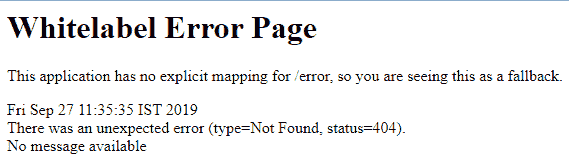

# Spring Boot 自动配置和调度小服务程序

> 原文：<https://www.javatpoint.com/restful-web-services-spring-boot-auto-configure>

在本节中，我们将看到应用程序的后台功能:

什么是 dispatcher servlet？

谁在配置 dispatcher servlet？

dispatcher servlet 是做什么的？

HelloWorldBean 对象是如何转换成 JSON 的？

谁在配置错误映射？

## Spring Boot 汽车配置

*   Spring Boot 根据类路径中存在或不存在的依赖项(如 jar、beans、属性等)自动配置 Spring 应用程序。
*   它使得开发更加容易和快速，因为不需要定义包含在自动配置类中的特定 beans。
*   典型的 MVC 数据库驱动的 Spring MVC 应用需要大量的配置，比如 **dispatcher servlet、视图解析器、Jackson、数据源、事务管理器、**等等。
    *   如果 **Spring MVC jar** 在类路径中，Spring Boot 会自动配置一个 **Dispatcher Servlet** 。
    *   如果**杰克逊罐子**在类路径中，则自动配置**杰克逊**。
    *   如果 **Hibernate jar** 在类路径中，则自动配置**数据源**。
*   可以通过在启动类中添加**@回弹应用**或**@启用自动配置**标注来启用自动配置。它表示这是一个 spring 上下文文件。
*   它启用了名为**自动配置**的功能。
*   它启用一种叫做**组件扫描**的东西。这是 Spring 的特性，它将开始自动扫描包和子包中的类，寻找任何 bean 文件。
*   Spring Boot 有一些自动配置的例子:
    *   **dispatchers servlet 自动配置**
    *   数据资源自动配置
    *   **杰克逊自动配置**
    *   **error mvcautious configuration**(# basic rorcontroller)
*   我们可以在**自动配置报告**或**条件评估报告**中看到 Spring Boot 完成的自动配置。
*   通过添加以下内容，可以从自动配置中排除类别**:**

```java

@SpringBootApplication (exclude={JacksonAutoConfiguration.class, JmxAutoConfiguration.class})

```

或者在 **application.properties** 文件中添加以下语句。

```java

spring.autoconfiguration.exclude=org.springframework.boot.autoconfigure.jackson.JacksonAutoConfiguration

```

我们将类排除在自动配置之外，以实现应用程序更快的启动和更好的性能。

*   通过启用**调试**模式生成自动配置报告。打开**应用程序.属性**文件并添加以下语句:

```java

logging.level.org.springframework=debug

```

运行 RestfulWebServiceApplication.java 文件。它显示了条件评估报告下的正匹配、负匹配、排除和无条件类。

```java

-----------------------------------------------
CONDITIONS EVALUATION REPORT
-----------------------------------------------
Positive matches:
----------------------
ActiveMQAutoConfiguration matched:
- @ConditionalOnClass found required classes 'javax.jms.ConnectionFactory', 'org.apache.activemq.ActiveMQConnectionFactory' (OnClassCondition)
- @ConditionalOnMissingBean (types: javax.jms.ConnectionFactory; SearchStrategy: all) did not find any beans (OnBeanCondition)
------------------
------------------
------------------
Negative matches:
-------------------------
ActiveMQConnectionFactoryConfiguration.PooledConnectionFactoryConfiguration: Did not match:
-@ConditionalOnClass did not find required classes 'org.messaginghub.pooled.jms.JmsPoolConnectionFactory','org.apache.commons.pool2.PooledObject' (OnClassCondition)
----------------
----------------
----------------
Exclusions:
---------------
None
Unconditional classes:
-----------------------------    org.springframework.boot.autoconfigure.context.ConfigurationPropertiesAutoConfiguration
org.springframework.boot.autoconfigure.context.PropertyPlaceholderAutoConfiguration

```

报告里面有很多信息，不可能显示所有的细节。如果我们向下滚动报告并仔细查看自动配置日志，我们会发现**dispatchersvletautuconfiguration 匹配**。

```java

DispatcherServletAutoConfiguration matched:
-@ConditionalOnClass found required class 'org.springframework.web.servlet.DispatcherServlet' (OnClassCondition)
- found 'session' scope (OnWebApplicationCondition)

```

因为，依赖 **spring-boot-starter-web** 依赖于 **spring-webmvc** 依赖。因此，我们在类路径中得到 DispatcherServlet 类。

## Dispatcher Servlet

在 Spring MVC 中，所有传入的请求都通过一个叫做 **Dispatcher servlet(前控制器)**的单个 Servlet。前端控制器是 web 应用程序开发中的一种设计模式。单个 servlet 接收所有的请求，并将它们传输到应用程序的所有其他组件。


DispatcherServlet 的工作是接收一个传入的 URI，并找到正确的组合**处理程序**(控制器类)和**视图**(通常是 JSP)。当 DispatcherServlet 确定视图时，它将其呈现为响应。最后，DispatcherServlet 将响应对象返回给客户端。简而言之，Dispatcher Servlet 扮演了关键角色。

另一件需要注意的事情是，错误管理配置:

```java

ErrorMvcAutoConfiguration matched:
-@ConditionalOnClass found required classes 'javax.servlet.Servlet', 'org.springframework.web.servlet.DispatcherServlet' (OnClassCondition)- found 'session' scope (OnWebApplicatiossssnCondition)

```

它配置**基本控制器、错误属性、错误管理配置、**和**默认错误视图解析器配置**。它创建默认错误页面，称为**白标错误页面**。



自动配置的另一件事是**Httpmessageconverters 自动配置**。这些消息转换器自动转换消息。

```java

HttpMessageConvertersAutoConfiguration matched:
-@ConditionalOnClass found required class 'org.springframework.http.converter.HttpMessageConverter' (OnClassCondition)
----------------
-----------------
JacksonAutoConfiguration.Jackson2ObjectMapperBuilderCustomizerConfiguration matched: - @ConditionalOnClass found required class 'org.springframework.http.converter.json.Jackson2ObjectMapperBuilder'(OnClassCondition)

```

它初始化杰克逊 bean 和消息转换器。**杰克逊 2 对象映射器**进行从 **bean 到 JSON** 和 **JSON 到 bean** 的转换。

[Click here to download Quick Review of Spring Boot Auto Configuration and Dispatcher Servlet project](https://static.javatpoint.com/tutorial/restful-web-services/download/Quick Review of Spring Boot Auto Configuration and Dispatcher Servlet.zip)

* * ***