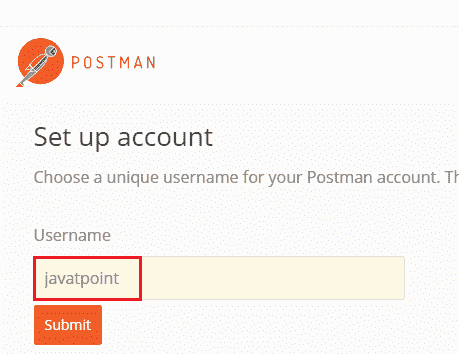

# 实现开机自检方法创建用户资源

> 原文：<https://www.javatpoint.com/restful-web-services-postman-for-chrome>

在前面的几个步骤中，我们已经创建了简单的 RESTful 服务。在本节中，我们将使用 POST 方法来发布特定 URI“**/用户**”的用户资源

这里我们使用了两个注解， **@RequestBody** 和 **@PathMapping** 。

## @RequestBody

@RequestBody 注释将 web 请求的主体映射到方法参数。请求的主体通过 HttpMessageConverter 传递。它根据请求的内容类型解析方法参数。或者，可以通过用@Valid 注释参数来应用自动验证。

在下面的例子中，当我们在 **createUser()** 方法中传递 **@RequestBody** 注释时，它映射到**用户**参数。

## @路径映射

@PathMapping 注释是 **@RequestMapping** 注释的专门化版本，它充当了 **@RequestMapping(方法=RequestMethod=POST)** 的快捷方式。@PostMapping 方法处理与指定的 URI 匹配的 Http POST 请求。

让我们创建一个用户资源，并通过 post 方法发布该资源。

**第一步:**打开 UserResource.java，添加 **@PostMapping("/user")** 。

**第二步:**创建一个方法 **createUser()** 并将用户类的**对象**作为 web 的**主体**传递。

**步骤 3:** 保存创建的用户。

**UserResource.java**

```java

package com.javatpoint.server.main.user;
import java.util.List;
import org.springframework.beans.factory.annotation.Autowired;
import org.springframework.web.bind.annotation.GetMapping;
import org.springframework.web.bind.annotation.PathVariable;
import org.springframework.web.bind.annotation.PostMapping;
import org.springframework.web.bind.annotation.RequestBody;
import org.springframework.web.bind.annotation.RestController;
@RestController
public class UserResource 
{
@Autowired
private UserDaoService service;
@GetMapping("/users")
public List retriveAllUsers()
{
return service.findAll();
}
//retrieves a specific user detail
@GetMapping("/users/{id}")
public User retriveUser(@PathVariable int id)
{
return service.findOne(id);
}
//method that posts a new user detail 
@PostMapping("/users")
public void createUser(@RequestBody User user)
{
User sevedUser=service.save(user);	
}
} 
```

当我们刷新页面时，它会返回 get 请求。但是我们需要发送开机自检请求。我们可以通过 **REST 客户端**发送 POST 请求。REST 客户端是一个被设计为使用来自服务器的服务(RESTful)的客户端。

让我们看看如何使用 REST 客户端。

**第四步:**从[https://www.getpostman.com/downloads/](https://www.getpostman.com/downloads/)下载邮差。

或者在浏览器[https://bit.ly/1HCOCwF](https://bit.ly/1HCOCwF)添加谷歌 Chrome 扩展。

第五步:启动**邮差**和**报名**。创建一个**用户名**。这里我们已经创建了用户名 **javatpoint** 并点击**提交**按钮。请考虑下图:



**步骤 6:** 首先，我们检查**获取**请求。在地址栏中输入网址 http://localhost:8080/users/1，点击**发送**按钮。它返回第一个用户的详细信息。


**第 7 步:**现在我们发送一个 POST 请求。

*   将方法改为**开机自检**。
*   复制来自“/users/1”的响应的**正文**。
*   点击**正文**选项卡。现在我们为 POST 请求创建一个主体。
*   选择**原始**选项。它会创建一个原始请求。
*   粘贴复制的内容。
*   移除 **id** ，因为它会自动递增。
*   更改“**名称**”:**托马斯**。
*   我们用 JSON 格式发送数据，而不是文本。所以选择 **JSON(应用/json)** 。
*   键入网址 http://localhost:8080/users，点击**发送**按钮。
*   点击窗口左侧的**获取**请求。
*   现在我们将再次发送一个 Get 请求，因此更改 URL http://localhost:8080/users 并点击**发送**按钮。它显示所有用户，包括我们创建的用户。


## 增强开机自检方法以返回正确的 HTTP 代码和状态位置

在本节中，我们将返回我们创建的用户资源的状态(已创建)和 URI(“/users/6”)。

### 响应实体<t>类</t>

**ResponseEntity** 是扩展**HttpEntity<t>T5】和 HttpStatus 类的类。在**org . spring framework . http . request entity**中定义。</t>**

*   用在 **RestTemplate** 和 **@Controller** 方法中。
*   在 **getForEntity()** 和 **exchange()** 方法中用作参数。
*   它也在 Spring MVC 中使用，作为@Controller 方法中的一个参数。

### RequestEntity <t>类</t>的 created()方法

**created()** 方法是**request entity<t>T4】类的静态方法。它创建了一个新的构建器，其创建状态和位置标题设置为给定的 URI。</t>**

**语法**

```java

public static ResponseEntity.BodyBuilder created(URI location)

```

**参数:**接受**位置 URI** 作为参数。

**返回:**返回**创建的构建器**。

所有的 Http 状态代码都是**枚举常量**，在 **HttpStatus** 类中定义。

### ServletUriComponentsBuilder

**servleturicomponents builder**是在*org . spring framework . web . servlet . support . servleturicomponents builder*中定义的类。它扩展了 **UriComponentsBuilder** 类。它有额外的静态工厂方法来基于当前的 HttpServletRequest 创建链接。

### fromCurrentRequest()方法

除了通过 RequestContextHolder 获取请求外，它类似于**from request(HttpServletRequest)**方法。

### path()方法

路径()是 **UriComponentsBuilder** 类的方法。它将给定的路径附加到该生成器的现有路径中。给定的路径可能包含 URI 模板变量。

**语法**

```java

public UriBuilderBuilder path(String path)

```

**参数:**接受一条**路径**作为参数。

**返回:**返回 **UriComponentsBuilder** 。

### buildAndExpand()方法

它构建了 UriComponents 实例，并用从数组中获得的值替换了 URI 模板变量。这是一个快捷方法，它结合了对 build()和 UriComponents.expand()对象的调用...uriVariableValues)。

**语法**

```java

public UriComponents buildAndExpand(Object...uriVariableValues)

```

**参数:**接受 **URI 变量值**作为参数。

**返回:**返回扩展值的 **URI 组件**。

### build()方法

它从构建器中包含的各种组件构建 UriComponents 实例。

**语法**

```java

public UriComponents build()

```

**参数:**不接受任何参数。

**返回:**返回 **Uri 组件**。

让我们看看如何返回已创建资源的状态，以及如何在响应中设置已创建资源的 URI。

**步骤 1:** 创建一个创建用户资源并返回**响应实体**的方法。

**UserResource.java**

```java

package com.javatpoint.server.main.user;
import java.net.URI;
import java.util.List;
import org.springframework.beans.factory.annotation.Autowired;
import org.springframework.http.ResponseEntity;
import org.springframework.web.bind.annotation.GetMapping;
import org.springframework.web.bind.annotation.PathVariable;
import org.springframework.web.bind.annotation.PostMapping;
import org.springframework.web.bind.annotation.RequestBody;
import org.springframework.web.bind.annotation.RestController;
import org.springframework.web.servlet.support.ServletUriComponentsBuilder;
@RestController
public class UserResource 
{
@Autowired
private UserDaoService service;
@GetMapping("/users")
public List retriveAllUsers()
{
return service.findAll();
}
//retrieves a specific user detail
@GetMapping("/users/{id}")
public User retriveUser(@PathVariable int id)
{
return service.findOne(id);
}
//method that posts a new user detail and returns the status of HTTP and location of the user resource
@PostMapping("/users")
public ResponseEntity<Object> createUser(@RequestBody User user)
{
User sevedUser=service.save(user);	
URI location=ServletUriComponentsBuilder.fromCurrentRequest().path("/{id}").buildAndExpand(sevedUser.getId()).toUri();
return ResponseEntity.created(location).build();
}
} 
```

**步骤 2:** 现在打开 REST 客户端**邮递员**并创建**邮政**请求。

**步骤 3:** 点击**历史**标签下的开机自检请求。

**第四步:**点击正文选项卡，将用户名改为**詹姆斯**。

**第五步:**确保选择了 **JSON(应用/json)** 媒体类型。

**第五步:**点击**发送**按钮。

在窗口的右侧，我们可以看到**状态:201 已创建**。这意味着资源已被正确创建。

**第 6 步:**现在点击标题选项卡查看位置。位置是创建的资源的 URI。它显示创建的用户詹姆斯的位置，即“**/用户/6** ”。


如果客户端想知道用户资源是在哪里创建的，只需从响应的头部获取位置。

[Click here to download Implementing POST Method to Create User Resource project](https://static.javatpoint.com/tutorial/restful-web-services/download/Implementing POST Method to Create User Resource.zip)
[Click here to download Enhancing POST Method to Return Correct HTTP Code and Status Location project](https://static.javatpoint.com/tutorial/restful-web-services/download/Enhancing POST Method to Return Correct HTTP Code and Status Location.zip)

* * *