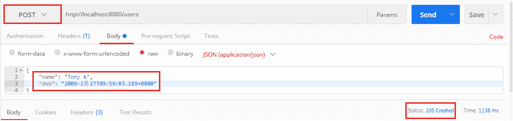

# 为 RESTful 服务实现验证

> 原文：<https://www.javatpoint.com/restful-web-services-validations>

验证是所有服务中的一个常见需求。我们将讨论 Java 验证 API，以便在我们的 beans 文件中添加验证。当我们收到创建用户的请求时，我们应该验证其内容。如果无效，我们应该返回一个适当的响应。

让我们看看如何验证请求。

**第一步:**打开**UserResource.java**文件。

**第二步:**添加**@有效**标注。它是一个 Javax 验证 API。它的默认类路径是 spring-boot-starter-web。

**UserResource.java**

```java

package com.javatpoint.server.main.user;
import java.net.URI;
import java.util.List;
import javax.validation.Valid;
import org.springframework.beans.factory.annotation.Autowired;
import org.springframework.http.ResponseEntity;
import org.springframework.web.bind.annotation.DeleteMapping;
import org.springframework.web.bind.annotation.GetMapping;
import org.springframework.web.bind.annotation.PathVariable;
import org.springframework.web.bind.annotation.PostMapping;
import org.springframework.web.bind.annotation.RequestBody;
import org.springframework.web.bind.annotation.RestController;
import org.springframework.web.servlet.support.ServletUriComponentsBuilder;
@RestController
public class UserResource 
{
@Autowired
private UserDaoService service;
@GetMapping("/users")
public List<User> retriveAllUsers()
{
return service.findAll();
}
//retrieves a specific user detail
@GetMapping("/users/{id}")
public User retriveUser(@PathVariable int id)
{
User user= service.findOne(id);
if(user==null)
//runtime exception
throw new UserNotFoundException("id: "+ id);
return user;
}
//method that delete a user resource
@DeleteMapping("/users/{id}")
public void deleteUser(@PathVariable int id)
{
User user= service.deleteById(id);
if(user==null)
//runtime exception
throw new UserNotFoundException("id: "+ id);
}
//method that posts a new user detail and returns the status of the user resource
@PostMapping("/users")
public ResponseEntity<Object> createUser(@Valid @RequestBody User user)	
{
User sevedUser=service.save(user);	
URI location=ServletUriComponentsBuilder.fromCurrentRequest().path("/{id}").buildAndExpand(sevedUser.getId()).toUri();
return ResponseEntity.created(location).build();
}
}

```

现在我们将在**姓名**和**出生日期**的**用户**类中添加验证。假设这个名字至少有五个字符，出生日期应该是过去而不是现在。

**第三步:**打开**User.java**文件。

**第 4 步:**在**名称**变量的正上方添加 **@Size(min=5)** 标注。

**第五步:**在 **dob** 变量的正上方添加**@过去**标注。

**User.java**

```java

package com.javatpoint.server.main.user;
import java.util.Date;
import javax.validation.constraints.Past;
import javax.validation.constraints.Size;
public class User 
{
private Integer id;
@Size(min=5)
private String name;
@Past
private Date dob;
//default constructor	
protected User()
{

}
public User(Integer id, String name, Date dob) 
{
super();
this.id = id;
this.name = name;
this.dob = dob;
}
public Integer getId() 
{
return id;
}
public void setId(Integer id) 
{
this.id = id;
}
public String getName() 
{
return name;
}
public void setName(String name) 
{
this.name = name;
}
public Date getDob() 
{
return dob;
}
public void setDob(Date dob) 
{
this.dob = dob;
}
@Override
public String toString() 
{
//return "User [id=" + id + ", name=" + name + ", dob=" + dob + "]";
return String.format("User [id=%s, name=%s, dob=%s]", id, name, dob);
}
}

```

**第五步:**打开 Rest 客户端**邮差**用新用户名 **Tony k** 发送 **POST** 请求。返回**状态:201 已创建**。



现在我们发送另一个 **POST** 请求。但是名称应该少于五个字符。返回**状态:400 不良请求**。


当我们创建 RESTful 服务时，我们需要考虑消费者，消费者如何知道哪里出了问题。为了解决这个问题，我们将添加一个在**response entityexceptionhandler**类中定义的方法 handleMethodArgumentNotValid()。这是当错误请求发生时触发的方法。

```java

protected ResponseEntity handleMethodArgumentNotValid(  MethodArgumentNotValidException ex, HttpHeaders headers, HttpStatus status, WebRequest request) 
{
return handleExceptionInternal(ex, null, headers, status, request);
} 
```

**第六步:**将上述方法复制粘贴到**CustomizedResponseEntityExceptionHandler.java**文件中。

**第 7 步:**通过添加批注**@覆盖**来覆盖该方法。

**customize dretennessyexceptionhandler . Java**

```java

package com.javatpoint.server.main;
import java.util.Date;
import org.springframework.http.HttpHeaders;
import org.springframework.http.HttpStatus;
import org.springframework.http.ResponseEntity;
import org.springframework.web.bind.MethodArgumentNotValidException;
import org.springframework.web.bind.annotation.ControllerAdvice;
import org.springframework.web.bind.annotation.ExceptionHandler;
import org.springframework.web.bind.annotation.RestController;
import org.springframework.web.context.request.WebRequest;
import org.springframework.web.servlet.mvc.method.annotation.ResponseEntityExceptionHandler;
import com.javatpoint.server.main.exception.ExceptionResponse;
import com.javatpoint.server.main.user.UserNotFoundException;
//defining exception handling for all the exceptions 
@ControllerAdvice
@RestController
public class CustomizedResponseEntityExceptionHandler extends ResponseEntityExceptionHandler
{
@ExceptionHandler(Exception.class)
//override method of ResponseEntityExceptionHandler class
public final ResponseEntity<Object> handleAllExceptions(Exception ex, WebRequest request)
{
//creating exception response structure
ExceptionResponse exceptionResponse= new ExceptionResponse(new Date(), ex.getMessage(), request.getDescription(false));
//returning exception structure and specific status 
return new ResponseEntity(exceptionResponse, HttpStatus.INTERNAL_SERVER_ERROR);
}
@ExceptionHandler(UserNotFoundException.class)
//override method of ResponseEntityExceptionHandler class
public final ResponseEntity<Object> handleUserNotFoundExceptions(UserNotFoundException ex, WebRequest request)
{
//creating exception response structure
ExceptionResponse exceptionResponse= new ExceptionResponse(new Date(), ex.getMessage(), request.getDescription(false));
//returning exception structure and specific status 
return new ResponseEntity(exceptionResponse, HttpStatus.NOT_FOUND);
}
@Override
protected ResponseEntity<Object> handleMethodArgumentNotValid(MethodArgumentNotValidException ex, HttpHeaders headers, HttpStatus status, WebRequest request) 
{
ExceptionResponse exceptionResponse= new ExceptionResponse(new Date(), ex.getMessage(), ex.getBindingResult().toString());
//returning exception structure and specific status 
return new ResponseEntity(exceptionResponse, HttpStatus.BAD_REQUEST);
}
}

```

**步骤 8:** 现在，我们通过**邮递员**发送**邮政**请求。它返回异常结构，并显示消息**参数**验证失败以及其他详细信息。


对用户来说很难理解信息。所以我们现在将使用字符串**验证失败**定制消息，而不是获取消息。

```java

@Override
protected ResponseEntity<Object> handleMethodArgumentNotValid(MethodArgumentNotValidException ex, HttpHeaders headers, HttpStatus status, WebRequest request) 
{
ExceptionResponse exceptionResponse= new ExceptionResponse(new Date(), "Validation Failed", ex.getBindingResult().toString());
//returning exception structure and specific status 
return new ResponseEntity(exceptionResponse, HttpStatus.BAD_REQUEST);
}

```

**步骤 9:** 再次发送 **POST** 请求。它返回我们定制的消息。


它可能对消费者有用。现在，我们再次定制消息，并使其更具体的错误。

**第十步:**打开**User.java**文件，在 **@Size** 批注中添加属性**消息=“名称至少要有 5 个字符”**。

```java

@Size(min=5, message="Name should have at least 5 characters")

```

**步骤 11:** 再次发送 **POST** 请求。它返回我们已经指定的更具体的异常。


我们可以按照 **BindingResult** 界面进一步自定义异常。异常消息种类繁多。在 validation-api-2.0.1.Final.jar 中定义了以下验证类。


[Click here to download Implementing Validations for RESTful Services project](https://static.javatpoint.com/tutorial/restful-web-services/download/Implementing Validations for RESTful Services.zip)

* * *