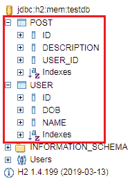

# 创建帖子实体以及与用户实体的多对一关系

> 原文：<https://www.javatpoint.com/restful-web-services-many-to-one-relationship>

在本节中，我们将创建一个包含与用户实体的多对一关系的发布实体。

**步骤 1:** 在包**中创建一个名为**Post.java**的类。**

**第二步:**Post.java 是实体，需要添加**@实体**标注。

**第三步:**添加三个字段: **id、【描述、**和**用户**。

```java

private Integer id;
private String description;
private User user;

```

**第 4 步:**生成吸气剂和沉降剂。

**第 5 步:**生成 toString()。

**记住:**在生成 toString()期间取消选中**用户**。

**第六步:**一个用户可以做很多帖子，所以添加 **@ManyToOne** 批注。用户实体与发布实体有多对一的关系。提取类型不会检索用户的详细信息，除非我们调用 **Post.getUser** 。

```java

@ManyToOne(fetch=FetchType.LAZY)

```

**第七步:** Id 是主键，需要添加 **@Id** 标注。

**Post.java**

```java

package com.javatpoint.server.main.user;
import javax.persistence.Entity;
import javax.persistence.FetchType;
import javax.persistence.GeneratedValue;
import javax.persistence.Id;
import javax.persistence.ManyToOne;
@Entity
public class Post 
{
@Id
@GeneratedValue
private Integer id;
private String description;
//many to one mapping 
@ManyToOne(fetch=FetchType.LAZY)
private User user;
public Integer getId() 
{
return id;
}
public void setId(Integer id) 
{
this.id = id;
}
public String getDescription() 
{
return description;
}
public void setDescription(String description) 
{
description = description;
}
public User getUser() 
{
return user;
}
public void setUser(User user) 
{
this.user = user;
}
@Override
public String toString() 
{
return String.format("Post [id=%s, description=%s]", id);
}
}

```

我们已经在 Post 实体端配置了关系。现在我们需要在用户实体端配置关系。

用户可以制作一个帖子列表，因此帖子具有一对多的关系。

**第八步:**打开**User.java**文件，创建帖子列表。

```java

private List posts 
```

**第九步:**添加一个带有属性 **(mappedBy="user")** 的注释**@ onetommy**。它将在发布实体中创建一个关系列。

**步骤 10:** 生成吸气剂和沉降剂。

**User.java**

```java

package com.javatpoint.server.main.user;
import java.util.Date;
import java.util.List;
import javax.persistence.Entity;
import javax.persistence.GeneratedValue;
import javax.persistence.Id;
import javax.persistence.OneToMany;
import javax.validation.constraints.Past;
import javax.validation.constraints.Size;
import io.swagger.annotations.ApiModel;
import io.swagger.annotations.ApiModelProperty;
@ApiModel(description="All details about the user")
@Entity
public class User 
{
//Id as a primary key
@Id
@GeneratedValue
private Integer id;
@Size(min=5, message="Name should have atleast 5 characters")
@ApiModelProperty(notes="name should have atleast 5 characters")
private String name;
@Past
@ApiModelProperty(notes="Birth date should be in the past")
private Date dob;
//default constructor	
@OneToMany(mappedBy="user")
private List posts; 
protected User()
{

}
public User(Integer id, String name, Date dob) 
{
super();
this.id = id;
this.name = name;
this.dob = dob;
}
public Integer getId() 
{
return id;
}
public void setId(Integer id) 
{
this.id = id;
}
public String getName() 
{
return name;
}
public void setName(String name) 
{
this.name = name;
}
public Date getDob() 
{
return dob;
}
public void setDob(Date dob) 
{
this.dob = dob;
}
public List <post>getPosts() 
{
return posts;
}
public void setPosts(List <post>posts) 
{
this.posts = posts;
}
@Override
public String toString() 
{
//return "User [id=" + id + ", name=" + name + ", dob=" + dob + "]";
return String.format("User [id=%s, name=%s, dob=%s]", id, name, dob);
}
}</post></post> 
```

**步骤 11:** 重启应用。


我们可以在日志中看到有两个表 post 和 user。帖子表通过用户标识链接到用户表。一个用户可以有多个帖子，并且所有帖子都有相同的用户 id。

**步骤 12:** 现在，打开 **H2 控制台**。我们可以看到有两个名为 USER 和 POST 的表。



**第 13 步:**打开我们之前创建的 **data.sql** 文件，将数据插入 **POST** 表中。我们插入了以下数据:

**data.sql**

```java

insert into user values(101, sysdate(), 'John');
insert into user values(102, sysdate(), 'Robert');
insert into user values(104, sysdate(), 'Andrew');
insert into user values(105, sysdate(), 'Jack');
insert into post values(111, 'first post', 101);
insert into post values(112, 'second post', 101);
insert into post values(113, 'third post', 104);

```

**步骤 14:** 重启应用。

**步骤 15:** 重启 H2 控制台，执行查询**选择*开机自检**；

它显示了我们已经插入到 **data.sql** 文件中的数据。


[Click here to download Creating Post Entity and Many to One Relationship with User Entity project](https://static.javatpoint.com/tutorial/restful-web-services/download/Creating Post Entity and Many to One Relationship with User Entity.zip)

* * *