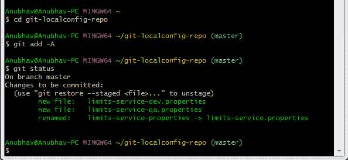

# 将 Spring 云配置服务器连接到本地 Git 存储库

> 原文：<https://www.javatpoint.com/connect-spring-cloud-config-server-to-local-git-repository>

在本节中，我们将学习如何将 spring-cloud-config-server 连接到本地 git 存储库。首先，我们将找到文件夹路径。

右键单击**git-local config-repo**->**Properties**->复制**位置**标签地址并粘贴到 **application.properties** 文件中。

在 SpringCloudConfigServerApplication.java 文件中添加注释 **@EnableConfigServer** 。

在浏览器中键入以下网址:

**本地主机:8888/限额-服务/默认**

**输出**

```java

{
name: "limits-service",
-profiles: [
"default"
],
label: null,
version:"0898c54ae1deb62733728e37e4c7962f529ee9ad",
state: null,
-propertySources: [
- {
name: C:\Users\Anubhav\git-localconfig-repo\limits-service.properties",
-source: {
limits-service-minimum: "8",
limits-service-maximum: "88"
}
}
]
}

```

在这里，我们已经建立了**sprincloudfigserver**和 **Git 存储库**之间的连接。

我们可以看到它显示了一组属性和值。它还检索从中检索这些值(最小值和最大值)的属性文件的文件名。

SpringCloudConfigServer 的重要之处在于**存储了多个服务的配置。**它还可以存储不同环境下每个服务的配置。


在上图中，有三个服务**current calculationservice**、**current exchangeservice**和**limitesservice**。该限制服务有四个环境服务**开发、质量保证、阶段、**和**生产**。我们可以在 SpringCloudConfigServer 中配置这三个服务。

## Git 库中多环境的配置

服务**开发、质量保证、舞台、**和**制作**。我们可以在 SpringCloudConfigServer 中配置这三个服务。

**Git 库中多个环境的配置**

在 spring-cloud-config-server 项目中，我们添加了一个指向 git-localconfig-repo 的链接，其中包含 limits-service.properties 文件。它成为限制服务的默认配置。

但是，我们可以针对特定环境覆盖它们。要覆盖这些值，复制**限制-服务.属性**并粘贴到文件夹 **git-localconfig-repo** 中，用**限制-服务-开发.属性**将其重命名。现在更新最小值和最大值。

```java

limits-service.minimum=1
limits-service.maximum=111

```

再次复制相同的文件并将其粘贴到相同的文件夹中。将其重命名为**限制-服务-质量保证属性**。现在更新最小值和最大值。

```java

limits-service.minimum=2
limits-service.maximum=222

```

如果我们想选择最大值的默认值而不是修改值，请在语句的开头放一个**货币兑换货币兑换服务介绍**符号。现在第二个语句变成了注释。

```java

limits-service.minimum=1
introduction-to-currency-conversion-and-currency-exchange-servicelimits-service.maximum=111

```

当我们执行它时，它从默认属性文件中获取最大值 888，而不是最大值 111。每当我们在文件中进行更改时，就在本地存储库中提交更改。

现在打开 Git Bash 并执行以下命令:

创建我们想要添加文件的目录。

```java

cd git-localconfig-repo

```

将文件添加到 Git 存储库中。

```java

git add -A

```

现在检查必须提交的文件的状态。

```java

git status

```



现在提交更改

```java

git commit -m "Dev and QA"

```


现在我们可以访问属性开发和质量保证。

在浏览器的地址栏中键入以下内容。

```java

localhost:8888/limits-service/qa

```

**输出**

```java

{
name: "limits-service",
-profiles: [
"qa"
],
label: null,
version:"0898c54ae1deb62733728e37e4c7962f529ee9ad",
state: null,
-propertySources: [
- {
name: C:\Users\Anubhav\git-localconfig-repo\limits-service-qa.properties",
-source: {
limits-service-minimum: "2",
limits-service-maximum: "222"
}
},
-{
name: C:\Users\Anubhav\git-localconfig-repo\limits-service.properties?,
-source: {
limits-service-minimum: "8",
limits-service-maximum: "888"
}
}
]
}

```

我们可以观察到它正在检索属性源。这些财产清单在优先权清单中。高度优先级是质量保证文件中配置的任何值。

如果有一个值不在质量保证文件中，那么默认文件中的值将被拾取。所以无论质量保证文件中有什么，都会得到最高的属性。

## 将限制服务连接到 Spring 云配置服务器

在本节中，我们将连接 limits-service 从 spring-cloud-config-server 获取配置。我们不需要在 application.properties 文件中配置值。转到**限制-服务**项目，并将**应用程序.属性**文件重命名为**引导程序.属性**。我们不需要在 bootstrap.properties 中配置值。所有的配置值都是从 spring-cloud-config-server 中选取的。在引导数据库属性中指定 URI。

```java

spring.application.name=limits-service
spring.cloud.config.uri=http://localhost:8888

```

**limits-service** 是 bootstrap.properties 的关键路径。基于应用程序名称，我们将从本地 Git 存储库中获取值。现在重启**LimitsServiceApplication.java。**

```java

Fetching config from the server at http://localhost:8888
Located environment: name=limits-service, profiles=[default], label= null,  version="0898c54ae1deb62733728e37e4c7962f529ee9ad", state=null, 

```

## 为限制服务配置配置文件

这里需要理解的一点是，限制服务的所有配置都来自 Git 存储库。我们没有在限制服务中配置任何东西。在 Git 存储库中配置东西的好处是限制服务的整个配置与限制服务的部署是分开的。它将自动从 Git 存储库中获取。

现在打开 **bootstrap.properties** 并将 **dev** 配置文件添加到其中。

```java

spring .profile.active=dev

```

当我们运行极限时，它会显示以下输出:

```java

{
maximum: 111,
minimum:1
}

```

如果我们查看 limits-service-dev.properties 文件，这些值就是从那里获取的。

假设我们想从**限制-服务属性**中选择一个最大值，从**限制-服务-开发属性**中选择一个最小值，然后从**限制-服务-开发属性**中删除最大值。limits-service-dev.properties 文件如下所示:

```java

limits-service-minimum: 1

```

现在使用以下命令提交更改:

```java

git add *;
git status
git commit -m "removed configuration for maximum "

```


现在启动**LimitsServiceApplication.java**。当我们启动 LimitsServiceApplication 时，它会从 SpringCloudConfigServer 中挑选值。我们可以观察到，它从限额-服务-属性(默认服务)中选择最大值，即 **888** ，从**限额-服务-开发属性**中选择最小值，即 **1。**但是，我们已经覆盖了默认服务的最小值。

让我们看看当我们将配置文件 **dev** 更改为 **qa 时会发生什么。**打开 **bootstrap.properties** ，写 **qa** 代替 **dev** 。应用程序将启动并接受更改。现在执行**限制。**

**输出**

```java
{
maximum: 222,
minimum: 2
}

```

这些值来自 qa 环境配置。

* * *