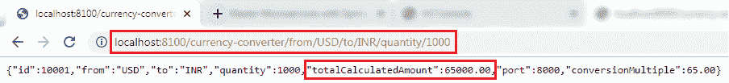

# 从货币兑换服务调用货币兑换服务

> 原文：<https://www.javatpoint.com/invoking-currency-exchange-service-from-currency-conversion-service>

我们已经准备好了货币兑换服务，并且我们已经设置了货币计算服务(货币兑换服务)。现在我们将从货币计算服务中调用货币兑换服务。

我们使用 **RestTemplate()** 构造函数来调用外部服务。让我们创建一个 RestTemplate 并尝试调用货币兑换服务。

**第一步:**选择**货币兑换服务**项目。

**第二步:**打开**CurrencyConversionController.java**并创建一个新的 **RestTemplate** 来调用货币兑换服务应用程序。

**第三步:**调用 RestTemplate 类的 **getForEntity()** 方法。

**getForEntity():** 是 **RestTemplate** 类的一个方法，通过对指定的 URL 使用 **HTTPGET** 方法来检索实体。它将响应转换并存储在响应实体中。它返回**响应实体**。

**参数:**接受两个参数:

*   **URL:**URL。
*   **响应类型:**返回值的类型。

```java

ResponseEntity<CurrencyConversionBean>responseEntity=new RestTemplate().getForEntity("http://localhost:8000/currency-exchange/from/{from}/to/{to}", CurrencyConversionBean.class, uriVariables);

```

**第四步:**在 URL 参数中，放入**货币兑换服务**的 URL，即[http://localhost:8000/货币兑换/from/{from}/to/{to}](http://localhost:8000/currency-exchange/from/%7bfrom%7d/to/%7bto%7d) 。它从请求中获取变量 **{from}** 和 **{to}** 的值。无论请求中出现什么，我们都将其发送给货币兑换服务。

**第五步:**在上面的 URL 中，我们需要传递两个值**“从”**和**“到。”**为了传递值，为 URI 变量创建一个**映射**。将 URI 的**变量**作为参数传递。

```java

Map<String, String>uriVariables=new HashMap<>();
uriVariables.put("from", from);
uriVariables.put("to", to);

```

**第六步:**我们期待返回的响应类型是**currency conversation bean，**所以将响应存储在 currency conversation bean 中。

```java

CurrencyConversionBean response=responseEntity.getBody();

```

**货币转换控制器. java**

```java

package com.javatpoint.microservices.currencyconversionservice;
import java.math.BigDecimal;
import java.util.HashMap;
import java.util.Map;
import org.springframework.http.ResponseEntity;
import org.springframework.web.bind.annotation.GetMapping;
import org.springframework.web.bind.annotation.PathVariable;
import org.springframework.web.bind.annotation.RestController;
import org.springframework.web.client.RestTemplate;
@RestController
public class CurrencyConversionController
{
@GetMapping("/currency-converter/from/{from}/to/{to}/quantity/{quantity}") //where {from} and {to} represents the column 
//returns a bean back
public CurrencyConversionBeanconvertCurrency(@PathVariable String from, @PathVariable String to, @PathVariableBigDecimal quantity)
{
//setting variables to currency exchange service
Map<String, String>uriVariables=new HashMap<>();
uriVariables.put("from", from);
uriVariables.put("to", to);
//calling the currency-exchange-service
ResponseEntity<CurrencyConversionBean>responseEntity=new RestTemplate().getForEntity("http://localhost:8000/currency-exchange/from/{from}/to/{to}", CurrencyConversionBean.class, uriVariables);
CurrencyConversionBean response=responseEntity.getBody();
//creating a new response bean and getting the response back and taking it into Bean
return new CurrencyConversionBean(response.getId(), from,to,response.getConversionMultiple(), quantity,quantity.multiply(response.getConversionMultiple()),response.getPort());
}
}

```

**步骤 7:** 独立运行两个服务。当我们运行货币转换时，它会返回如下所示的响应:



转换倍数乘以数量，返回**合计计算数** 65000.00。意思是 1000 美元等于 65000.00 印度卢比。它还显示了端口 **8000** ，表示其他服务(货币兑换服务)正在端口 8000 上运行。

[Click here to download currency-conversion-service](https://static.javatpoint.com/tutorial/microservices/download/invoking/currency-conversion-service.zip)
[Click here to download currency-exchange-service](https://static.javatpoint.com/tutorial/microservices/download/invoking/currency-exchange-service.zip)

* * *