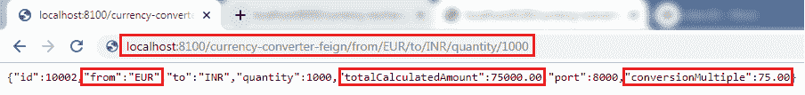

# 使用 Feign REST 客户端进行服务调用

> 原文：<https://www.javatpoint.com/using-feign-rest-client-for-service-invocation>

在本节中，我们将从流行的 SpringCloud 组件之一 **Feign** 开始。

## 假装

Feign 是由网飞开发的声明式网络服务。其目的是简化 HTTP 应用编程接口客户端。它是一个 Java 到 HTTP 的客户端绑定器。如果你想使用 Feign，创建一个界面，并对其进行注释。它提供可插入的注释支持，包括 Feign 注释和 JAX-RS 注释。

它是一个创建 REST API 客户端的库。它使 web 服务客户端变得更加容易。开发人员可以使用声明性注释来调用 REST 服务，而不是编写代表性的样板代码。

## SpringCloud 开放

**Spring Cloud open feify**通过自动配置和绑定到 Spring 环境，为 Spring Boot 应用程序提供 open feify 集成。没有 Feign，在 Spring Boot 应用中，我们使用 **RestTemplate** 调用用户服务。要使用 Feign，我们需要在 pom.xml 文件中添加**spring-cloud-starter-open feify**依赖项。

让我们使用 Spring Cloud 假动作来简化之前开发的代码。

在前一节中，我们已经遇到的一件事是当我们开发货币兑换服务时；调用 REST 服务有多难。我们需要做很多手册来调用一个非常简单的服务。但是我们仍然为它写了很多代码。

当我们使用微服务时，会有很多对其他服务的调用。我们不需要像前一个那样编码。Feign 是解决这个问题的一个组成部分。Feign 使得调用其他微服务变得很容易。

Feign 提供的另一个附加功能是:它与**功能区**(客户端负载平衡框架)集成在一起。

让我们在项目中实现 Feign，并使用 Feign 调用其他微服务。

**第一步:**选择**货币-兑换-服务**项目。

**第二步:**打开 **pom.xml** 并添加 **Feign** 依赖项。Feign 继承了**网飞**。

```java

<dependency>
<groupId>org.springframework.cloud</groupId>  
<artifactId>spring-cloud-starter-feign</artifactId>
<version>1.4.4.RELEASE</version>
</dependency>

```

**第三步:**添加依赖项后，**通过在**CurrencyConversionServiceApplication.java**文件中添加注释 **@EnableFeignClients** 来启用**feign 扫描客户端。

**第四步:**在 **@EnableFeignClients** 标注中定义一个属性。该属性是我们要扫描的包的名称。

**货币转换服务应用. java**

```java

package com.javatpoint.microservices.currencyconversionservice;
import org.springframework.boot.SpringApplication;
import org.springframework.boot.autoconfigure.SpringBootApplication;
import org.springframework.cloud.openfeign.EnableFeignClients;
@SpringBootApplication
@EnableFeignClients("com.javatpoint.microservices.currencyconversionservice")
public class CurrencyConversionServiceApplication 
{
public static void main(String[] args) 
{
SpringApplication.run(CurrencyConversionServiceApplication.class, args);
}
}

```

我们在项目中启用了 Feign。现在，我们将使用 Feign 调用该服务。

**步骤 5:** 创建一个 **Feign 代理**，使我们能够与外部微服务对话。让我们创建一个名为**的接口。**

**第六步:**添加注释 **@FeignClient。**传递属性**名称**和**网址**。

在**名称**属性中，写下我们将要消费的服务的名称。在我们的例子中，我们将消费**货币兑换服务**。在**网址**属性中，写下运行货币兑换服务的端口。

```java

@FeignClient(name="currency-exchange-service", url="localhost:8000")

```

**第七步:**现在，我们需要定义一个与**货币兑换控制器**对话的方法。打开**Currency-ConverterController.java**文件。复制**货币转换器**映射并粘贴到同一个文件中。

**第 8 步:**将映射名称更改为**/货币-转换器-feign/从/{从}/到/{到}/数量/{数量}** 并将方法名称更改为**转换货币。**

**第九步:**利用**currency exchangeserviceproxy**自动连线。

```java

@Autowired
private CurrencyExchangeServiceProxy proxy;

```

**步骤 10:** 首先，通过调用 URL[http://localhost:8000/货币兑换/from/USD/to/INR](http://localhost:8000/currency-exchange/from/USD/to/INR) 运行**货币兑换服务**，之后，使用 URL[http://localhost:8100/货币兑换/from/USD/to/INR/quantity/1000](http://localhost:8100/currency-converter/from/USD/to/INR/quantity/1000)运行**货币兑换服务。**

如果我们没有运行订单中的服务，货币兑换服务将显示**白色标签错误页面**。这是因为货币兑换服务使用了货币兑换服务的兑换倍数。

**第 11 步:**使用网址[http://localhost:8100/货币转换器-feign/from/USD/to/INR/quantity/1000](http://localhost:8100/currency-converter-feign/from/USD/to/INR/quantity/1000)执行 feign 服务。它返回与货币兑换服务相同的响应。


将上述网址中的货币**美元**更改为**欧元**，并再次调用相同的网址。它从货币兑换服务的“T5”中提取变量**，并返回**合计计算金额。****



我们发送的请求使用了 **Feign** 。Feign 是一个休息服务客户。Feign 可以很容易地调用 RESTful 网络服务。当我们使用 RestTemplate 调用 RESTful 服务时，它会创建与 RESTful 服务对话的**重复的**代码。

当我们定义 Feign 时，我们只需要定义一个代理，并在其中定义一个方法。Feign 帮助我们简化客户端代码，以便与 RESTful 网络服务进行对话。

考虑货币兑换服务提供 15 种不同服务的场景。与这些服务相关的所有细节都必须在一个地方定义，那就是**currency exchangeserviceproxy**界面。

* * *