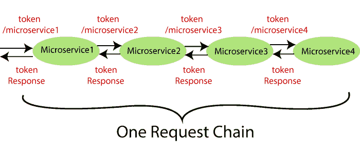
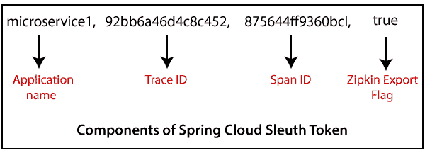
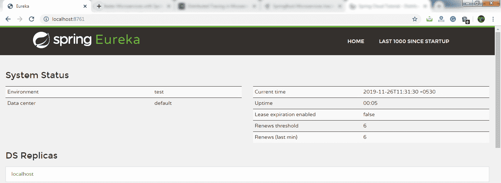

# 分布式跟踪简介

> 原文：<https://www.javatpoint.com/introduction-to-distributed-tracing>

## 分布式跟踪

分布式跟踪是一种监控应用程序的技术，尤其是那些使用微服务架构构建的应用程序。也称为**分布式请求跟踪**。开发人员使用分布式跟踪来**调试**和**优化**代码。

分布式跟踪提供了一个我们可以看到“特定请求发生了什么？”这很重要，因为微服务中涉及到各种组件。

如果我们想解决一个问题或调试一个问题，我们需要一个集中式服务器。于是**分布式追踪**这个术语就产生了。

在本节中，我们将使用**Spring****Cloud Sleuth**和 **Zipkin** 。SpringCloud 侦探为我们提出的每个请求分配一个**唯一标识**。我们可以根据所有组件的唯一 id 跟踪所有请求。

## SpringCloud 侦探

Spring Cloud Sleuth 是一个 **Spring Cloud 库**，它通过在适当的 HTTP 请求头上添加 **trace** 和 **span Ids** 来提供跟踪后续微服务进度的能力。侦探库基于 **MDC** (映射诊断上下文)概念，在这里我们可以轻松提取值，放入上下文，并在日志中显示它们。

## 分布式跟踪

Zipkin 是一个开源的，基于 Java 的**分布式追踪系统**。它有一个管理控制台，为**发送、接收、存储、**和**可视化**跟踪后续服务的细节提供了一种机制。

在 Zipkin 服务器的帮助下，我们可以将所有组件的所有日志放入**MQ**(rabbtmq)。我们将日志发送到 Zipkin 服务器，在那里日志被合并。这样做之后，我们可以监控不同的请求。我们还可以发现特定请求发生了什么？

## 使用 Spring 云探测实现分布式跟踪

在这一步中，我们将为所有微服务添加 Spring Cloud 探测。它为所有请求添加一个唯一的标识。用于生成**轨迹标识**、**跨度标识**并将其附加到日志中，以便工具(齐普金)可以使用这些标识。



Spring Cloud 探测令牌包含以下组件:

*   **应用程序名称:**在**属性**文件中定义的应用程序名称。
*   **踪迹 Id:** 侦察员添加踪迹 Id。对于给定的请求，它在所有服务中保持不变。
*   **跨度 Id:** 侦察员还会添加跨度 Id。它在一个工作单元中保持不变，但对于给定请求的不同服务则不同。
*   **齐普金导出标志:**表示布尔值。它可以是**真的**或者

下图显示了 Spring Cloud 侦察令牌。



让我们在项目中实现**SpringCloud 侦察**。

**第一步:**选择项目**网飞-zuul-API-网关-服务器**。

**第二步:**打开 **pom.xml** 并添加**侦探**依赖项。

```java
<dependency>
<groupId>org.springframework.cloud</groupId>
<artifactId>spring-cloud-starter-sleuth</artifactId>
</dependency>

```

现在我们需要追踪所有的请求。如果我们想跟踪所有的请求，我们需要创建**始终 _ 采样**。我们可以使用**豆**创建一个采样器。

**取样器**

分布式跟踪可能有非常大的数据量，因此采样在分布式跟踪中很重要。SpringCloud 侦察提供了**采样器**策略。在采样器的帮助下，我们可以实现提供算法控制的采样算法。默认情况下，如果**跨**T4(关联:是单个操作)已经处于活动状态，我们会得到一个连续执行跟踪的过程。

但是新创建的跨度总是被标记为**不可导出**。如果所有应用程序都使用采样器运行，我们可以在日志中看到跟踪(由跨度组成的端到端延迟图)，而不是在任何远程位置。默认情况下，SpringCloud 侦察将所有跨度设置为**不可导出**。

当我们将跨度数据导出到 **Zipkin** 或**SpringCloud 流**时，SpringCloud 侦察提供了 **AlwaysSampler** 类，该类将所有数据导出到 Zipkin。它还提供了一个 **PercentageBasedSampler** 类，用于对固定部分的跨度进行采样。

**请记住:**如果您使用的是 **Spring 2.0.0** 或以上版本，请使用以下采样器。我们使用了相同的，因为我们使用的是 Spring 版本 **2.2.1。**

```java
@Bean
public Sampler defaultSampler()
{
return Sampler.ALWAYS_SAMPLE;
}

```

**第三步:**打开**NetflixZuulApiGatewayServerApplication.java**文件，定义一个**豆**。

**NetflixZuulApiGatewayServerApplication.java**

```java
package com.javatpoint.microservices.netflixzuulapigatewayserver;
import org.springframework.boot.SpringApplication;
import org.springframework.boot.autoconfigure.SpringBootApplication;
import org.springframework.cloud.client.discovery.EnableDiscoveryClient;
import org.springframework.cloud.netflix.zuul.EnableZuulProxy;
import org.springframework.context.annotation.Bean;
import brave.sampler.Sampler;
@SpringBootApplication
@EnableDiscoveryClient
@EnableZuulProxy
public class NetflixZuulApiGatewayServerApplication 
{
public static void main(String[] args) 
{
SpringApplication.run(NetflixZuulApiGatewayServerApplication.class, args);
}
//creating a bean
@Bean
//creating a sampler called 
public Sampler defaultSampler()
{
return Sampler.ALWAYS_SAMPLE;
}
}

```

在上面的代码中，我们已经将 Spring Cloud Sleuth 添加到了 Zuul API 网关服务器中。

现在我们必须在**货币兑换服务**和**货币兑换服务**中定义 Bean。

**第四步:**打开**货币兑换服务**的 **pom.xml** ，添加**侦查**依赖项。

```java
<dependency>
<groupId>org.springframework.cloud</groupId>
<artifactId>spring-cloud-starter-sleuth</artifactId>
</dependency>

```

**第五步:**打开**CurrencyExchangeServiceApplication.java**文件，定义一个**豆**。

**CurrencyExchangeServiceApplication.java**

```java
package com.javatpoint.microservices.currencyexchangeservice;
import org.springframework.boot.SpringApplication;
import org.springframework.boot.autoconfigure.SpringBootApplication;
import org.springframework.cloud.client.discovery.EnableDiscoveryClient;
import org.springframework.context.annotation.Bean;
import brave.sampler.Sampler;
@SpringBootApplication
@EnableDiscoveryClient
public class CurrencyExchangeServiceApplication 
{
public static void main(String[] args) 
{
SpringApplication.run(CurrencyExchangeServiceApplication.class, args);
}
@Bean
//creating a sampler called always sampler
public Sampler defaultSampler()
{
return Sampler.ALWAYS_SAMPLE;
}
}

```

**第六步:**同样，打开**货币兑换服务**的 **pom.xml** ，添加侦探依赖。

```java
<dependency>
<groupId>org.springframework.cloud</groupId>
<artifactId>spring-cloud-starter-sleuth</artifactId>
</dependency>

```

**第七步:**打开**CurrencyConversionServiceApplication.java**文件，定义一个**豆**。

**货币转换服务应用. java**

```java
package com.javatpoint.microservices.currencyconversionservice;
import org.springframework.boot.SpringApplication;
import org.springframework.boot.autoconfigure.SpringBootApplication;
import org.springframework.cloud.client.discovery.EnableDiscoveryClient;
import org.springframework.cloud.openfeign.EnableFeignClients;
import org.springframework.context.annotation.Bean;
import brave.sampler.Sampler;
@SpringBootApplication
@EnableFeignClients("com.javatpoint.microservices.currencyconversionservice")
@EnableDiscoveryClient
public class CurrencyConversionServiceApplication 
{
public static void main(String[] args) 
{
SpringApplication.run(CurrencyConversionServiceApplication.class, args);
}
@Bean
//creating a sampler called always sampler
public Sampler defaultSampler()
{
return Sampler.ALWAYS_SAMPLE;
}
}

```

现在，我们有三个应用程序连接到 Spring Cloud 探测。

**步骤 8:** 按以下顺序启动应用程序:

**网飞-尤里卡-命名服务器**

*   打开浏览器，调用网址 [http://localhost:8761](http://localhost:8761) 。它返回尤里卡界面，如下所示。



**货币兑换服务**(端口 8000)

**货币兑换服务**

**Netflix-zuul API 网关服务器**

**记住:**启动各项服务后，刷新**尤里卡服务器**。

它显示了当前向尤里卡服务器注册的所有实例。


**第九步:**打开**CurrencyExchangeController.java**文件，并在其中添加一个**记录器**。

**货币兑换控制器. java**

```java
package com.javatpoint.microservices.currencyexchangeservice;
import org.slf4j.Logger;
import org.slf4j.LoggerFactory;
import org.springframework.beans.factory.annotation.Autowired;
import org.springframework.boot.autoconfigure.SpringBootApplication;
import org.springframework.core.env.Environment;
import org.springframework.web.bind.annotation.GetMapping;
import org.springframework.web.bind.annotation.PathVariable;
import org.springframework.web.bind.annotation.RestController;
@SpringBootApplication
@RestController 
public class CurrencyExchangeController 
{
private Logger logger=LoggerFactory.getLogger(this.getClass());
@Autowired
private Environment environment;
@Autowired
private ExchangeValueRepository repository;
@GetMapping("/currency-exchange/from/{from}/to/{to}")		//where {from} and {to} are path variable
public ExchangeValue retrieveExchangeValue(@PathVariable String from, @PathVariable String to)   //from map to USD and to map to INR
{		
ExchangeValue exchangeValue = repository.findByFromAndTo(from, to);
//setting the port
exchangeValue.setPort(Integer.parseInt(environment.getProperty("local.server.port")));
logger.info("{}", exchangeValue);
return exchangeValue;
}
}

```

同样，我们将把 logger 添加到 CurrencyConversionContoller 中。

**第 10 步:**打开**电流转换控制器**。 **java** 文件，并添加一个**记录器**到其中。

**电流转换控制器**。**爪哇**

```java
package com.javatpoint.microservices.currencyconversionservice;
import java.math.BigDecimal;
import java.util.HashMap;
import java.util.Map;
import org.slf4j.Logger;
import org.slf4j.LoggerFactory;
import org.springframework.beans.factory.annotation.Autowired;
import org.springframework.http.ResponseEntity;
import org.springframework.web.bind.annotation.GetMapping;
import org.springframework.web.bind.annotation.PathVariable;
import org.springframework.web.bind.annotation.RestController;
import org.springframework.web.client.RestTemplate;
@RestController
public class CurrencyConversionController 
{
private Logger logger=LoggerFactory.getLogger(this.getClass());
@Autowired
private CurrencyExchangeServiceProxy proxy;
@GetMapping("/currency-converter/from/{from}/to/{to}/quantity/{quantity}") //where {from} and {to} represents the column 
//returns a bean back
public CurrencyConversionBean convertCurrency(@PathVariable String from, @PathVariable String to, @PathVariable BigDecimal quantity)
{
//setting variables to currency exchange service
Map<String, String> uriVariables=new HashMap<>();
uriVariables.put("from", from);
uriVariables.put("to", to);
//calling the currency exchange service
ResponseEntity<CurrencyConversionBean> responseEntity=new RestTemplate().getForEntity("http://localhost:8000/currency-exchange/from/{from}/to/{to}", CurrencyConversionBean.class, uriVariables);
CurrencyConversionBean response=responseEntity.getBody();
//creating a new response bean and getting the response back and taking it into Bean
return new CurrencyConversionBean(response.getId(), from, to, response.getConversionMultiple(), quantity, quantity.multiply(response.getConversionMultiple()), response.getPort());
}
//mapping for currency-converter-feign service
@GetMapping("/currency-converter-feign/from/{from}/to/{to}/quantity/{quantity}") //where {from} and {to} represents the column 
//returns a bean 
public CurrencyConversionBean convertCurrencyFeign(@PathVariable String from, @PathVariable String to, @PathVariable BigDecimal quantity)
{
CurrencyConversionBean response=proxy.retrieveExchangeValue(from, to);
logger.info("{}", response);
//creating a new response bean
//getting the response back and taking it into Bean
return new CurrencyConversionBean(response.getId(), from, to, response.getConversionMultiple(), quantity, quantity.multiply(response.getConversionMultiple()), response.getPort());
}
}

```

**第 12 步:**执行请求[http://localhost:8100/货币-转换器-feign/from/EUR/to/INR/数量/100](http://localhost:8100/currency-converter-feign/from/EUR/to/INR/quantity/100) 。它返回如下响应，如下所示。


让我们看看控制台中**货币-兑换-服务**的日志。货币兑换服务显示以下日志:


我们还可以看到**货币兑换服务**的日志。货币兑换服务显示以下日志:


同样，我们可以看到**网飞-zuul-API-网关-服务器的日志。**


让我们仔细看看上面三个不同服务的日志。我们发现这三个服务都有相同的**跟踪 Id (533f8d3966d8f4e7)** 。

Spring Cloud 侦察为请求分配一个跟踪标识。我们可以使用这个 Id 跨多个组件跟踪请求。但是有一个问题，这个日志分布在多个地方。我们使用 **Zipkin** 来消除这个问题。在齐普金的帮助下，我们可以将日志集中在一个地方。

## 用齐普金进行分布式跟踪

我们已经在货币兑换服务、货币兑换服务和网飞-zuul-API-网关-服务器中安装了 Spring Cloud Sleuth 依赖项。我们已经看到为每个请求分配了一个唯一的标识。我们使用这些 Id 在这些多个服务的日志中跟踪请求。

然而，我们在追踪方面面临挑战。如果我们想跟踪一个请求，我们必须检查单个应用程序的日志。这个问题的解决方案叫做**集中日志。**

我们需要集中所有微服务的所有日志。我们可以通过 SpringCloud 侦探分配的 Id 进行搜索。在集中的地方，我们将能够搜索并找出特定请求发生了什么。

集中日志记录有以下解决方案:

*   **ELK 堆栈(弹性搜索)**
*   **Kibana**
*   **拉链**


在本次分布式追踪中，我们将使用 **Zipkin 分布式追踪服务器**。它为我们提供了所有微服务的综合视图。我们从单个微服务获取所有日志消息。齐普金服务器收集日志消息。所有的微服务都将日志消息放在名为**Rabbtmq、**的队列中，Zipkin 从 Rabbtmq 中挑选这些日志消息。齐普金追踪服务器与数据库连接。

在我们的例子中，我们使用内存数据库。我们将从数据库中提取日志消息。下一步，我们将安装 RabbitMQ。

* * *