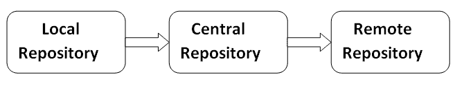

# Maven 知识库

> 原文：<https://www.javatpoint.com/maven-repository>

一个 **maven 存储库**是一个带有 pom.xml 文件的打包 JAR 文件的目录。Maven 在存储库中搜索依赖项。maven 存储库有 3 种类型:

1.  本地存储库
2.  中央存储库
3.  远程存储库

Maven 按照以下顺序搜索依赖项:

**本地存储库**然后**中央存储库**然后**远程存储库**。



如果在这些存储库中找不到依赖关系，maven 将停止处理并抛出一个错误。

* * *

 ## 1) Maven 本地存储库

Maven **本地存储库**位于您的本地系统中。它是由 maven 在您运行任何 maven 命令时创建的。

默认情况下，maven 本地存储库是%USER_HOME%/.m2 目录。例如: **C:\Users\SSS IT\.m2** 。


## 更新本地存储库的位置

我们可以通过更改 **settings.xml** 文件来更改 maven 本地存储库的位置。位于**MAVEN _ HOME/conf/settings . XML**，例如:**E:\ Apache-MAVEN-3 . 1 . 1 \ conf \ settings . XML**。

让我们看看 settings.xml 文件的默认代码。

settings.xml

```java
...
<settings  
   xmlns:xsi="http://www.w3.org/2001/XMLSchema-instance" 
   xsi:schemaLocation="http://maven.apache.org/SETTINGS/1.0.0 http://maven.apache.org/xsd/settings-1.0.0.xsd">
  <!-- localRepository
   | The path to the local repository maven will use to store artifacts.
   |
   | Default: ${user.home}/.m2/repository
  <localRepository>/path/to/local/repo</localRepository>
  -->

...
</settings>

```

现在更改本地存储库的路径。更改本地存储库的路径后，它将如下所示:

settings.xml

```java
...
<settings  
   xmlns:xsi="http://www.w3.org/2001/XMLSchema-instance" 
   xsi:schemaLocation="http://maven.apache.org/SETTINGS/1.0.0 http://maven.apache.org/xsd/settings-1.0.0.xsd">
   <localRepository>e:/mavenlocalrepository</localRepository>

...
</settings>

```

如您所见，现在本地存储库的路径是 e:/mavenlocalrepository。

* * *

 ## 2)Maven 中央存储库

Maven **中央存储库**位于网络上。它是由 apache maven 社区自己创建的。

中心库路径为:[http://repo1.maven.org/maven2/](https://repo1.maven.org/maven2/)。

中央存储库包含了很多公共库，可以通过这个网址[http://search.maven.org/#browse](https://search.maven.org/#browse)查看。

* * *

 ## 3) Maven 远程存储库

Maven **远程存储库**位于网络上。大多数库可能会从中央存储库中丢失，例如 JBoss 库等，因此我们需要在 pom.xml 文件中定义远程存储库。

让我们看看在 pom.xml 文件中添加 jUnit 库的代码。

pom.xml

```java
<project  
xmlns:xsi="http://www.w3.org/2001/XMLSchema-instance"
  xsi:schemaLocation="http://maven.apache.org/POM/4.0.0 
http://maven.apache.org/xsd/maven-4.0.0.xsd">

  <modelVersion>4.0.0</modelVersion>

  <groupId>com.javatpoint.application1</groupId>
  <artifactId>my-application1</artifactId>
  <version>1.0</version>
  <packaging>jar</packaging>

  <name>Maven Quick Start Archetype</name>
  <url>http://maven.apache.org</url>

  <dependencies>
    <dependency>
      <groupId>junit</groupId>
      <artifactId>junit</artifactId>
      <version>4.8.2</version>
      <scope>test</scope>
    </dependency>
  </dependencies>

</project>

```

你可以从 Maven 官方网站**mvnrepository.com**搜索任何储存库。