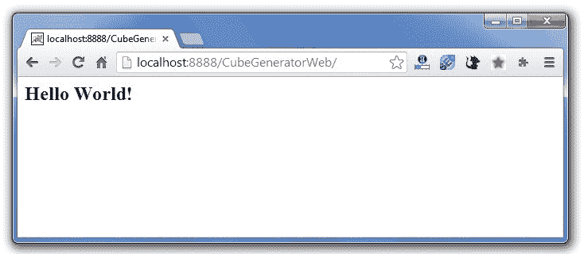
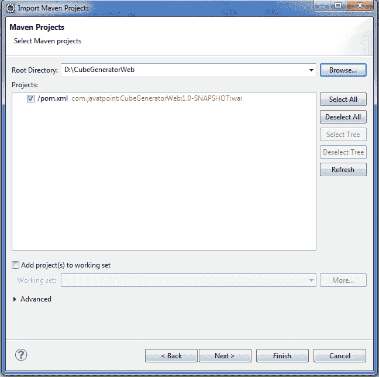
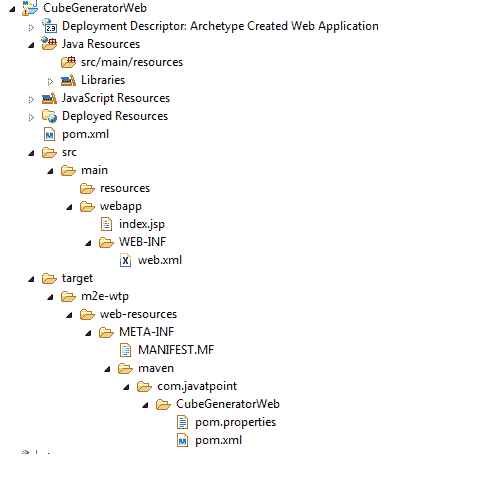

# 微型网络应用程序

> 原文：<https://www.javatpoint.com/maven-web-application>

我们可以通过执行**原型:生成 **mvn 工具**的**命令来创建一个简单的 maven web 应用程序示例。

要使用 maven 创建一个简单的 java 项目，需要打开命令提示符，运行 mvn 工具的**原型:生成**命令。

#### 句法

生成项目架构的**语法**如下:

```java
mvn archetype:generate -DgroupId=groupid -DartifactId=artifactid 
-DarchetypeArtifactId=maven-archetype-webapp -DinteractiveMode=booleanValue

```

#### 例子

生成项目架构的**示例**如下:

```java
mvn archetype:generate -DgroupId=com.javatpoint -DartifactId=CubeGeneratorWeb 
-DarchetypeArtifactId=maven-archetype-webapp -DinteractiveMode=false

```

#### 注意:在这里，我们使用 maven-原型-webapp 来创建简单的 maven web 应用程序。如果您使用 maven-prototype-quick start，它将生成一个简单的 maven 核心项目。

#### 输出

现在它将在命令提示符中**生成以下代码:**

```java
mvn archetype:generate -DgroupId=com.javatpoint -DartifactId=CubeGeneratorWe
b -DarchetypeArtifactId=maven-archetype-webapp -DinteractiveMode=false
[INFO] Scanning for projects...
[INFO]
[INFO] ------------------------------------------------------------------------
[INFO] Building Maven Stub Project (No POM) 1
[INFO] ------------------------------------------------------------------------
[INFO]
[INFO] >>> maven-archetype-plugin:2.2:generate (default-cli) @ standalone-pom >>
>
[INFO]
[INFO] <<< maven-archetype-plugin:2.2:generate (default-cli) @ standalone-pom <<
<
[INFO]
[INFO] --- maven-archetype-plugin:2.2:generate (default-cli) @ standalone-pom --
-
[INFO] Generating project in Batch mode
Downloading: http://repo.maven.apache.org/maven2/org/apache/maven/archetypes/mav
en-archetype-webapp/1.0/maven-archetype-webapp-1.0.jar
Downloaded: http://repo.maven.apache.org/maven2/org/apache/maven/archetypes/mave
n-archetype-webapp/1.0/maven-archetype-webapp-1.0.jar (4 KB at 3.8 KB/sec)
Downloading: http://repo.maven.apache.org/maven2/org/apache/maven/archetypes/mav
en-archetype-webapp/1.0/maven-archetype-webapp-1.0.pom
Downloaded: http://repo.maven.apache.org/maven2/org/apache/maven/archetypes/mave
n-archetype-webapp/1.0/maven-archetype-webapp-1.0.pom (533 B at 0.8 KB/sec)
[INFO] -------------------------------------------------------------------------
---
[INFO] Using following parameters for creating project from Old (1.x) Archetype:
 maven-archetype-webapp:1.0
[INFO] -------------------------------------------------------------------------
---
[INFO] Parameter: groupId, Value: com.javatpoint
[INFO] Parameter: packageName, Value: com.javatpoint
[INFO] Parameter: package, Value: com.javatpoint
[INFO] Parameter: artifactId, Value: CubeGeneratorWeb
[INFO] Parameter: basedir, Value: D:\
[INFO] Parameter: version, Value: 1.0-SNAPSHOT
[INFO] project created from Old (1.x) Archetype in dir: D:\CubeGeneratorWeb
[INFO] ------------------------------------------------------------------------
[INFO] BUILD SUCCESS
[INFO] ------------------------------------------------------------------------
[INFO] Total time: 10.273s
[INFO] Finished at: Thu Dec 26 19:25:04 IST 2013
[INFO] Final Memory: 10M/24M
[INFO] ------------------------------------------------------------------------
'cmd' is not recognized as an internal or external command,
operable program or batch file.

```

#### 生成的目录结构

现在转到当前目录，在那里您已经执行了 mvn 命令。例如:**d:\ cubesgeneratorweb**。您将看到创建了一个简单的 java 项目，它有以下目录:

```java
CubeGenerator
-src
--main
---resources
---webapp
----WEB-INF
-----web.xml
----index.jsp
-pom.xml

```

如您所见，创建了 3 个文件:pom.xml、index.jsp 和 web.xml。让我们快速浏览一下这些文件:

#### 1)自动生成的 xml 文件

```java
<project  
xmlns:xsi="http://www.w3.org/2001/XMLSchema-instance"
  xsi:schemaLocation="http://maven.apache.org/POM/4.0.0 
http://maven.apache.org/maven-v4_0_0.xsd">
  <modelVersion>4.0.0</modelVersion>
  <groupId>com.javatpoint</groupId>
  <artifactId>CubeGeneratorWeb</artifactId>
  <packaging>war</packaging>
  <version>1.0-SNAPSHOT</version>
  <name>CubeGeneratorWeb Maven Webapp</name>
  <url>http://maven.apache.org</url>
  <dependencies>
    <dependency>
      <groupId>junit</groupId>
      <artifactId>junit</artifactId>
      <version>3.8.1</version>
      <scope>test</scope>
    </dependency>
  </dependencies>
  <build>
    <finalName>CubeGeneratorWeb</finalName>
  </build>
</project>

```

#### 2)自动生成的 index.jsp 文件

```java
<html>
<body>
<h2>Hello World!</h2>
</body>
</html>

```

#### 3)自动生成的网络文件

```java
<!DOCTYPE web-app PUBLIC
 "-//Sun Microsystems, Inc.//DTD Web Application 2.3//EN"
 "http://java.sun.com/dtd/web-app_2_3.dtd" >

<web-app>
  <display-name>Archetype Created Web Application</display-name>
</web-app>

```

* * *

## 部署和运行马文网络项目

现在，您需要在服务器上部署该项目，并通过以下 url 访问它:

http:// <host-name>: <portnumber>/projectname，例如:http://localhost:8888/cubesgeneratorweb</portnumber></host-name>



* * *

## Eclipse 中的 Maven Webapp

您可以在 eclipse 中导入 maven web 项目。为此，请执行以下步骤:

**1)打开 eclipse IDE**

**2)导入 maven 项目**

文件菜单->导入-> Maven ->现有 Maven 项目


->下一步->浏览项目



->完成。

**3)运行 maven 网络项目**

右键单击项目->运行方式->在服务器上运行

* * *

## Eclipse 中 Maven Webapp 的目录结构

