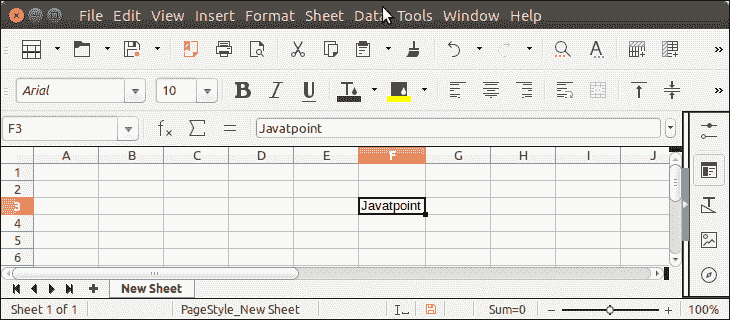

# 阿帕奇兴趣点 Excel 单元格

> 原文：<https://www.javatpoint.com/apache-poi-excel-cell>

在 Excel 工作表中创建单元格，可以使用 Apache POI 提供的 **createCell()** 方法。此方法需要一个整数参数，该参数应为列号。

**createCell()** 是 Row 类的一个方法。

让我们看一个在指定位置创建单元格的例子。

## 阿帕奇兴趣点 Excel 单元格示例

```java

package poiexample;
import java.io.FileNotFoundException;
import java.io.FileOutputStream;
import java.io.IOException;
import java.io.OutputStream;
import org.apache.poi.hssf.usermodel.HSSFWorkbook;
import org.apache.poi.ss.usermodel.Cell;
import org.apache.poi.ss.usermodel.Row;
import org.apache.poi.ss.usermodel.Sheet;
import org.apache.poi.ss.usermodel.Workbook;
public class NewCellExample {
	public static void main(String[] args) throws FileNotFoundException, IOException {
		Workbook wb = new HSSFWorkbook();
	    try  (OutputStream os = new FileOutputStream("Javatpoint.xls")) {
	        Sheet sheet = wb.createSheet("New Sheet");
	        Row row     = sheet.createRow(2);
	        Cell cell   = row.createCell(5);
	        cell.setCellValue("Javatpoint");
	        wb.write(os);
	    }catch(Exception e) {
	    	System.out.println(e.getMessage());
	    }
	}
}

```

**输出:**

