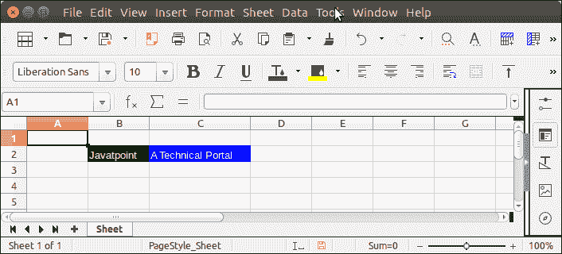

# 阿帕奇兴趣点 Excel 单元格颜色

> 原文：<https://www.javatpoint.com/apache-poi-excel-cell-color>

Apache POI 允许我们在背景和前景中设置单个单元格的颜色。为此，它提供了帮助设置单元格颜色的方法。

在下面的例子中，我们创建了两个单元格，并分别为背景和前景填充颜色。请看例子。

## 阿帕奇兴趣点 Excel 单元格颜色示例

```java

package poiexample;
import java.io.FileNotFoundException;
import java.io.FileOutputStream;
import java.io.IOException;
import java.io.OutputStream;
import org.apache.poi.ss.usermodel.Cell;
import org.apache.poi.ss.usermodel.CellStyle;
import org.apache.poi.ss.usermodel.FillPatternType;
import org.apache.poi.ss.usermodel.IndexedColors;
import org.apache.poi.ss.usermodel.Row;
import org.apache.poi.ss.usermodel.Sheet;
import org.apache.poi.ss.usermodel.Workbook;
import org.apache.poi.xssf.usermodel.XSSFWorkbook;
public class ColorExample {
	public static void main(String[] args) throws FileNotFoundException, IOException {
		try (OutputStream fileOut = new FileOutputStream("Javatpoint.xls")) {
		    Workbook wb = new XSSFWorkbook();
		    Sheet sheet = wb.createSheet("Sheet");
		    Row row = sheet.createRow(1);
		    CellStyle style = wb.createCellStyle();
		    // Setting Background color
		    style.setFillBackgroundColor(IndexedColors.GREEN.getIndex());
		    style.setFillPattern(FillPatternType.BIG_SPOTS);
		    Cell cell = row.createCell(1);
		    cell.setCellValue("Javatpoint");
		    cell.setCellStyle(style);
		    // Setting Foreground Color
		    style = wb.createCellStyle();
		    style.setFillForegroundColor(IndexedColors.BLUE.getIndex());
		    style.setFillPattern(FillPatternType.SOLID_FOREGROUND);
		    cell = row.createCell(2);
		    cell.setCellValue("A Technical Portal");
		    cell.setCellStyle(style);
            wb.write(fileOut);
		    }catch(Exception e) {
		    	System.out.println(e.getMessage());
		    }
	}
}

```

**输出:**

