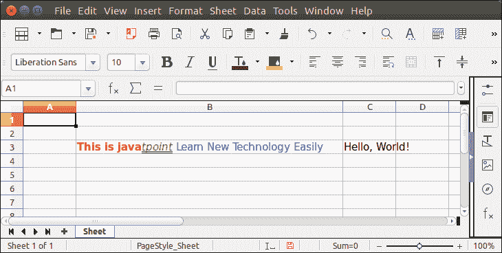

# ApachePOI 单元格多样式

> 原文：<https://www.javatpoint.com/apache-poi-cell-multiple-styles>

为了对一个单元格应用多种样式和文本格式，Apache POI 提供了单元格样式功能。我们可以为工作簿创建单元格样式，然后将文本样式应用于单元格。

## ApachePOI 单元格多样式示例

```java

package poiexample;
import java.io.FileOutputStream;
import java.io.OutputStream;
import org.apache.poi.ss.usermodel.Row;
import org.apache.poi.ss.usermodel.Sheet;
import org.apache.poi.ss.usermodel.Workbook;
import org.apache.poi.xssf.usermodel.XSSFCell;
import org.apache.poi.xssf.usermodel.XSSFColor;
import org.apache.poi.xssf.usermodel.XSSFFont;
import org.apache.poi.xssf.usermodel.XSSFRichTextString;
import org.apache.poi.xssf.usermodel.XSSFWorkbook;
public class MultipleStylesExample {
	public static void main(String[] args) {
		try (OutputStream os = new FileOutputStream("Javatpoint.xls")) {
			 Workbook wb = new XSSFWorkbook();
			 Sheet sheet = wb.createSheet("Sheet");
			 Row row = sheet.createRow(2);
			 XSSFFont font1 = (XSSFFont) wb.createFont();
			 XSSFFont font2 = (XSSFFont) wb.createFont();
			 XSSFFont font3 = (XSSFFont) wb.createFont();
		 XSSFCell hssfCell = (XSSFCell) row.createCell(2);
		  XSSFRichTextString richString = new XSSFRichTextString( "Hello, World!" );
		  richString.applyFont( 0, 6, font1 );
		  richString.applyFont( 6, 13, font2 );
		  hssfCell.setCellValue( richString );
		  XSSFCell cell = (XSSFCell) row.createCell(1);
		  XSSFRichTextString rt = new XSSFRichTextString("This is javatpoint");
		  font1.setBold(true);
		  font1.setColor(new XSSFColor(new java.awt.Color(255, 0, 0)));
		  rt.applyFont(0, 12, font1);
		  font2.setItalic(true);
		  font2.setUnderline(XSSFFont.U_DOUBLE);
		  font2.setColor(new XSSFColor(new java.awt.Color(0, 255, 0)));
		  rt.applyFont(12, 18, font2);
		  font3.setColor(new XSSFColor(new java.awt.Color(0, 0, 255)));
		  rt.append(" Learn New Technology Easily", font3);
		  cell.setCellValue(rt);
		  wb.write(os);
		}catch(Exception e) {
			System.out.println(e);
		}
	}
}

```

**输出:**

