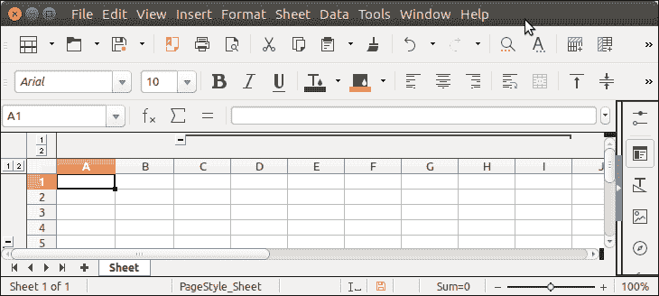

# 阿帕奇兴趣点概述

> 原文：<https://www.javatpoint.com/apache-poi-outlining>

大纲非常适合将信息的各个部分组合在一起。可以使用兴趣点应用编程接口的方法轻松地将其添加到列和行中。

让我们看一个应用大纲的例子。

## 阿帕奇兴趣点概述示例

```java

package poiexample;
import java.io.FileOutputStream;
import java.io.OutputStream;
import org.apache.poi.hssf.usermodel.HSSFWorkbook;
import org.apache.poi.ss.usermodel.Sheet;
import org.apache.poi.ss.usermodel.Workbook;
public class OutlineExample {
	public static void main(String[] args) {
		 try (OutputStream fileOut = new FileOutputStream("Javatpoint.xls")) {
			 Workbook wb = new HSSFWorkbook();
			 Sheet sheet1 = wb.createSheet("Sheet");
			 sheet1.groupRow( 4, 10 );
			 sheet1.groupColumn( 2, 8 );
		     wb.write(fileOut);
		 }catch(Exception e) {
			 System.out.println(e.getMessage());
		 }
	}
}

```

**输出:**

