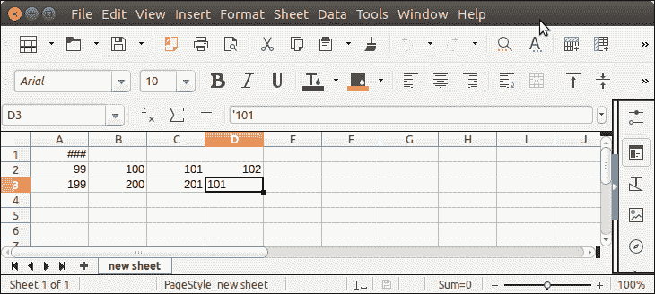

# 阿帕奇兴趣点重写

> 原文：<https://www.javatpoint.com/apache-poi-rewriting>

为了将数据重写到现有的 excel 文档中，Apache POI 提供了各种方法 getRow()、getCell()、getSheet()等。

## 阿帕奇兴趣点重写示例

```java

package poiexample;
import java.io.FileInputStream;
import java.io.FileNotFoundException;
import java.io.FileOutputStream;
import java.io.IOException;
import java.io.InputStream;
import java.io.OutputStream;
import org.apache.poi.EncryptedDocumentException;
import org.apache.poi.openxml4j.exceptions.InvalidFormatException;
import org.apache.poi.ss.usermodel.Cell;
import org.apache.poi.ss.usermodel.CellType;
import org.apache.poi.ss.usermodel.Row;
import org.apache.poi.ss.usermodel.Sheet;
import org.apache.poi.ss.usermodel.Workbook;
import org.apache.poi.ss.usermodel.WorkbookFactory;
public class RewritingExample {
	public static void main(String[] args) throws FileNotFoundException, IOException, EncryptedDocumentException, InvalidFormatException {
		try (InputStream inp = new FileInputStream("Javatpoint.xls")) {
		        Workbook wb = WorkbookFactory.create(inp);
		        Sheet sheet = wb.getSheetAt(0);
		        Row row = sheet.getRow(2);
		        Cell cell = row.getCell(3);
		        if (cell == null)
		            cell = row.createCell(3);
		        cell.setCellType(CellType.STRING);
		        cell.setCellValue("101");	    
		        try (OutputStream fileOut = new FileOutputStream("Javatpoint.xls")) {
		            wb.write(fileOut);
		        }
	    }catch(Exception e) {
	    	System.out.println(e);
	    }
	}
}

```

**输出:**


在 202 处重写 102 之后。

