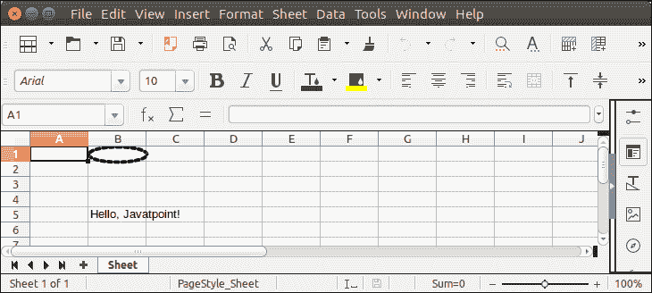

# ApachePOI 造型

> 原文：<https://www.javatpoint.com/apache-poi-styling-shapes>

默认情况下，形状很简单。但是，可以对形状应用不同的样式。目前可以做的事情有:

*   更改填充颜色。
*   制作一个没有填充颜色的形状。
*   更改线条的粗细。
*   更改线条的样式。虚线，虚线。
*   更改线条颜色。

让我们看一个例子，其中形状的外部线条是虚线。

## ApachePOI 造型示例

```java

package poiexample;
import java.io.FileOutputStream;
import java.io.OutputStream;
import org.apache.poi.hssf.usermodel.HSSFClientAnchor;
import org.apache.poi.hssf.usermodel.HSSFPatriarch;
import org.apache.poi.hssf.usermodel.HSSFShape;
import org.apache.poi.hssf.usermodel.HSSFSimpleShape;
import org.apache.poi.hssf.usermodel.HSSFWorkbook;
import org.apache.poi.ss.usermodel.Cell;
import org.apache.poi.ss.usermodel.Row;
import org.apache.poi.ss.usermodel.Sheet;
import org.apache.poi.ss.usermodel.Workbook;
public class ShapeStyleExample {
	public static void main(String[] args) {
		try (OutputStream fileOut = new FileOutputStream("Javatpoint.xls")) {
			Workbook wb = new HSSFWorkbook();
			Sheet sheet = wb.createSheet("Sheet");
			Row row = sheet.createRow(4); // Creating a row
			Cell cell = row.createCell(1); // Creating a cell
			cell.setCellValue("Hello, Javatpoint!");

			HSSFPatriarch patriarch = (HSSFPatriarch) sheet.createDrawingPatriarch();
			HSSFClientAnchor a = new HSSFClientAnchor( 0, 0, 1023, 255, (short) 1, 0, (short) 1, 0 );
			HSSFSimpleShape s = patriarch.createSimpleShape(a);
		    s.setShapeType(HSSFSimpleShape.OBJECT_TYPE_OVAL);
		    s.setLineStyleColor(10,10,10);
		    //s.setFillColor(90,10,200);
		    s.setLineWidth(HSSFShape.LINEWIDTH_ONE_PT * 3);
		    s.setLineStyle(HSSFShape.LINESTYLE_DOTSYS);
		    wb.write(fileOut);
		}catch(Exception e) {
			System.out.println(e.getMessage());
		}	
	}
}

```

**输出:**

