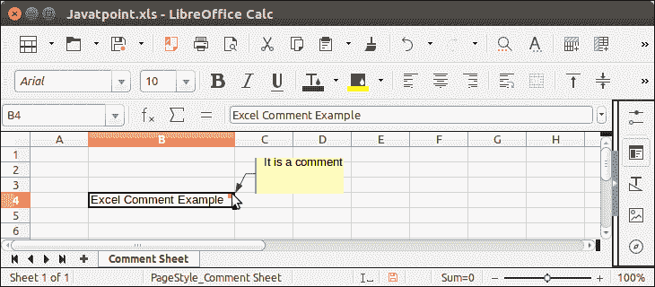

# Apache 然后 Comment

> 哎哎哎:[https://www . javatppoint . com/Apache-then-comment](https://www.javatpoint.com/apache-poi-comment)

注释是与单元格相关联的富文本注释。注释内容与单元格分开存储，并显示在单独但与单元格相关联的文本框中。

要创建注释，请使用 createComment()方法。

让我们看一个例子，其中我们正在创建一个与单元格相关联的注释消息。

## ApachePOI 评论示例

```java

package poiexample;
import java.io.FileOutputStream;
import java.io.IOException;
import org.apache.poi.hssf.usermodel.HSSFCell;
import org.apache.poi.hssf.usermodel.HSSFClientAnchor;
import org.apache.poi.hssf.usermodel.HSSFComment;
import org.apache.poi.hssf.usermodel.HSSFPatriarch;
import org.apache.poi.hssf.usermodel.HSSFRichTextString;
import org.apache.poi.hssf.usermodel.HSSFSheet;
import org.apache.poi.hssf.usermodel.HSSFWorkbook;
public class CellComments {
public static void main(String[] args) throws IOException  {
	try (FileOutputStream out = new FileOutputStream("Javatpoint.xls")) {
		 HSSFWorkbook wb   = new HSSFWorkbook();
		 HSSFSheet sheet   = wb.createSheet("Comment Sheet");
         HSSFPatriarch hpt = sheet.createDrawingPatriarch();
         HSSFCell cell1 = sheet.createRow(3).createCell(1);
         cell1.setCellValue("Excel Comment Example");
         // Setting size and position of the comment in worksheet
         HSSFComment comment1 = hpt.createComment(new HSSFClientAnchor(0, 0, 0, 0, (short) 4, 2, (short) 6, 5));
         // Setting comment text
         comment1.setString(new HSSFRichTextString("It is a comment"));
         // Associating comment to the cell
         cell1.setCellComment(comment1);
         wb.write(out);
     }catch(Exception e) {
    	 System.out.println(e.getMessage());
     }
     }
 }

```

**输出:**

