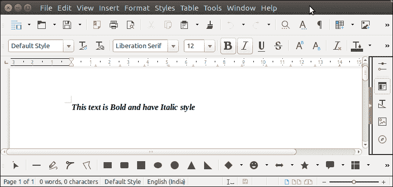

# ApachePOI 单词风格

> 原文：<https://www.javatpoint.com/apache-poi-word-style>

为了设置文本的样式、字体、对齐方式等，Apache POI 提供了 setItalic()、setBold()等方法。这些方法很有用，可以在 Java 程序中用来处理 word 文档。

让我们看一个例子，我们正在创建一个段落，并将其设置为粗体和斜体。

## ApachePOI 单词样式示例

```java

package poiexample;
import java.io.FileOutputStream;
import java.io.OutputStream;
import org.apache.poi.xwpf.usermodel.XWPFDocument;
import org.apache.poi.xwpf.usermodel.XW.PFParagraph;
import org.apache.poi.xwpf.usermodel.XWPFRun;
public class StyleExample {
	public static void main(String[] args) {
		XWPFDocument doc = new XWPFDocument();
	    try(OutputStream os = new FileOutputStream("Javatpoint.docx")) {
	    	XWPFParagraph paragraph = doc.createParagraph();
		//Set Bold an Italic
	      XWPFRun xr = paragraph.createRun();
	      xr.setBold(true);
	      xr.setItalic(true);
	      xr.setText("This text is Bold and have Italic style");
	      xr.addBreak();
	      doc.write(os);
	    }catch(Exception e) {
	    	System.out.println(e);
	    }
	}
}

```

**输出:**

