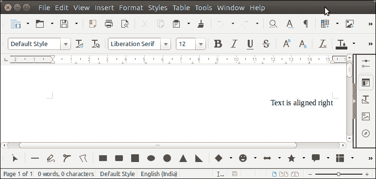

# 阿帕奇兴趣点单词对齐

> 原文：<https://www.javatpoint.com/apache-poi-word-aligning>

为了将文本向右、向左和居中对齐，Apache POI 提供了一种方法 setAlignment()，该方法采用对齐常数(例如 center)。

**段落对齐。向右**将段落向右对齐。

**段落对齐。向左**将段落向左对齐。

**段落对齐。居中**将段落与中心对齐。

让我们看一个例子，其中我们将文本向左对齐。

## 阿帕奇兴趣点单词对齐示例

```java

package poiexample;
import java.io.FileOutputStream;
import java.io.OutputStream;
import org.apache.poi.xwpf.usermodel.ParagraphAlignment;
import org.apache.poi.xwpf.usermodel.XWPFDocument;
import org.apache.poi.xwpf.usermodel.XWPFParagraph;
import org.apache.poi.xwpf.usermodel.XWPFRun;
public class AligningExample {
	public static void main(String[] args) {
		XWPFDocument doc = new XWPFDocument();
	    try(OutputStream os = new FileOutputStream("Javatpoint.docx")) {
	    	 XWPFParagraph paragraph = doc.createParagraph();
	    	 paragraph.setAlignment(ParagraphAlignment.RIGHT);
	         XWPFRun run = paragraph.createRun();
	         run.setText("Text is aligned right");
	         doc.write(os);
	    }catch(Exception e) {
	    	System.out.println(e);
	    }
	}
}

```

**输出:**

