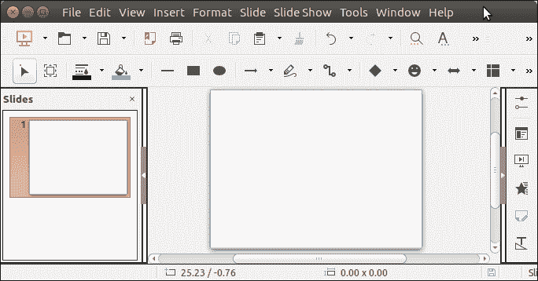

# Apache POI 幻灯片

> 原文：<https://www.javatpoint.com/apache-poi-powerpoint-slide>

要在 Powerpoint 文档中创建新幻灯片，我们可以使用 createSlide()方法。此方法创建新的空幻灯片。让我们看一个例子。

## Apache POI 幻灯片示例

```java

package poiexample;
import java.io.FileOutputStream;
import java.io.OutputStream;
import org.apache.poi.xslf.usermodel.XMLSlideShow;
import org.apache.poi.xslf.usermodel.XSLFSlide;
public class CreatingPptExample {
	public static void main(String[] args) {
		XMLSlideShow ppt = new XMLSlideShow();
	    try (OutputStream os = new FileOutputStream("Javatpoint.pptx")) {
	    XSLFSlide slide = ppt.createSlide();
	    ppt.write(os);
	    }catch(Exception e) {
	    	System.out.println(e);
	    }
	}
}

```

**输出:**

