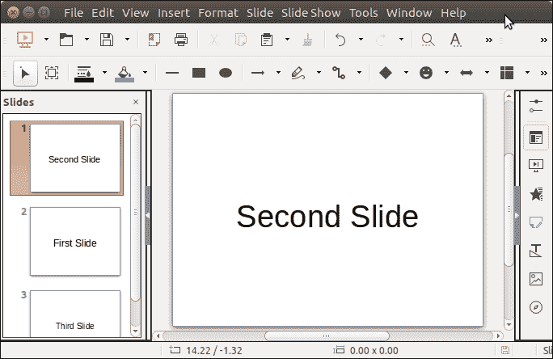

# ApachePOI 重新排序幻灯片

> 原文：<https://www.javatpoint.com/apache-poi-powerpoint-reorder-slide>

为了重新排序幻灯片，Apache POI 提供了一种方法**设置幻灯片顺序()**。这种方法通过幻灯片的位置来切换幻灯片。这是一种简单的方法，可以通过使用 Java 程序来处理。让

请参见我们用第二张幻灯片重新排序第一张幻灯片的示例。

## ApachePOI 重新排序幻灯片示例

```java

package poiexample;
import java.io.FileInputStream;
import java.io.FileOutputStream;
import java.io.IOException;
import java.util.List;
import org.apache.poi.xslf.usermodel.XMLSlideShow;
import org.apache.poi.xslf.usermodel.XSLFSlide;
public class ReOrderSlidesExample {	
 public static void main(String args[]) throws IOException{
	 try(XMLSlideShow ppt = new XMLSlideShow(new FileInputStream("Javatpoint.pptx"))){
		  // Getting all the slides
		   List<XSLFSlide> slides = ppt.getSlides();  
		   // Selecting the second slide
		   XSLFSlide secondslide = slides.get(1);
		   // Getting on the top
		   ppt.setSlideOrder(secondslide, 0);
		   // Writing Modifications
		   FileOutputStream out = new FileOutputStream("Javatpoint.pptx");
		   ppt.write(out);
	 }catch(Exception e) {
		 System.out.println(e);
	 }
  }
}

```

**输出:**

重新排序前


重新排序后，看到第二张幻灯片到达第一个位置。

