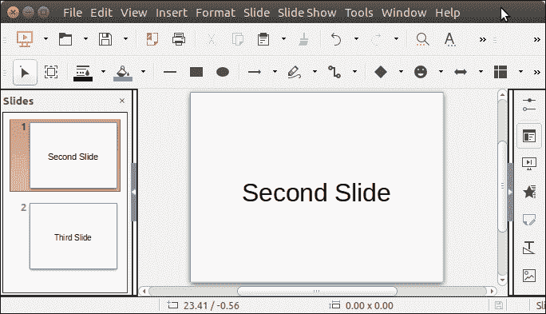

# ApachePOI 删除幻灯片

> 原文：<https://www.javatpoint.com/apache-poi-powerpoint-delete-slide>

要删除 powerpoint 幻灯片，Apache POI 提供了一种方法 **removeSlide()** 。它以 slide 的索引作为参数。幻灯片索引以 0 开始，因此可以通过将 0 传递给此方法来访问第一张幻灯片。

让我们看一个从幻灯片组中删除第一张幻灯片的例子。

## ApachePOI 删除幻灯片示例

```java

package poiexample;
import java.io.FileInputStream;
import java.io.FileOutputStream;
import org.apache.poi.xslf.usermodel.XMLSlideShow;
public class DeleteSlideExample {
	public static void main(String[] args) {
	    try (XMLSlideShow ppt = new XMLSlideShow(new FileInputStream("Javatpoint.pptx"))) {
		  ppt.removeSlide(0);
		  FileOutputStream out = new FileOutputStream("Javatpoint.pptx");
		  ppt.write(out);
	    }catch(Exception e) {
	    	System.out.println(e);
	    }
	}
}

```

**输出:**

请参阅，在删除幻灯片之前，本文档中有三张幻灯片。


删除第一张幻灯片后，现在我们只剩下两张幻灯片。

