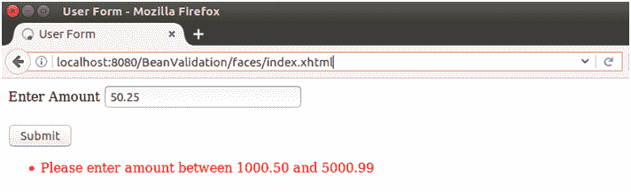
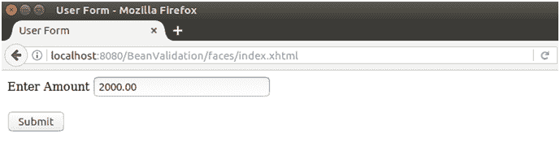
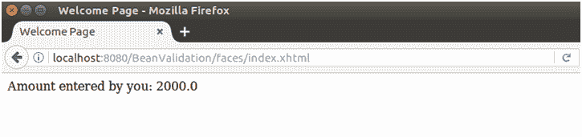

# JSF <validatedoublerange>标签</validatedoublerange>

> 哎哎哎:# t0]https://www . javatppoint . com/JSF-validator ubberange

用于检查输入字段的值是否在一定范围内。该值必须是浮点型或可转换为浮点型。

### <validatedoublerange>标签属性</validatedoublerange>

| 属性 | 描述 |
| 最低限度 | 它用于设置该组件的最小值。 |
| 最高的 | 它用于设置该组件的最大值。 |

* * *

## <validatedoublerange>标签示例</validatedoublerange>

在本例中，我们正在指定范围内验证双精度类型的用户输入。如果输入不有效，该程序将报告错误消息。

// index.xhtml

```java
<h:outputLabel for="amount">Enter Amount </h:outputLabel>
<h:inputText id="name-id" value="#{user.amount}" validatorMessage="Please enter amount between 1000.50 and 5000.99">
<f:validateDoubleRange minimum="1000.50" maximum="5000.99"/>
</h:inputText><br/><br/>
<h:commandButton value="Submit" action="response.xhtml"></h:commandButton>
</h:form>

```

//User.java

```java
import javax.faces.bean.ManagedBean;
import javax.faces.bean.RequestScoped;
@ManagedBean
@RequestScoped
public class User{
double amount;
public double getAmount() {
return amount;
}

public void setAmount(double amount) {
this.amount = amount;
}
}

```

// response.xhtml

```java
<h:body>
<f:view locale="fr">
Amount entered by you: <h:outputText id = "user-name-id" value="#{user.amount}">
</h:outputText>
</f:view>
</h:body>

```

输出:

//索引页



//索引页



//响应页面



* * *