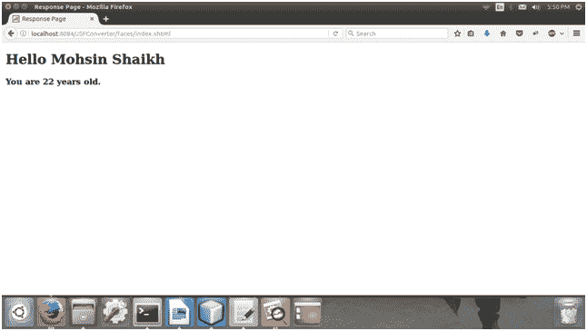

# JSF 标准转换器

> 原文：<https://www.javatpoint.com/jsf-standard-converters>

JavaServer Faces 提供了一组转换器。您可以使用它来转换组件数据。转换的目的是从 Servlet 应用编程接口中获取基于字符串的数据，并将其转换为强类型的 Java 对象。

**javax.faces.convert** 包包含所有标准转换器。转换器是根据组件值所指向的 EL 表达式的类型隐式赋值的。您也可以通过转换器标识访问这些转换器。下表显示了转换器类及其关联的转换器标识。

### JSF 转换器

| 班级 | 转换器标识 |
| 大十进制转换器 | javax.faces.BigDecimal |
| begin integer converter | javax 脸 BigInteger |
| BooleanConverter | javax.faces .布尔值 |
| 字节转换器 | javax.faces.Byte |
| 字符转换器 | javax.faces.Character |
| 日期时间转换器 | javax.faces.Datetime |
| 双转换器 | javax.faces.Double |
| EnumConverter | javax.faces.Enum |
| 浮点转换器 | javax.faces.Float |
| 英特尔转换器 | javax.faces.Integer |
| 对数转换器 | javax.faces.Long |
| NumberConverter | javax.faces.Number |
| ShortConverter | javax.faces.Short |

每个转换器都有一条标准错误消息。如果您正在页面上的组件上使用任何转换器，并且转换器无法转换组件的值，则转换器的错误消息将显示在页面上。

标准转换器 DateTimeConverter 和 NumberConverter 都有自己的标签，允许您使用标签属性配置组件数据的格式。

### JSF 数据转换核心标签

| 标签 | 功能 |
| f:转换器 | 它用于向父组件添加任意转换器。 |
| f:convertDateTime | 它用于向父组件添加日期时间转换器实例。 |
| f：转换编号 | 它用于向父组件添加 NumberConverter 实例。 |

* * *

## JSF <converter>标签示例</converter>

// index.xhtml

```java
<h:form>
<h:outputLabel for="username">User Name</h:outputLabel>
<h:inputText id="user-id" value="#{user.name}"/><br/>
<h:outputLabel for="age">Enter Age</h:outputLabel>
<h:inputText id="age-id" value="#{user.age}">
<f:converter converterId="javax.faces.Integer" />
</h:inputText><br/>
<h:commandButton action="response.xhtml" value="Submit"/>
</h:form>

```

//User.java

```java
import javax.faces.bean.ManagedBean;
import javax.faces.bean.RequestScoped;
@ManagedBean
@RequestScoped
public class User {
String name;
Integer age;
public String getName() {
return name;
}
public void setName(String name) {
this.name = name;
}
public Integer getAge() {
return age;
}
public void setAge(Integer age) {
this.age = age;
}
}  

```

// response.xhtml

```java
<?xml version='1.0' encoding='UTF-8' ?>
<!DOCTYPE html PUBLIC "-//W3C//DTD XHTML 1.0 Transitional//EN""http://www.w3.org/TR/xhtml1/DTD/xhtml1-transitional.dtd">
<html 
xmlns:h="http://xmlns.jcp.org/jsf/html"
<h:head>
<title>Response Page</title>
</h:head>
<h:body>
<h1>
<h:outputText value="Hello #{user.name}"/>
</h1>
<h3><h:outputLabel value="You are #{user.age} years old."></h:outputLabel></h3>
</h:body>
</html>

```

输出:

//索引页


//响应页面

