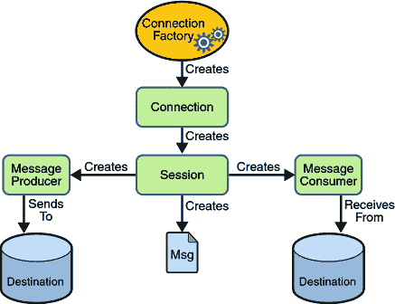
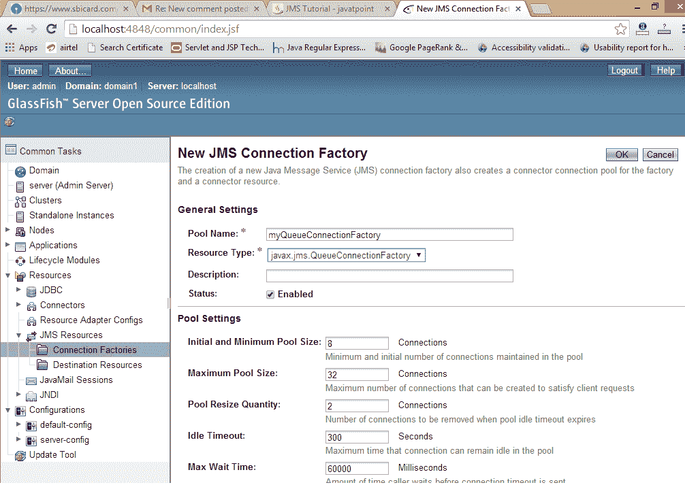
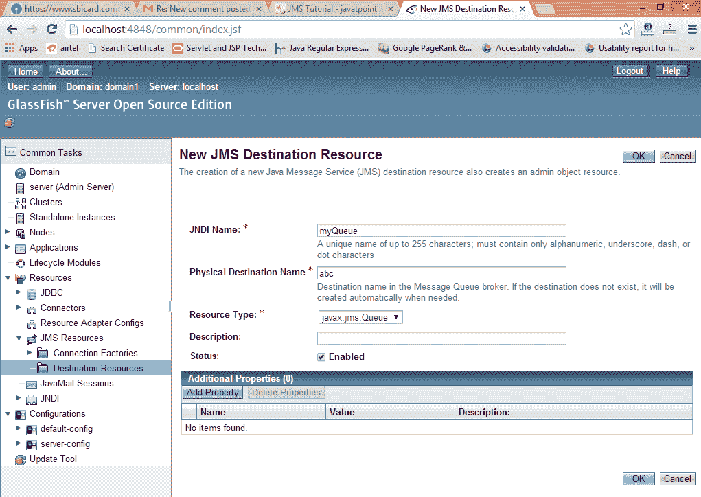

# JMS 教程

> 原文：<https://www.javatpoint.com/jms-tutorial>

JMS (Java 消息服务)是一个提供创建、发送和读取消息功能的应用编程接口。它提供松散耦合、可靠和异步的通信。

JMS 也称为消息服务。

* * *

## 理解消息传递

消息传递是一种传递应用程序或软件组件的技术。

JMS 主要用于从一个应用程序向另一个应用程序发送和接收消息。

* * *

## JMS 的要求

通常，用户向应用程序发送消息。但是，如果我们想从一个应用程序向另一个应用程序发送消息，我们需要使用 JMS API。

考虑一个场景，一个应用程序 A 在印度运行，另一个应用程序 B 在美国运行。要将消息从应用程序 A 发送到应用程序 B，我们需要使用 JMS。

* * *

## JMS 的优势

1) **异步:**接收消息，不需要客户端发送请求。消息将自动到达客户端。

2) **可靠:**提供消息传递的保证。

* * *

## 消息传递域

JMS 中有两种类型的消息传递域。

1.  点对点消息传递域
2.  发布者/订阅者消息传递域

* * *

## 1)点对点(PTP)消息传递域

在 PTP 模式下，一条信息只传递给一个接收者。这里，**队列**被用作面向消息的中间件(MOM)。

队列负责保存消息，直到接收者准备好。

在 PTP 模型中，发送方和接收方之间不存在**时序依赖关系**。


* * *

## 2)发布者/订阅者(发布者/订阅者)消息传递域

在发布/订阅模式中，一条消息**被传递给所有订阅者**。这就像广播。这里，**主题**被用作面向消息的中间件，负责保存和传递消息。

在 PTP 模型中，发布者和订阅者之间存在**时间依赖性**。


* * *

* * *

## JMS 编程模型



* * *

## JMS 队列示例

要开发 JMS 队列示例，您需要安装任何应用服务器。在这里，我们使用 **glassfish3** 服务器，在这里我们创建了两个 JNDI。

1.  创建名为 **myQueueConnectionFactory** 的连接工厂
2.  创建名为**我的队列**的目标资源

创建 JNDI 后，创建服务器和接收器应用程序。您需要在不同的控制台中运行服务器和接收器。这里，我们使用的是 eclipse IDE，默认情况下是在不同的控制台中打开的。

#### 1)创建连接工厂和目标资源

通过网址 **http://localhost:4848** 打开服务器管理控制台

使用用户名和密码登录。

单击 **JMS 资源- >连接工厂- >新建**，现在写入池名称并选择资源类型为 QueueConnectionFactory，然后单击确定按钮。



点击 **JMS 资源- >目的地资源- >新建**，现在写出 JNDI 名称和物理目的地名称然后点击确定按钮。



#### 2)创建发送方和接收方应用程序

让我们看看发送方和接收方代码。请注意，接收器与监听器相连，监听器将在用户发送消息时被调用。

File: MySender.java

```java
import java.io.BufferedReader;
import java.io.InputStreamReader;
import javax.naming.*;
import javax.jms.*;

public class MySender {
	public static void main(String[] args) {
		try
		{	//Create and start connection
			InitialContext ctx=new InitialContext();
			QueueConnectionFactory f=(QueueConnectionFactory)ctx.lookup("myQueueConnectionFactory");
			QueueConnection con=f.createQueueConnection();
			con.start();
			//2) create queue session
			QueueSession ses=con.createQueueSession(false, Session.AUTO_ACKNOWLEDGE);
			//3) get the Queue object
			Queue t=(Queue)ctx.lookup("myQueue");
			//4)create QueueSender object		
			QueueSender sender=ses.createSender(t);
			//5) create TextMessage object
			TextMessage msg=ses.createTextMessage();

			//6) write message
			BufferedReader b=new BufferedReader(new InputStreamReader(System.in));
			while(true)
			{
				System.out.println("Enter Msg, end to terminate:");
				String s=b.readLine();
				if (s.equals("end"))
					break;
				msg.setText(s);
				//7) send message
				sender.send(msg);
				System.out.println("Message successfully sent.");
			}
			//8) connection close
			con.close();
		}catch(Exception e){System.out.println(e);}
	}
}

```

File: MyReceiver.java

```java
import javax.jms.*;
import javax.naming.InitialContext;

public class MyReceiver {
	public static void main(String[] args) {
		try{
			//1) Create and start connection
			InitialContext ctx=new InitialContext();
			QueueConnectionFactory f=(QueueConnectionFactory)ctx.lookup("myQueueConnectionFactory");
			QueueConnection con=f.createQueueConnection();
			con.start();
			//2) create Queue session
			QueueSession ses=con.createQueueSession(false, Session.AUTO_ACKNOWLEDGE);
			//3) get the Queue object
			Queue t=(Queue)ctx.lookup("myQueue");
			//4)create QueueReceiver
			QueueReceiver receiver=ses.createReceiver(t);

			//5) create listener object
			MyListener listener=new MyListener();

			//6) register the listener object with receiver
			receiver.setMessageListener(listener);

			System.out.println("Receiver1 is ready, waiting for messages...");
			System.out.println("press Ctrl+c to shutdown...");
			while(true){				
				Thread.sleep(1000);
			}
		}catch(Exception e){System.out.println(e);}
	}

}

```

File: MyListener.java

```java
import javax.jms.*;
public class MyListener implements MessageListener {

	public void onMessage(Message m) {
		try{
		TextMessage msg=(TextMessage)m;

		System.out.println("following message is received:"+msg.getText());
		}catch(JMSException e){System.out.println(e);}
	}
}

```

首先运行接收者类，然后运行发送者类。

* * *

## JMS 主题示例

它与 JMS 队列相同，但是您需要将队列更改为主题，将发送者更改为发布者，将接收者更改为订阅者。

您需要创建 2 个名为**我的主题连接工厂**和**我的主题**的 JNDI。

File: MySender.java

```java
import java.io.BufferedReader;
import java.io.InputStreamReader;
import javax.naming.*;
import javax.jms.*;

public class MySender {
	public static void main(String[] args) {
		try
		{	//Create and start connection
			InitialContext ctx=new InitialContext();
			TopicConnectionFactory f=(TopicConnectionFactory)ctx.lookup("myTopicConnectionFactory");
			TopicConnection con=f.createTopicConnection();
			con.start();
			//2) create queue session
			TopicSession ses=con.createTopicSession(false, Session.AUTO_ACKNOWLEDGE);
			//3) get the Topic object
			Topic t=(Topic)ctx.lookup("myTopic");
			//4)create TopicPublisher object		
			TopicPublisher publisher=ses.createPublisher(t);
			//5) create TextMessage object
			TextMessage msg=ses.createTextMessage();

			//6) write message
			BufferedReader b=new BufferedReader(new InputStreamReader(System.in));
			while(true)
			{
				System.out.println("Enter Msg, end to terminate:");
				String s=b.readLine();
				if (s.equals("end"))
					break;
				msg.setText(s);
				//7) send message
				publisher.publish(msg);
				System.out.println("Message successfully sent.");
			}
			//8) connection close
			con.close();
		}catch(Exception e){System.out.println(e);}
	}
}

```

File: MyReceiver.java

```java
import javax.jms.*;
import javax.naming.InitialContext;

public class MyReceiver {
	public static void main(String[] args) {
		try	{
			//1) Create and start connection
			InitialContext ctx=new InitialContext();
			TopicConnectionFactory f=(TopicConnectionFactory)ctx.lookup("myTopicConnectionFactory");
			TopicConnection con=f.createTopicConnection();
			con.start();
			//2) create topic session
			TopicSession ses=con.createTopicSession(false, Session.AUTO_ACKNOWLEDGE);
			//3) get the Topic object
			Topic t=(Topic)ctx.lookup("myTopic");
			//4)create TopicSubscriber
			TopicSubscriber receiver=ses.createSubscriber(t);

			//5) create listener object
			MyListener listener=new MyListener();

			//6) register the listener object with subscriber
			receiver.setMessageListener(listener);

			System.out.println("Subscriber1 is ready, waiting for messages...");
			System.out.println("press Ctrl+c to shutdown...");
			while(true){				
				Thread.sleep(1000);
			}
		}catch(Exception e){System.out.println(e);}
	}

}

```

File: MyListener.java

```java
import javax.jms.*;
public class MyListener implements MessageListener {

	public void onMessage(Message m) {
		try{
		TextMessage msg=(TextMessage)m;

		System.out.println("following message is received:"+msg.getText());
		}catch(JMSException e){System.out.println(e);}
	}
}

```