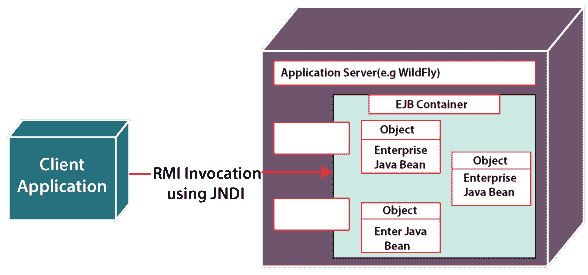

# EJB 建筑 Java

> 原文：<https://www.javatpoint.com/ejb-architecture-java>

**Java bean**将一组对象合并到一个可访问的对象中，该对象可以从任何应用程序轻松访问。这个单一的可访问对象是可维护的、可定制的和可重用的。setter/getter 方法和单个公共构造函数用于管理单个可访问对象。我们可以分别使用 setter 和 getter 来更新和读取任何对象的任何变量值。

**EJB** 代表**企业 Java bean**，这是一个基于服务器的架构，遵循企业环境的规范和要求。EJB 在概念上基于 Java RMI(远程方法调用)规范。在 EJB，beans 在具有四层架构的容器中运行。该体系结构由四层组成，即客户端层、Web 层、应用层和数据层。

### 体系结构

[EJB](https://www.javatpoint.com/ejb-tutorial) 架构有两个主要层，即**应用服务器**和 **EJB 容器**，EJB 架构就是基于这两个层而存在的。EJB 建筑的图示如下。



在上图中，定义了如何使用 RMI(远程方法调用)调用和部署 EJB 的逻辑表示。EJB 的集装箱不能自行部署。为了部署容器，它需要应用服务器。

### 应用服务器

在 EJB 体系结构中，应用服务器是保存或包含要部署的容器的最外层。应用层在执行使用 beans 开发的应用程序中起着重要的作用。它为执行这些应用程序提供了必要的环境。一些最流行的应用服务器是网络逻辑、Tomcat、JBoss、网络球体、Wildfly 和 Glass-finish。应用服务器的主要任务是:

1.  管理接口
2.  流程的执行
3.  连接到数据库
4.  管理其他资源。

### 容器

在 EJB 建筑中，容器是第二个最外层。对于包含在其中的企业 beans 来说，这是一个非常重要的层。对于企业 bean，容器提供了各种支持服务，如下所示:

*   它为事务服务提供支持，例如注册对象、分配远程接口、清除实例。
*   它为监视对象的活动和协调分布式组件提供支持。
*   它为安全服务提供支持。
*   它为汇集资源提供支持。
*   它为管理 beans 的生命周期及其并发性提供了支持。
*   它提供了专注于业务逻辑的支持。

### 豆子

[企业的 Java bean](https://www.javatpoint.com/java-bean)安装在容器中的方式与普通旧 Java 对象(POJO)安装并注册到容器中的方式相同。为了开发安全、大规模和健壮的业务应用程序，beans 提供了业务逻辑。

### EJB 的类型

有三种类型的**企业 Java 豆**或 **EJB** 可供选择，具体如下:

1.  **无状态企业 Java bean**
2.  **有状态企业 Java bean**
3.  **消息驱动的企业 Java bean**

### 无国籍的 EJB

为了实现无状态业务逻辑，主要使用**无状态 EJB**。将用户的物理地址存储到库存系统的数据库中就是无状态 EJB 的一个例子。此外，无状态 bean 非常适合这种类型的业务逻辑，因为在事务的所有阶段，用户界面上不需要有两个以上的表单。

**StatelessBeanExample.java**

```java

package com.javatpoint.ejbarchitecture;
import javax.ejb.Stateless;

@Stateless
public class StatelessBeanExample {
}

```

### 有状态 EJB

有状态的 EJB 与无状态的 EJB 正好相反。当我们在用户会话期间必须在后端维护应用程序的状态时，使用**状态 EJB**。在线购物应用程序的购物车是**状态 EJB** 的一个例子。为了实现这样的应用，我们将使用以下步骤:

1.  我们将创建有状态会话 bean。
2.  之后，为了在后端临时存储用户会话中的选定产品，我们必须创建类型产品的全局变量集合。
3.  接下来，我们将创建一个方法，通过该方法，我们将把所有选定的产品添加到我们在上一步中创建的集合中。
4.  我们还创建了一个方法，通过该方法我们将从集合中移除产品。
5.  最后，我们将为要处理的选定产品创建一个结帐方法。

**StatelessBeanExample.java**

```java

package com.javatpoint.ejbarchitecture;
import javax.ejb.Stateful;

@Stateful
public class StatelessBeanExample {
}

```

### 信息驱动的 EJB

用于从消息代理发送和接收消息的另一种特殊类型的 EJB 实现了 JMS 规范。基于代理的系统是松散耦合的。通过代理进行通信的组件的优势在于，在提交另一个请求之前不需要等待一个请求完成，因为代理本质上是异步的。

**MessageDrivenBeanExample.java**

```java

package com.javatpoint.ejbarchitecture;
import javax.ejb.MessageDriven;
import javax.jms.MessageListener;
import javax.jms.Message;
import javax.ejb.ActivationConfigProperty;

@MessageDriven(mappedName = "jms/Queue", activationConfig = {
                @ActivationConfigProperty(propertyName = "reciverType", propertyValue = "javax.jms.Queue"),
                @ActivationConfigProperty(propertyName = "reciver", propertyValue = "java:/queue/testqueue")
        })
public class MessageDrivenBeanExample implements MessageListener {

    public MessageDrivenBeanExample() {
    }
    public void onMessage(Message message) {
        System.out.println("Message received successfully .");
    }
}

```

### EJB 和 JB 之间的差异

以下是 EJB 和 JB 之间的区别:

| 没有。 | 部署 | 分线盒 |
| 1. | EJB 不可见，因为它作为一个遥控器运行。 | JB 可见。 |
| 2. | EJB 在服务器端执行。 | EJB 可以在客户端和服务器端执行。 |
| 3. | EJB 使用外部构建工具或其集成开发环境。 | 为了解释 bean 的功能，EJB 使用了它的外部接口。 |
| 4. | EJB 使用组件技术，但无法在豆子上构建或扩展它。 | 通过使用 Java beans 创建的通用组件，它能够构建小程序和应用程序。 |
| 5. | 它没有属性编辑器、定制器和 bean 信息类。它只有关于部署描述符所提供的信息。 | 它有属性编辑器、定制器和 bean 信息类。 |
| 6. | 它支持交易。 | 它不支持交易。 |
| 7. | 三种类型的 EJB 是可能的。 | 没有类型。 |

* * *