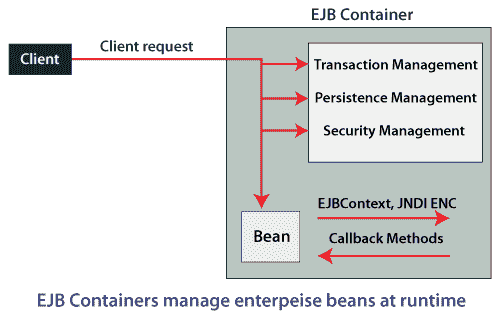

# EJB 集装箱公司

> 原文：<https://www.javatpoint.com/ejb-container>

**EJB** 是一个服务器端软件元素，它总结了应用程序的**业务逻辑**。**企业[Java bean](https://www.javatpoint.com/java-bean)**web 存储库为 web 相关的软件元素产生一个运行时域，包括计算机可靠性、 **Java Servlet 生命周期** (JSL)管理、事务处理程序和其他 web 服务。

## 什么是 EJB 集装箱？

**EJB 容器**是包含业务逻辑的服务器端组件。它提供对企业 beans 的本地和远程访问。换句话说，我们可以说它在应用服务器中为 EJB 应用程序提供了一个运行时环境。一个 EJB 集装箱可以有一个或多个 EJB 模块。它充当业务逻辑和企业应用程序之间的中间动作。下图描述了 EJB 集装箱的结构。

[Java EE](https://www.javatpoint.com/java-ee) 规范所设想的典型行为是，开发人员编写一个简单的组件 Enterprise JavaBean，而 EJB 容器为通信、事务和数据访问添加了必要的基础设施。它将业务逻辑转化为可执行的东西。

此外，EJB 容器为组件提供生命周期管理，以确保组件的创建、使用和销毁既高效又符合规范。

当 [EJB](https://www.javatpoint.com/ejb-tutorial) 容器启动时，它的最高级别是 EJBContainerImpl 类作为它的控制器。它是泛型 ContainerImpl 类的子类。EJBContainerImpl 实现了 EJBContainer 服务接口，并具有用于对部署的应用程序模块和环境其他部分进行更改的侦听器。

让我们看看定义 EJB 容器的继承依赖项、方法和接口。

但是如果我们看一下 WsComponent 接口，我们可以看到一些关键的方法，解释了组件以及容器是如何被 WAS 运行时环境控制的。ContainerImpl 类是 ComponentImpl 类的子类，因此它可以像任何其他组件一样被初始化它的外部容器的 loadComponents 调用处理。它是基础服务器如何启动、控制和与 EJB 容器交互的。

它负责创建企业 bean，将企业 bean 绑定到命名服务，以便其他应用程序组件可以访问企业 bean，确保只有授权的客户端可以访问企业 bean 的方法，将 bean 的状态保存到持久存储中，缓存 bean 的状态，并在必要时激活或钝化 bean。

## EJB 容器实现类

**EJBContainerImpl** 类是一个有很多依赖关系的复杂类，如下图所示。有些依赖是结构性的和继承相关的，有些是动态的和协作性的。

使用反射，我们可以看到 EJBContainerImpl 类使用的接口。

### EJB 集装箱能做什么？

EJB 集装箱执行以下任务:

*   按需实例化 beans
*   管理 bean 实例池
*   管理交易
*   从/向数据库加载/保存 bean 数据
*   处理安全性
*   提供其他系统服务

## EJB 集装箱服务公司

EJB 容器为企业应用程序开发提供了以下有价值的服务。

*   事务支持(启动、回滚和提交)
*   安全模型
*   持久性支持
*   定时服务和作业调度
*   信息发送
*   远程存取
*   分配
*   网络服务
*   组件池
*   组件生命周期
*   拦截器
*   异步交互
*   线程安全和并发控制

* * *