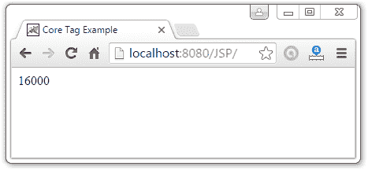

# JSTL 核心<set>标签</set>

> 原文：<https://www.javatpoint.com/jstl-core-set-tag>

它用于设置在“范围”中计算的表达式的结果。<set>标记很有帮助，因为它计算表达式并使用结果来设置 java.util.Map 或 JavaBean 的值。</set>

这个标记类似于 jsp:setProperty 动作标记。

让我们看看<set>标签的简单例子:</set>

```java

Core Tag Example

```

输出:

```java
16000

```

