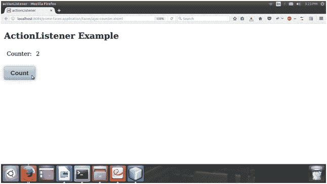

# Ajax ActionListener 范本

> 原文：<https://www.javatpoint.com/primefaces-ajax-actionlistener>

用于通过触发动作调用 Java 方法。此操作可以通过使用命令按钮或命令链接来完成。在这里，我们创建了一个调用 ManagedBean 方法的示例，并且每次单击按钮时，当前值都会用 Ajax 更新。

该示例包括以下文件。

### JSF 档案

//action listener . XHTML

```java

<?xml version="1.0" encoding="UTF-8"?>
<!DOCTYPE html>
<html 
xmlns:h="http://xmlns.jcp.org/jsf/html"
xmlns:p="http://primefaces.org/ui">
<h:head>
<title>actionListener</title>
<meta name="viewport" content="width=device-width, initial-scale=1.0"/>
</h:head>
<h:body>
<h2>ActionListener Example</h2>
<h:form>
<h:panelGrid columns="2" cellpadding="5">
<h:outputText value="Counter: " />
<h:outputText id="output" value="#{ajaxCounter.counter}" />
</h:panelGrid><br/>
<p:commandButton value="Count" actionListener="#{ajaxCounter.increment()}" update="output" />
</h:form>
</h:body>
</html>

```

### 托管 Bean

**//AjaxCounter.java**

```java

package com.javatpoint;
import javax.faces.bean.ManagedBean;
import javax.faces.bean.ViewScoped;
@ManagedBean
@ViewScoped
public class AjaxCounter {
int counter;
public int getCounter() {
return counter;
}
public void setCounter(int counter) {
this.counter = counter;
}
public void increment(){
counter+=2;
}
}

```

输出:


单击命令按钮后，它调用方法并将计数器增加 2。

