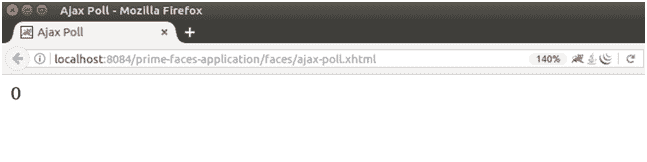

# PrimeFaces Ajax 投票

> 原文：<https://www.javatpoint.com/primefaces-ajax-poll>

PrimeFaces 提供**T4【p:poll>**组件，用于定期进行 ajax 调用。它提供了一个选项**间隔**，用于指定时间。

以下示例解释了该组件的用法。本示例包含以下文件。

### JSF 档案

**// ajax-poll.xhtml**

```java

<?xml version='1.0' encoding='UTF-8' ?>
<!DOCTYPE html PUBLIC "-//W3C//DTD XHTML 1.0 Transitional//EN""http://www.w3.org/TR/xhtml1/DTD/xhtml1-transitional.dtd">
<html 
xmlns:h="http://xmlns.jcp.org/jsf/html"
xmlns:p="http://primefaces.org/ui">
<h:head>
<title>Ajax Poll</title>
</h:head>
<h:body>
<h:form>
<h:outputText id="poll" value="#{ajaxCounter.counter}" />
<p:poll interval="1" listener="#{ajaxCounter.increment()}" update="poll" />
</h:form>
</h:body>
</html>

```

### ManagedBean

**//AjaxCounter.java**

```java

package com.javatpoint;
import javax.faces.bean.ManagedBean;
import javax.faces.bean.ViewScoped;
@ManagedBean
@ViewScoped
public class AjaxCounter {
int counter;
public int getCounter() {
return counter;
}
public void setCounter(int counter) {
this.counter = counter;
}
public void increment(){
counter+=2;
}
}

```

输出:

此页面根据指定时间每次更新。最初，它被设置为 0。



更新后的页面。

