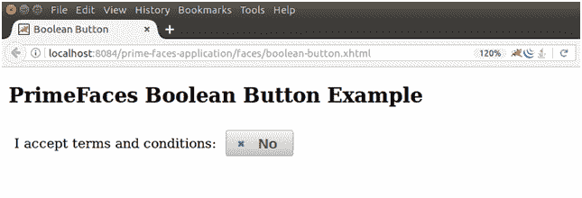

# selectbooleanbutton 选取布林选项

> 原文：<https://www.javatpoint.com/primefaces-booleanbutton>

**T2 p:selectBooleanButton>**用于在 JSF 应用中创建 booleanebutton。我们可以用它从用户那里获得布尔输入。它提供了一个与用户交互的切换按钮。

## 选择按钮按钮属性

下表包含 InputTextarea 组件的属性。

| 属性 | 缺省值 | 返回类型 | 描述 |
| 编号 | 空 | 线 | 它是组件的唯一标识符。 |
| 提供 | 真实的 | 布尔代数学体系的 | 它返回布尔值来指定组件的呈现。 |
| 有约束力的 | 空 | 目标 | 它用于设置映射到支持 bean 中的服务器端 UIComponent 实例的表达式。 |
| 价值 | 空 | 目标 | 它保存引用列表的组件的值。 |
| 转换器 | 空 | 转换器/字符串 | 它用于设置定义组件转换器的表达式或文本。 |
| 马上 | 错误的 | 布尔代数学体系的 | 它用于设置布尔值。如果值为真，则在应用该组件的请求值阶段执行流程验证逻辑。 |
| 需要 | 错误的 | 布尔代数学体系的 | 它用于根据需要制作组件。 |
| 所需消息 | 空 | 线 | 它用于设置当必填字段验证失败时要显示的消息。 |
| 昂哥 | 空 | 线 | 它用于调用值更改的方法。 |
| 风格 | 空 | 线 | 它用于设置组件的内联样式。 |
| 奥瑞孔 | 空 | 线 | 用于设置选择按钮时显示的图标。 |
| 办公室 | 空 | 线 | 用于设置按钮未选中时显示的图标。 |
| 得到焦点时 | 空 | 线 | 它在按钮获得焦点时执行。 |
| onblur(声音) | 空 | 线 | 当按钮失去焦点时执行。 |

* * *

## 例子

这里，在下面的例子中，我们正在实现**<p:selectBooleanButton>**组件。本示例包含以下文件。

### JSF 档案

**//布尔-button.xhtml**

```java

<?xml version='1.0' encoding='UTF-8' ?>
<!DOCTYPE html PUBLIC "-//W3C//DTD XHTML 1.0 Transitional//EN""http://www.w3.org/TR/xhtml1/DTD/xhtml1-transitional.dtd">
<html 
xmlns:h="http://xmlns.jcp.org/jsf/html"
xmlns:p="http://primefaces.org/ui">
<h:head>
<title>Boolean Button</title>
</h:head>
<h:body>
<h2>PrimeFaces Boolean Button Example</h2>
<h:form>
<h:panelGrid columns="2" style="margin-bottom:10px" cellpadding="5">
<h:outputText value="I accept terms and conditions: " />
<p:selectBooleanButton id="bol" value="#{booleanButton.checkValue}" onLabel="Yes" offLabel="No" style="width:80px" onIcon="ui-icon-check" offIcon="ui-icon-close"/>
</h:panelGrid>
</h:form>
</h:body>
</html>

```

### ManagedBean

**//booran button . Java**

```java

package com.javatpoint;
import javax.faces.bean.ManagedBean;
@ManagedBean
public class BooleanButton {
private boolean checkValue;   
public boolean isCheckValue() {
return checkValue;
}
public void setCheckValue(boolean checkValue) {
this.checkValue = checkValue;
}
}

```

输出:



点击按钮后，它切换到是。

