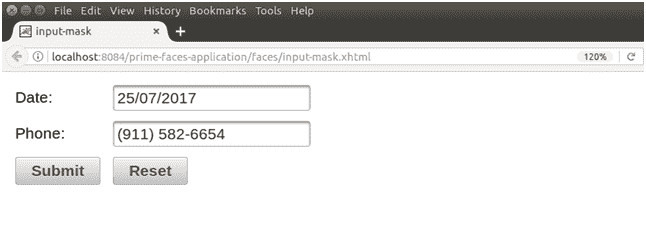

# inputmask 输入遮罩

> 哎哎哎:# t0]https://www . javatppoint . com/primitives-input mask

这是一种特殊类型的输入框，强制用户输入格式化的输入。我们可以通过使用 **< p:inputMask >** 组件来创建它。它以某种模式接受输入。当我们想要格式化的用户输入时，它是有用的。它具有以下列出的各种属性。

## 输入磁盘属性

| 属性 | 缺省值 | 返回类型 | 描述 |
| 编号 | 空 | 线 | 它是组件的唯一标识符。 |
| 提供 | 真实的 | 布尔代数学体系的 | 它用于指定组件的呈现。 |
| 面具 | 空 | 目标 | 用于设置掩码模板。 |
| slotcar | 空 | 线 | 它是掩码模板中的占位符。 |
| 价值 | 空 | 目标 | 它用于设置组件的值。 |
| 需要 | 错误的 | 布尔代数学体系的 | 它用于根据需要制作组件。 |
| 最大长度 | 空 | 整数 | 它用于设置该字段中可以输入的最大字符数。 |
| onblur(声音) | 空 | 线 | 它用于在输入元素失去焦点时调用脚本。 |
| onselect | 空 | 线 | 当用户选择输入元素中的文本时，用于执行脚本。 |
| 占位符 | 空 | 线 | 它用于指定一个简短的提示。 |
| 只读的 | 错误的 | 布尔代数学体系的 | 它用于将组件设置为只读。 |
| 大小 | 空 | 整数 | 它用于设置用于确定输入元素宽度的字符数。 |
| 自我意识 | 真实的 | 布尔代数学体系的 | 它用于在输入不完整的输入时清除模糊上的字段。 |

* * *

## 例子

这里，在下面的例子中，我们正在实现**<p:inputmask>**组件。本示例包含以下文件。

### JSF 档案

**// inputMask.xhtml**

```java

<?xml version='1.0' encoding='UTF-8' ?>
<!DOCTYPE html PUBLIC "-//W3C//DTD XHTML 1.0 Transitional//EN""http://www.w3.org/TR/xhtml1/DTD/xhtml1-transitional.dtd">
<html 
xmlns:h="http://xmlns.jcp.org/jsf/html"
xmlns:p="http://primefaces.org/ui">
<h:head>
<title>input-mask</title>
</h:head>
<h:body>
<h:form>
<h:panelGrid columns="2" cellpadding="5">
<p:outputLabel for="date" value="Date: " />
<p:inputMask id="date" value="#{inputMask.date}" mask="99/99/9999"/>
<p:outputLabel for="phone" value="Phone:" />
<p:inputMask id="phone" value="#{inputMask.phone}" mask="(999) 999-9999"/>
<p:commandButton value="Submit" oncomplete="PF('dlg').show()"/>
<p:commandButton value="Reset" type="reset" />
</h:panelGrid>
</h:form>
</h:body>
</html>

```

### ManagedBean

//input mask . Java

```java

package com.javatpoint;
import javax.faces.bean.ManagedBean;
@ManagedBean
public class InputMask {
private String date;
private String phone;
public String getDate() {
return date;
}
public void setDate(String date) {
this.date = date;
}
public String getPhone() {
return phone;
}
public void setPhone(String phone) {
this.phone = phone;
}
}

```

输出:


