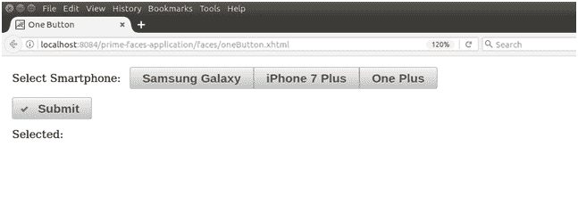
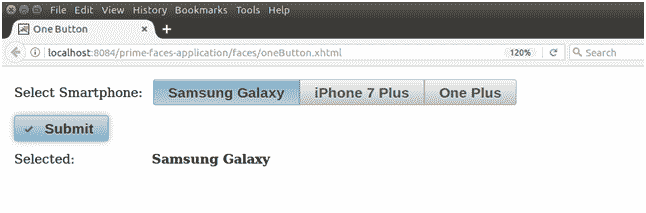

# 选择一个按钮

> 原文：<https://www.javatpoint.com/primefaces-selectonebutton>

它用于使用按钮从列表中选择单个项目。它将项目列表创建为按钮列表。因此，我们可以通过点击按钮来选择项目。**<p:select one button>**组件用于在 JSF 应用程序中创建按钮列表。下面列出了它的各种属性。

## 选择一个按钮属性

| 属性 | 缺省值 | 类型 | 描述 |
| 编号 | 空 | 线 | 它是组件的唯一标识符 |
| 提供 | 真实的 | 布尔代数学体系的 | 它用于指定组件的呈现。 |
| 需要 | 错误的 | 布尔代数学体系的 | 它用于根据需要标记组件。 |
| converterMessage | 空 | 线 | 用于设置转换失败时显示的消息。 |
| 有缺陷的 | 错误的 | 布尔代数学体系的 | 它用于禁用组件。 |
| 标签 | 空 | 线 | 它用于设置组件的标签。 |
| 昂哥 | 空 | 线 | 它用于在值更改时调用脚本。 |
| 风格 | 空 | 线 | 用于设置组件的内联 CSS。 |
| tab 键索引 | Zero | 线 | 它用于设置柠檬在标签顺序中的位置。 |
| 不可选择 | 真实的 | 布尔代数学体系的 | 它用于取消选择组件。 |

## 纺纱

下面是结构样式类的列表；

| 样式类 | 适用 |
| 。ui-selectonebutton | 它适用于主容器元素。 |

## 例子

这里，在下面的例子中，我们正在实现**<p:selectone button>**组件。本示例包含以下文件。

### JSF 档案

**// oneButton.xhtml**

```java

<?xml version='1.0' encoding='UTF-8' ?>
<!DOCTYPE html PUBLIC "-//W3C//DTD XHTML 1.0 Transitional//EN""http://www.w3.org/TR/xhtml1/DTD/xhtml1-transitional.dtd">
<html 
xmlns:h="http://xmlns.jcp.org/jsf/html"
xmlns:p="http://primefaces.org/ui"
xmlns:f="http://xmlns.jcp.org/jsf/core">
<h:head>
<title>One Button</title>
</h:head>
<h:body>
<h:form>
<h:panelGrid columns="2" style="margin-bottom:10px" cellpadding="5">
<h:outputText value="Select Smartphone: " />
<p:selectOneButton value="#{oneButton.option}">
<f:selectItem itemLabel="Samsung Galaxy" itemValue="Samsung Galaxy" />
<f:selectItem itemLabel="iPhone 7 Plus" itemValue="iPhone 7 Plus" />
<f:selectItem itemLabel="One Plus" itemValue="One Plus" />
</p:selectOneButton>
<p:commandButton value="Submit" update="display" icon="ui-icon-check" />
<p:spacer />
<h:outputText value="Selected:" />
<h:outputText id="display" value="#{oneButton.option}" style="font-weight: bold" />
</h:panelGrid>
</h:form>
</h:body>
</html>

```

### ManagedBean

**//OneButton.java**

```java

package com.javatpoint;
import javax.faces.bean.ManagedBean;
@ManagedBean
public class OneButton {
private String option;
public String getOption() {
return option;
}
public void setOption(String option) {
this.option = option;
}
}

```

输出:


