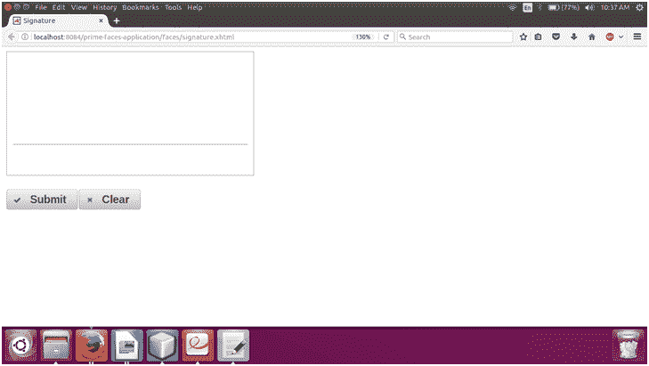

# 素数脸签名

> 原文：<https://www.javatpoint.com/primefaces-signature>

它用于绘制签名作为输入。它提供了一个画布，我们可以在这里画签名。它提供了各种选项，如背景色，前景色，自定义厚度。它可以用于支持触摸的设备。在 JSF 应用程序中，我们可以使用 **< p:signature >** 组件来创建它。它还提供了下面列出的各种属性。

## 签名属性

| 属性 | 缺省值 | 类型 | 描述 |
| 编号 | 空 | 线 | 它用于组件的唯一标识符。 |
| 提供 | 真实的 | 布尔代数学体系的 | 它用于指定组件的呈现。 |
| 价值 | 空 | 目标 | 它用于设置组件的值。 |
| 需要 | 错误的 | 布尔代数学体系的 | 它用于根据需要标记组件。 |
| 验证器 | 空 | MethodExpr | 它用于设置验证器。 |
| 所需消息 | 空 | 线 | 它用于设置当必填字段验证失败时要显示的消息。 |
| widgetVar | 空 | 线 | 这是客户端小部件的名称。 |
| 背景颜色 | #ffffff | 线 | 用于设置背景颜色。 |
| 颜色 | #000000 | 线 | 用于设置前景色。 |
| 厚度 | Two | 整数 | 它用于设置线条的粗细。 |
| 风格 | 空 | 线 | 用于设置组件的内联 CSS。 |
| 只读的 | 错误的 | 布尔代数学体系的 | 它用于使组件只读。 |
| 指导方针 | 错误的 | 布尔代数学体系的 | 它被用来设置一个 guildeline。 |
| guideclinecolor | #a0a0a0 | 线 | 它用于设置指南的颜色。 |
| guideclineoffset | Twenty-five | 线 | 它用于设置指引线从底部的偏移。 |
| 导向斜面 | Ten | 布尔代数学体系的 | 它用于设置从边缘开始的辅助线缩进。 |
| 昂哥 | 空 | 线 | 它用于在签名更改时执行脚本。 |
| base65Value 值 | 空 | 线 | 只写值，用于将 base64 中的值传递给后备 bean。 |

## 例子

这里，在下面的例子中，我们正在实现 **< p:signature >** 组件。本示例包含以下文件。

### JSF 档案

**// signature.xhtml**

```java

<?xml version='1.0' encoding='UTF-8' ?>
<!DOCTYPE html PUBLIC "-//W3C//DTD XHTML 1.0 Transitional//EN""http://www.w3.org/TR/xhtml1/DTD/xhtml1-transitional.dtd">
<html 
xmlns:h="http://xmlns.jcp.org/jsf/html"
xmlns:p="http://primefaces.org/ui"
>
<h:head>
<title>Signature</title>
</h:head>
<h:body>
<h:form>
<p:growl autoUpdate="true" />
<p:signature style="width:400px;height:200px" widgetVar="sig" value="#{signatureDemo.signature}" required="true" label="Signature" guideline="true"/>
<div style="margin:20px 0">
<p:commandButton value="Submit" icon="ui-icon-check"/>
<p:commandButton value="Clear" icon="ui-icon-close" type="button" onclick="PF('sig').clear()"/>
</div>
</h:form>
</h:body>
</html>

```

### ManagedBean

**//signature edemo . Java**

```java

package com.javatpoint;
import javax.faces.bean.ManagedBean;
@ManagedBean
public class SignatureDemo {
private String signature;
public String getSignature() {
return signature;
}
public void setSignature(String signature) {
this.signature = signature;
}
}

```

输出:


