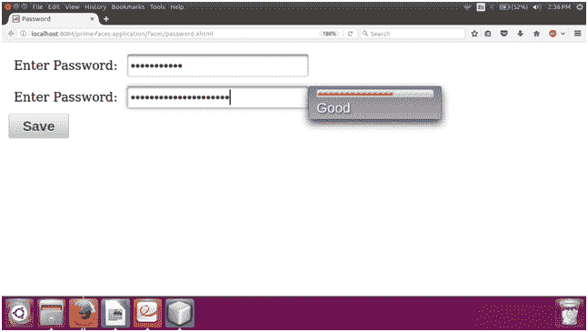

# PrimeFace 密码

> 原文：<https://www.javatpoint.com/primefaces-password>

它是一个输入字段，从用户那里获取隐藏值。 **< p:密码>** 组件用于在 JSF 应用程序中创建密码字段。它还在输入密码时提供反馈。下面列出了它的各种属性。

## 密码属性

| 属性 | 缺省值 | 类型 | 描述 |
| 需要 | 错误的 | 布尔代数学体系的 | 它用于根据需要标记组件。 |
| 反馈 | 错误的 | 布尔代数学体系的 | 它启用强度指示器。 |
| 在一条直线上的 | 错误的 | 布尔代数学体系的 | 它以内嵌方式显示反馈，而不是使用弹出窗口。 |
| promptLabel | 请输入密码 | 线 | 这是一个提示的标签。 |
| weakLabel | 无力的 | 布尔代数学体系的 | 用于设置弱密码标签。 |
| 好标签 | 好的 | 线 | 用于设置好密码的标签。 |
| strongLabel 标签 | 强烈的 | 线 | 用于设置强密码标签。 |
| 重新展示 | 错误的 | 布尔代数学体系的 | 它用于显示以前的值。 |
| 比赛 | 空 | 线 | 它匹配另一个密码组件的 id 以匹配值。 |
| 最大长度 | 空 | 整数 | 它用于设置该字段中可以输入的最大字符数。 |
| 占位符 | 空 | 线 | 它指定了一个简短的提示。 |
| 只读的 | 错误的 | 布尔代数学体系的 | 它用于将组件设置为只读。 |
| 大小 | 空 | 整数 | 用于确定输入元素宽度的字符数。 |
| 风格 | 空 | 线 | 用于设置输入元素的内联 CSS。 |
| tab 键索引 | 空 | 整数 | 它用于设置输入元素在跳转顺序中的位置。 |
| 标题 | 空 | 线 | 用于设置咨询工具提示信息。 |

## 例子

这里，在下面的例子中，我们正在实现 **< p:password >** 组件。本示例包含以下文件。

### JSF 档案

**// password.xhtml**

```java

<?xml version='1.0' encoding='UTF-8' ?>
<!DOCTYPE html PUBLIC "-//W3C//DTD XHTML 1.0 Transitional//EN""http://www.w3.org/TR/xhtml1/DTD/xhtml1-transitional.dtd">
<html 
xmlns:h="http://xmlns.jcp.org/jsf/html"
xmlns:p="http://primefaces.org/ui">
<h:head>
<title>Password</title>
</h:head>
<h:body>
<h:form>
<h:panelGrid columns="2" cellpadding="5">
<h:outputText value="Enter Password: " />
<p:password value="#{password.passwordField1}" />
<h:outputText value="Enter Password: " />
<p:password value="#{password.passwordField2}" feedback="true" />
</h:panelGrid>
<p:commandButton  value="Save" />
</h:form>
</h:body>
</html>

```

### ManagedBean

**//Password.java**

```java

package com.javatpoint;
import javax.faces.bean.ManagedBean;
@ManagedBean
public class Password {
private String passwordField1;  
private String passwordField2;  
public String getPasswordField1() {
return passwordField1;
}
public void setPasswordField1(String passwordField1) {
this.passwordField1 = passwordField1;
}
public String getPasswordField2() {
return passwordField2;
}
public void setPasswordField2(String passwordField2) {
this.passwordField2 = passwordField2;
}
}

```

输出:


