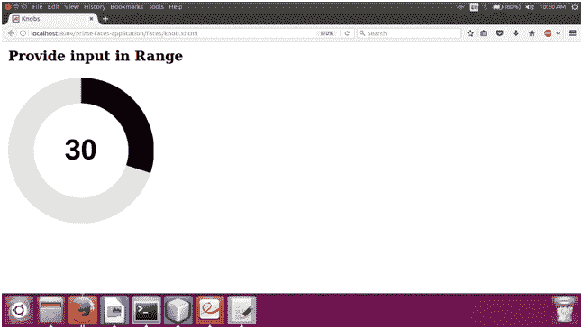

# 素数面旋钮

> 原文：<https://www.javatpoint.com/primefaces-knob>

它是一个用于获取数值的输入组件。它用于获取指定范围内的用户输入。PrimeFaces 提供**T2【p】:旋钮>** 组件，用于创建一个图形圆。我们可以从中选择任何数值。它还提供了下面列出的各种属性。

## 旋钮属性

| 属性 | 缺省值 | 类型 | 描述 |
| 价值 | 空 | 目标 | 它用于设置组件的值。 |
| 需要 | 错误的 | 布尔代数学体系的 | 它用于根据需要标记组件。 |
| 部 | Zero | 整数 | 它代表组件的最小有效值。 |
| 最大 | One hundred | 整数 | 用于设置组件的最大有效值。 |
| 步骤 | one | 整数 | 用于设置组件的递增/递减步长。 |
| 厚度 | 空 | 浮动 | 用于设置棒材的厚度。 |
| 宽度 | 汽车 | 线 | 它用于设置组件的宽度。 |
| 高度 | 汽车 | 线 | 它用于设置组件的高度。 |
| 前景颜色 | 空 | 目标 | 用于设置组件的前景色。 |
| 背景颜色 | 空 | 目标 | 用于设置组件的背景颜色。 |
| 颜色主题 | 空 | 线 | 用于设置旋钮的主题。 |
| 有缺陷的 | 错误的 | 布尔代数学体系的 | 它禁用输入元素。 |
| 显示标签 | 真实的 | 布尔代数学体系的 | 它用于隐藏/显示标签。 |
| 光标 | 错误的 | 布尔代数学体系的 | 当设置为 true 时，仅显示光标而不是整个栏。 |
| 标签模板 | {value} | 线 | 进度值的模板。 |

## 例子

这里，在下面的例子中，我们正在实现 **< p:旋钮>** 组件。本示例包含以下文件。

### JSF 档案

**//旋钮. xhtml**

```java
<?xml version='1.0' encoding='UTF-8' ?>
<!DOCTYPE html PUBLIC "-//W3C//DTD XHTML 1.0 Transitional//EN""http://www.w3.org/TR/xhtml1/DTD/xhtml1-transitional.dtd">
<html 
xmlns:h="http://xmlns.jcp.org/jsf/html"
xmlns:p="http://primefaces.org/ui">
<h:head>
<title>Knobs</title>
</h:head>
<h:body>
<h:form>
<p:growl autoUpdate="true"/>
<h3 style="margin-top:0">Provide input in Range</h3>
<div class="knob-container ui-corner-all">
<p:knob value="#{knob.value}">
<p:ajax listener="#{knob.onChange}"/>
</p:knob>
</div>
</h:form>
</h:body>
</html>

```

### ManagedBean

**//Knob.java**

```java
package com.javatpoint;
import java.io.Serializable;
import javax.faces.application.FacesMessage;
import javax.faces.bean.ManagedBean;
import javax.faces.context.FacesContext;
@ManagedBean
public class Knob implements Serializable {  
private int value = 30;  
public int getValue() {  
return value;  
}  
public void setValue(int value) {  
this.value = value;  
} 
public void onChange(){  
FacesContext.getCurrentInstance().addMessage(null, new FacesMessage(FacesMessage.SEVERITY_INFO, 
"You have selected: " + value, null));  
}  
}  

```

输出:


