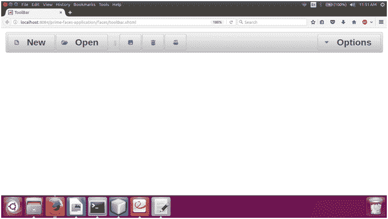

# PrimeFace 工具栏

> 原文：<https://www.javatpoint.com/primefaces-toolbar>

这是一个水平分组组件，用于形成包含命令和其他内容的工具栏。PrimeFaces 提供**T2【p】:工具栏>** 组件在 JSF 应用中创建工具栏。创建基于工具的 web 应用程序非常有用。下面列出了它的各种属性。

## 工具栏属性

| 属性 | 缺省值 | 类型 | 描述 |
| 编号 | 空 | 线 | 它是组件的唯一标识符。 |
| 提供 | 真实的 | 布尔代数学体系的 | 它用于指定组件的呈现。 |
| 有约束力的 | 空 | 目标 | 映射到支持 bean 中的服务器端 UIComponent 实例的 el 表达式 |
| 风格 | 空 | 线 | 它用于设置容器元素的内联样式。 |
| styleClass(样式类) | 空 | 线 | 它用于设置容器的样式类。元素。 |

## 例子

这里，在下面的例子中，我们正在实现 **< p:工具栏>** 组件。本示例包含以下文件。

### JSF 档案

**//Tooll . XHTML**

```java

<?xml version='1.0' encoding='UTF-8' ?>
<!DOCTYPE html PUBLIC "-//W3C//DTD XHTML 1.0 Transitional//EN""http://www.w3.org/TR/xhtml1/DTD/xhtml1-transitional.dtd">
<html 
xmlns:h="http://xmlns.jcp.org/jsf/html"
xmlns:p="http://primefaces.org/ui"
xmlns:f="http://xmlns.jcp.org/jsf/core">
<h:head>
<title>ToolBar</title>
</h:head>
<h:body>
<h:form>
<p:growl id="messages" showDetail="true" />
<p:toolbar>
<f:facet name="left">
<p:commandButton type="button" value="New" icon="ui-icon-document" />
<p:commandButton type="button" value="Open" icon="ui-icon-folder-open" />
<span class="ui-separator">
<span class="ui-icon ui-icon-grip-dotted-vertical" />
</span>
<p:commandButton type="button" title="Save" icon="ui-icon-disk" />
<p:commandButton type="button" title="Delete" icon="ui-icon-trash" />
<p:commandButton type="button" title="Print" icon="ui-icon-print" />
</f:facet>
<f:facet name="right">
<p:menuButton value="Options">
<p:menuitem value="Save" actionListener="#{toolbar.save}" update="messages" icon="ui-icon-disk" />
<p:menuitem value="Update" actionListener="#{toolbar.update}" update="messages" icon="ui-icon-arrowrefresh-1-w" />
<p:menuitem value="Delete" actionListener="#{toolbar.delete}" ajax="false" icon="ui-icon-close" />
<p:menuitem value="Homepage" url="http://www.javatpoint.com" icon="ui-icon-extlink" />
</p:menuButton>
</f:facet>
</p:toolbar>
</h:form>
</h:body>
</html>

```

### ManagedBean

**//ToolBar.java**

```java

package com.javatpoint;
import javax.faces.application.FacesMessage;
import javax.faces.bean.ManagedBean;
import javax.faces.context.FacesContext;
@ManagedBean
public class ToolBar {
public void save() {
addMessage("Success", "Data saved");
}
public void update() {
addMessage("Success", "Data updated");
}
public void delete() {
addMessage("Success", "Data deleted");
}
public void addMessage(String summary, String detail) {
FacesMessage message = new FacesMessage(FacesMessage.SEVERITY_INFO, summary, detail);
FacesContext.getCurrentInstance().addMessage(null, message);
}
}

```

输出:

