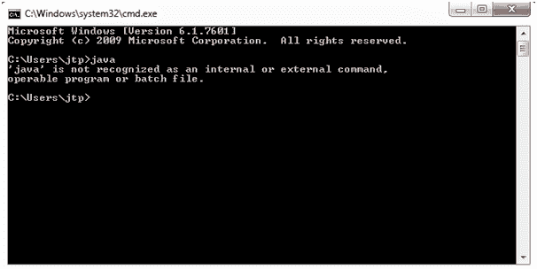

# JDB 安装

> 原文：<https://www.javatpoint.com/jdb-installation>

在本节中，我们将了解在窗口操作系统上安装 Java 调试器。

*   打开命令提示符，在控制台上键入 **java** ，检查 java 是否预装。

如果上面的消息在你的控制台上生成，那么它意味着 java 没有被安装。在这种情况下，请按照下面的链接安装和设置 java 路径。

[How To Set Path In Java](https://www.javatpoint.com/how-to-set-path-in-java)

*   如果下面的消息是在您的控制台上生成的，那么这意味着 java 已经安装在您的系统上了。

*   通过在控制台上键入 **java-version** 命令来验证 java 版本。

#### 注意-要执行 JDB 命令，需要有 JDK 1.5 或更高版本。

*   现在，要验证系统中的 JDB 安装，请在控制台上键入 **jdb -version** 命令。