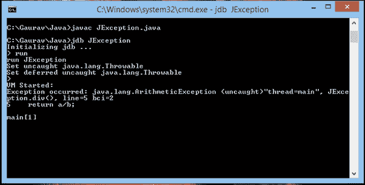

# JDB 异常处理

> 原文：<https://www.javatpoint.com/jdb-exception-handling>

异常是中断程序正常流程的事件。因此，处理这些异常非常重要。

像 Java 一样，Java 调试器(JDB)也能够处理这些异常。JDB catch 命令在运行时捕获异常。

## 异常处理示例

在这个例子中，我们将通过控制台上的 JDB 命令处理算术异常。

### jeexception . Java

```java

public class JException
{
int div(int a,int b)
{
return a/b;
}
public static void main( String...jtp)
{
JException obj=new JException();
System.out.println(obj.div(10,0));
}
}

```

*   编译上述程序并创建一个 JDB 会话。
*   程序执行后，出现以下异常:



*   现在，通过以下命令捕获这个异常

```java

>catch java.lang.ArithmeticException

```

*   以下消息将显示在您的控制台上

**设置所有 Java . lang . arithmeticexception**

*   通过以下命令继续执行

```java

>cont

```

