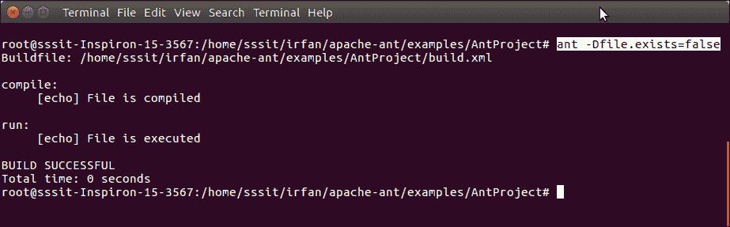
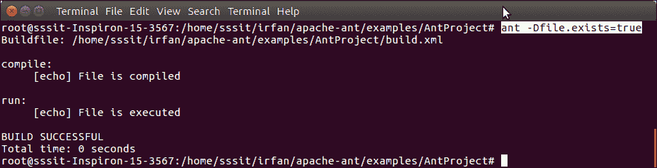

# ApacheAnt 如果和除非

> 原文：<https://www.javatpoint.com/apache-ant-if-and-unless-attributes>

Ant**如果**和**除非**都是 **<目标>** 元素(任务)的[属性](xml-attributes)。这些[属性](attribute)用于控制任务是否运行。

除了 target，还可以搭配**<target>****T6【JUnit>**元素使用。

**在早期版本和 Ant 1.7.1** 中，这些[属性](xhtml-attributes)只是属性名称。如果定义了属性，即使值为 false，它也会运行。

例如，即使在传递 false 之后，也没有办法停止执行。

**// build.xml**

```java

<project name="java-ant project" default="run">
<target name="compile">
    <available property="file.exists" file="some-file"/>
    <echo>File is compiled</echo>
</target>
<target name="run" depends="compile" if="file.exists">
    <echo>File is executed</echo>
</target>
</project>

```

**输出:**

**无参数**:在没有命令行参数的情况下运行。只需将**Ant**输入到终端，但首先定位到项目位置，它将显示空输出。

**带论证**:现在通过论证但是**假**。

ant-0 file . exists = false



现在通过论证但**为真**。
Ant 文件存在=真



自从 Ant 1.8.0 以来，我们可以使用属性扩展，它只允许在值为真时执行。在新版本中，它给了我们更多的灵活性，现在我们可以从命令行[覆盖](method-overriding-in-java)条件值。请看下面的例子。

**// build.xml**

```java

<project name="java-ant project" default="run">
<target name="compile" unless="file.exists">
    <available property="file.exists" file="some-file"/>
</target>
<target name="run" depends="compile" if="${file.exists}">
    <echo>File is executed</echo>
</target>
</project>

```

**输出:**

**无参数**:在没有命令行参数的情况下运行。只需将**Ant**输入到终端，但首先定位到项目的位置，它将显示空输出。

**带论证**:现在通过论证但是**假**。
Ant 文件存在=假

没有输出，因为这次如果不执行。

**带论证**:现在通过论证但**为真**。现在它显示输出，因为 if 被求值。
Ant 文件存在=真

