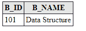

# 多对一映射

> 原文：<https://www.javatpoint.com/jpa-many-to-one-mapping>

多对一映射表示单值关联，其中一组实体可以与相似的实体关联。因此，在关系数据库中，一个实体的任何一行以上都可以引用另一个实体的类似行。

## @ ManyToOne 示例

在本例中，我们将在学生和图书馆之间创建多对一的关系，这样一个学生可以发行同一本书。

该示例包含以下步骤:-

*   在包含学生标识(s_id)和学生名称(s_name)的 com.javatpoint.mapping 包下创建一个实体类 Student.java，并带有包含库类型对象的@ManyToOne 注释。

**Student.java**

```java

package com.javatpoint.mapping;

import javax.persistence.*;

@Entity
public class Student {

	@Id
	@GeneratedValue(strategy=GenerationType.AUTO)
	private int s_id;
	private String s_name;

	@ManyToOne
	private Library lib;

	public int getS_id() {
		return s_id;
	}
	public void setS_id(int s_id) {
		this.s_id = s_id;
	}
	public String getS_name() {
		return s_name;
	}
	public void setS_name(String s_name) {
		this.s_name = s_name;
	}
	public Library getLib() {
		return lib;
	}
	public void setLib(Library lib) {
		this.lib = lib;
	}

}

```

*   在 com.javatpoint.mapping 包下创建另一个实体类 Library.java，它包含图书 id (b_id)，图书名称(b_name)。

**Library.java**

```java

package com.javatpoint.mapping;

import javax.persistence.*;

@Entity
public class Library {
	@Id
	@GeneratedValue(strategy=GenerationType.AUTO)
private int b_id;
private String b_name;

public Library(int b_id, String b_name) {
	super();
	this.b_id = b_id;
	this.b_name = b_name;

}

public Library() {
	super();
	// TODO Auto-generated constructor stub
}

public int getB_id() {
	return b_id;
}

public void setB_id(int b_id) {
	this.b_id = b_id;
}

public String getB_name() {
	return b_name;
}

public void setB_name(String b_name) {
	this.b_name = b_name;
}

}

```

*   现在，在 Persistence.xml 文件中映射实体类和其他数据库配置。

**Persistence.xml**

```java

<persistence>
<persistence-unit name="books_issued">

      <class>com.javatpoint.mapping.Student</class>
      <class>com.javatpoint.mapping.Library</class>

     <properties>
      <property name="javax.persistence.jdbc.driver" value="com.mysql.jdbc.Driver"/>
         <property name="javax.persistence.jdbc.url" value="jdbc:mysql://localhost:3306/mapping_db"/>
         <property name="javax.persistence.jdbc.user" value="root"/>
         <property name="javax.persistence.jdbc.password" value=""/>
         <property name="eclipselink.logging.level" value="SEVERE"/>
         <property name="eclipselink.ddl-generation" value="create-or-extend-tables"/>
      </properties>

	</persistence-unit>
</persistence>

```

*   在 com.javatpoint.ManyToOne 包下创建一个持久性类 ManyToOneExample，用数据持久化实体对象。

```java

package com.javatpoint.mapping.ManyToOne;

import javax.persistence.*;
import com.javatpoint.mapping.Student;

import javax.persistence.EntityManagerFactory;

import com.javatpoint.mapping.Library;
public class ManyToOneExample {

	public static void main(String[] args) {

		EntityManagerFactory emf=Persistence.createEntityManagerFactory("books_issued");

		EntityManager em=emf.createEntityManager();

		em.getTransaction().begin();

		Library lib=new Library();
		lib.setB_id(101);
		lib.setB_name("Data Structure");

		em.persist(lib);

		Student st1=new Student();
		st1.setS_id(1);
		st1.setS_name("Vipul");
	   st1.setLib(lib);

		Student st2=new Student();
		st2.setS_id(2);
		st2.setS_name("Vimal");
		st2.setLib(lib);

		em.persist(st1);;
		em.persist(st2);

		em.getTransaction().commit();
		em.close();
		emf.close();

	}

}

```

**输出:**

程序执行后，这两个表在 MySQL 工作台下生成。

*   库表-该表包含库的详细信息。要获取数据，在 MySQL 中运行**从库**中选择*查询。



*   学生表-该表表示学生和图书馆之间的映射。要获取数据，在 MySQL 中运行**从学生**中选择*查询。

