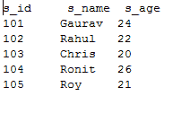

# 批量数据操作

> 原文：<https://www.javatpoint.com/jpa-jpql-bulk-data-operations>

在前一节中，我们只提取了单个列。现在，我们将学习如何处理大容量数据并执行相应的操作。

## JPQL 批量数据示例

在这个例子中，我们将获取一个基本的实体类(在这个例子中是 StudentEntity.java)，并对其执行不同的操作。

*   在 com.javatpoint.jpa 包下创建一个名为 StudentEntity.java 的实体类。

**学生学位。java**

```java

package com.javatpoint.jpa;
import javax.persistence.*;

@Entity
@Table(name="student")
public class StudentEntity {

	@Id
	private int s_id;
	private String s_name;
	private int s_age;

	public StudentEntity(int s_id, String s_name, int s_age) {
		super();
		this.s_id = s_id;
		this.s_name = s_name;
		this.s_age = s_age;
	}

	public StudentEntity() {
		super();
	}

	public int getS_id() {
		return s_id;
	}

	public void setS_id(int s_id) {
		this.s_id = s_id;
	}

	public String getS_name() {
		return s_name;
	}

	public void setS_name(String s_name) {
		this.s_name = s_name;
	}

	public int getS_age() {
		return s_age;
	}

	public void setS_age(int s_age) {
		this.s_age = s_age;
	}

}

```

*   现在，在 Persistence.xml 文件中映射实体类和其他数据库配置。

**Persistence.xml**

```java

<persistence>
<persistence-unit name="Student_details">

      <class>com.javatpoint.jpa.StudentEntity</class>

      <properties>
         <property name="javax.persistence.jdbc.driver" value="com.mysql.jdbc.Driver"/>
         <property name="javax.persistence.jdbc.url" value="jdbc:mysql://localhost:3306/studentdata"/>
         <property name="javax.persistence.jdbc.user" value="root"/>
         <property name="javax.persistence.jdbc.password" value=""/>
         <property name="eclipselink.logging.level" value="SEVERE"/>
         <property name="eclipselink.ddl-generation" value="create-or-extend-tables"/>
      </properties>

   </persistence-unit>
</persistence>

```

*   现在，我们可以在 StudentEntity.java 类上执行以下任何操作。

## JPQL 获取

在这里，我们将从数据库中获取所有记录。

**FetchData.java**

```java

package com.javatpoint.jpa.jpql;
import com.javatpoint.jpa.StudentEntity;
import javax.persistence.*;
import java.util.*;
public class FetchData {

	 public static void main( String args[]) {

	      EntityManagerFactory emf = Persistence.createEntityManagerFactory( "Student_details" );
	      EntityManager em = emf.createEntityManager();
	      em.getTransaction().begin( );

	      Query query = em.createQuery( "Select s from StudentEntity s ");

	      @SuppressWarnings("unchecked")
		List list=(List<studententity>)query.getResultList( );

	      System.out.print("s_id");
	      System.out.print("\t s_name");
	     System.out.println("\t s_age");

	      for( StudentEntity s:list ){
	         System.out.print( s.getS_id( ));
	         System.out.print("\t" +  s.getS_name( ));
	        System.out.print("\t" + s.getS_age( ));
	        System.out.println();
	      }
em.getTransaction().commit();
	      em.close();
	      emf.close();  
	 }
}</studententity> 
```

**输出:**



## JPQL 更新

在这里，我们将更新数据库中的记录。

**已更新。java**

```java

package com.javatpoint.jpa.jpql;
import javax.persistence.*;
public class UpdataData {

	 public static void main( String args[]) {

	      EntityManagerFactory emf = Persistence.createEntityManagerFactory( "Student_details" );
	      EntityManager em = emf.createEntityManager();
	      em.getTransaction().begin( );

	       Query query = em.createQuery( "update StudentEntity SET s_age=25 where s_id>103");
            query.executeUpdate();

	      em.getTransaction().commit();
	      em.close();
	      emf.close();  
	 }
}

```

**输出:**

程序执行后，在 MySQL 工作台下生成如下学生表。要获取数据，在 MySQL 中运行**从学生**中选择*。


## JPQL 删除

这里，我们将从数据库中删除特定的记录。

**删除数据.java**

```java

package com.javatpoint.jpa.jpql;
import javax.persistence.*;
public class DeleteData {

	 public static void main( String args[]) {

	      EntityManagerFactory emf = Persistence.createEntityManagerFactory( "Student_details" );
	      EntityManager em = emf.createEntityManager();
	      em.getTransaction().begin( );

	      Query query = em.createQuery( "delete from StudentEntity where s_id=102");

	      query.executeUpdate();

	      em.getTransaction().commit();
	      em.close();
	      emf.close();  
	 }
}

```

**输出:**

程序执行后，在 MySQL 工作台下生成如下学生表。要获取数据，在 MySQL 中运行**从学生**中选择*。

