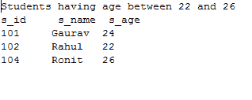

# JPA 标准 WHERE 条款

> 原文：<https://www.javatpoint.com/jpa-criteria-where-clause>

WHERE 子句用于对数据库应用条件，并根据该条件获取数据。在标准应用编程接口中，抽象查询接口的 where()方法用于设置条件。

## 标准位置示例

在这里，我们将对学生表执行几个 WHERE 操作。让我们假设该表包含以下记录


现在，按照以下步骤执行操作:-

*   在 com.javatpoint.jpa 包下创建一个名为 StudentEntity.java 的实体类名。这个类包含三个属性 s_id、s_name、s_age 以及所有必需的注释。

**学生学位。java**

```java

package com.javatpoint.jpa;
	import javax.persistence.*;

	@Entity
	@Table(name="student")
	public class StudentEntity {

		@Id
		private int s_id;
		private String s_name;
		private int s_age;

		public StudentEntity(int s_id, String s_name, int s_age) {
			super();
			this.s_id = s_id;
			this.s_name = s_name;
			this.s_age = s_age;
		}

		public StudentEntity() {
			super();
		}

		public int getS_id() {
			return s_id;
		}

		public void setS_id(int s_id) {
			this.s_id = s_id;
		}

		public String getS_name() {
			return s_name;
		}

		public void setS_name(String s_name) {
			this.s_name = s_name;
		}

		public int getS_age() {
			return s_age;
		}

		public void setS_age(int s_age) {
			this.s_age = s_age;
		}

	}

```

*   现在，在 Persistence.xml 文件中映射实体类和其他数据库配置。

**Persistence.xml**

```java

<persistence>
<persistence-unit name="Student_details">

      <class>com.javatpoint.jpa.StudentEntity</class>

      <properties>
         <property name="javax.persistence.jdbc.driver" value="com.mysql.jdbc.Driver"/>
         <property name="javax.persistence.jdbc.url" value="jdbc:mysql://localhost:3306/studentdata"/>
         <property name="javax.persistence.jdbc.user" value="root"/>
         <property name="javax.persistence.jdbc.password" value=""/>
         <property name="eclipselink.logging.level" value="SEVERE"/>
         <property name="eclipselink.ddl-generation" value="create-or-extend-tables"/>
      </properties>

   </persistence-unit>

</persistence>

```

*   一旦我们创建了基本的实体类并将配置映射到 persistence.xml 文件中，我们就可以通过以下方式执行不同类型的选择操作:-

**JPQL 大于和小于**

**Comparison.java**

```java

package com.javatpoint.jpa.jpql;
import com.javatpoint.jpa.StudentEntity;
import javax.persistence.*;
import javax.persistence.criteria.*;

import java.util.*;
public class Comparison {

	public static void main( String args[]) {

		 EntityManagerFactory emf = Persistence.createEntityManagerFactory( "Student_details" );
	      EntityManager em = emf.createEntityManager();
	      em.getTransaction().begin( );

	      CriteriaBuilder cb=em.getCriteriaBuilder();

	      AbstractQuery cq1=cb.createQuery(StudentEntity.class);
	      AbstractQuery <studententity>cq2=cb.createQuery(StudentEntity.class);

	     Root <studententity>stud1=cq1.from(StudentEntity.class);

	    cq1.where(cb.greaterThan(stud1.get("s_age"), 22));

	      CriteriaQuery <studententity>select1 = ((CriteriaQuery<studententity>) cq1).select(stud1);
	      TypedQuery <studententity>tq1 = em.createQuery(select1);
	      List <studententity>list1 = tq1.getResultList();

	      System.out.println("Students having age greater than 22");

	      System.out.print("s_id");
		     System.out.print("\t s_name");
		     System.out.println("\t s_age");

	      for(StudentEntity s:list1)
	      {
	      System.out.print(s.getS_id());
	      System.out.print("\t"+s.getS_name());
	      System.out.println("\t"+s.getS_age());
	      }

	      Root <studententity>stud2=cq2.from(StudentEntity.class);

		    cq2.where(cb.lessThan(stud2.get("s_age"), 22));

		      CriteriaQuery <studententity>select2 = ((CriteriaQuery<studententity>) cq2).select(stud2);
		      TypedQuery <studententity>tq2 = em.createQuery(select2);
		      List <studententity>list2 = tq2.getResultList();

		      System.out.println("Students having age Less than 22");

		      System.out.print("s_id");
			     System.out.print("\t s_name");
			     System.out.println("\t s_age");

		      for(StudentEntity s:list2)
		      {
		      System.out.print(s.getS_id());
		      System.out.print("\t"+s.getS_name());
		      System.out.println("\t"+s.getS_age());
		      }

em.getTransaction().commit();
	      em.close();
	      emf.close();  
	 }
}</studententity></studententity></studententity></studententity></studententity></studententity></studententity></studententity></studententity></studententity></studententity> 
```

**输出:**


**JPQL 之间**

**Between.java**

```java

package com.javatpoint.jpa.jpql;
import com.javatpoint.jpa.StudentEntity;
import javax.persistence.*;
import javax.persistence.criteria.*;

import java.util.*;
public class Between {

	public static void main( String args[]) {

		 EntityManagerFactory emf = Persistence.createEntityManagerFactory( "Student_details" );
	      EntityManager em = emf.createEntityManager();
	      em.getTransaction().begin( );

	      CriteriaBuilder cb=em.getCriteriaBuilder();

	      AbstractQuery cq=cb.createQuery(StudentEntity.class);

	     Root <studententity>stud=cq.from(StudentEntity.class);

	     cq.where(cb.between(stud.get("s_age"), 22, 26)) ;
	      CriteriaQuery <studententity>select = ((CriteriaQuery<studententity>) cq).select(stud);
	      TypedQuery <studententity>tq = em.createQuery(select);
	      List <studententity>list = tq.getResultList();

	    System.out.println("Students having age between 22 and 26");

	      System.out.print("s_id");
		     System.out.print("\t s_name");
		     System.out.println("\t s_age");

	      for(StudentEntity s:list)
	      {
	      System.out.print(s.getS_id());
	      System.out.print("\t"+s.getS_name());
	      System.out.println("\t"+s.getS_age());
	      }

em.getTransaction().commit();
	      em.close();
	      emf.close();  
	 }
}</studententity></studententity></studententity></studententity></studententity> 
```

**输出:**



**JPQL Like**

**Like.java**

```java

package com.javatpoint.jpa.jpql;
import com.javatpoint.jpa.StudentEntity;
import javax.persistence.*;
import javax.persistence.criteria.*;

import java.util.*;
public class Like {

	public static void main( String args[]) {

		 EntityManagerFactory emf = Persistence.createEntityManagerFactory( "Student_details" );
	      EntityManager em = emf.createEntityManager();
	      em.getTransaction().begin( );

	      CriteriaBuilder cb=em.getCriteriaBuilder();

	      AbstractQuery cq=cb.createQuery(StudentEntity.class);

	     Root <studententity>stud=cq.from(StudentEntity.class);

	     cq.where(cb.like(stud.get("s_name"), "R%"));
	      CriteriaQuery <studententity>select = ((CriteriaQuery<studententity>) cq).select(stud);
	      TypedQuery <studententity>tq = em.createQuery(select);
	      List <studententity>list = tq.getResultList();

	    System.out.println("Students name starting with R");

	      System.out.print("s_id");
		     System.out.print("\t s_name");
		     System.out.println("\t s_age");

	      for(StudentEntity s:list)
	      {
	      System.out.print(s.getS_id());
	      System.out.print("\t"+s.getS_name());
	      System.out.println("\t"+s.getS_age());
	      }
	   em.getTransaction().commit();
	      em.close();
	      emf.close();  
	 }
}</studententity></studententity></studententity></studententity></studententity> 
```

**输出:**


**JPQL In**

**In.java**

```java

package com.javatpoint.jpa.jpql;
import com.javatpoint.jpa.StudentEntity;
import javax.persistence.*;
import javax.persistence.criteria.*;

import java.util.*;
public class In.java {

	public static void main( String args[]) {

		 EntityManagerFactory emf = Persistence.createEntityManagerFactory( "Student_details" );
	      EntityManager em = emf.createEntityManager();
	      em.getTransaction().begin( );

	      CriteriaBuilder cb=em.getCriteriaBuilder();

	      AbstractQuery cq=cb.createQuery(StudentEntity.class);

	     Root <studententity>stud=cq.from(StudentEntity.class);

	     cq.where(cb.in(stud.get("s_age")).value(22).value(24));
	      CriteriaQuery <studententity>select = ((CriteriaQuery<studententity>) cq).select(stud);
	      TypedQuery <studententity>tq = em.createQuery(select);
	      List <studententity>list = tq.getResultList();

	    System.out.println("Students having age 22 and 24");

	      System.out.print("s_id");
		     System.out.print("\t s_name");
		     System.out.println("\t s_age");

	      for(StudentEntity s:list)
	      {
	      System.out.print(s.getS_id());
	      System.out.print("\t"+s.getS_name());
	      System.out.println("\t"+s.getS_age());
	      }

em.getTransaction().commit();
	      em.close();
	      emf.close();  
	 }
}</studententity></studententity></studententity></studententity></studententity> 
```

**输出:**

