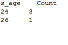

# JPA 标准有条款

> 原文：<https://www.javatpoint.com/jpa-criteria-having-clause>

HAVING 子句与 GROUP BY 子句一起使用来筛选表中的数据。在标准应用编程接口中，抽象接口的 having()方法用于设置分组数据的条件。

## 具有示例的标准

在这里，我们将对学生表执行分组操作。让我们假设该表包含以下记录


现在，按照以下步骤执行操作:-

*   在 com.javatpoint.jpa 包下创建一个名为 StudentEntity.java 的实体类名。这个类包含三个属性 s_id、s_name 和 s_age 以及所有必需的注释。

**学生学位。java**

```java

package com.javatpoint.jpa;
	import javax.persistence.*;

	@Entity
	@Table(name="student")
	public class StudentEntity {

		@Id
		private int s_id;
		private String s_name;
		private int s_age;

		public StudentEntity(int s_id, String s_name, int s_age) {
			super();
			this.s_id = s_id;
			this.s_name = s_name;
			this.s_age = s_age;
		}

		public StudentEntity() {
			super();
		}

		public int getS_id() {
			return s_id;
		}

		public void setS_id(int s_id) {
			this.s_id = s_id;
		}

		public String getS_name() {
			return s_name;
		}

		public void setS_name(String s_name) {
			this.s_name = s_name;
		}

		public int getS_age() {
			return s_age;
		}

		public void setS_age(int s_age) {
			this.s_age = s_age;
		}

	}

```

*   现在，在 Persistence.xml 文件中映射实体类和其他数据库配置。

**Persistence.xml**

```java

<persistence>
<persistence-unit name="Student_details">

      <class>com.javatpoint.jpa.StudentEntity</class>

      <properties>
         <property name="javax.persistence.jdbc.driver" value="com.mysql.jdbc.Driver"/>
         <property name="javax.persistence.jdbc.url" value="jdbc:mysql://localhost:3306/studentdata"/>
         <property name="javax.persistence.jdbc.user" value="root"/>
         <property name="javax.persistence.jdbc.password" value=""/>
         <property name="eclipselink.logging.level" value="SEVERE"/>
         <property name="eclipselink.ddl-generation" value="create-or-extend-tables"/>
      </properties>

   </persistence-unit>

</persistence>

```

*   一旦我们创建了基本的实体类，并将配置映射到 persistence.xml 文件中，我们就可以执行不同类型的 HAVING 操作。这里，我们对年龄等于或大于 24 岁的学生人数进行分组。

**StudentHaving.java**

```java

package com.javatpoint.jpa.jpql;
import com.javatpoint.jpa.StudentEntity;
import javax.persistence.*;
import javax.persistence.criteria.*;

import java.util.*;
public class StudentHaving {

	public static void main( String args[]) {

		 EntityManagerFactory emf = Persistence.createEntityManagerFactory( "Student_details" );
	      EntityManager em = emf.createEntityManager();
	      em.getTransaction().begin( );

CriteriaBuilder cb = em.getCriteriaBuilder();
CriteriaQuery cq = cb.createQuery(Object[].class);
Root <studententity>stud = cq.from(StudentEntity.class);

cq.multiselect(stud.get("s_age"),cb.count(stud)).groupBy(stud.get("s_age")).having(cb.ge(stud.get("s_age"), 24));

System.out.print("s_age");
System.out.println("\t Count");
List <object>list = em.createQuery(cq).getResultList();
for(Object[] object : list){
	System.out.println(object[0] + " " + object[1]);

}

em.getTransaction().commit();
	      em.close();
	      emf.close();  
	 }
}</object></studententity> 
```

**输出:**

