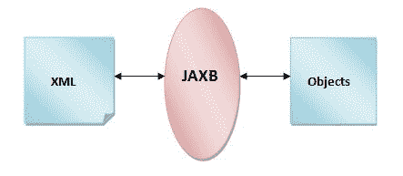

# JAXB 教程

> 原文：<https://www.javatpoint.com/jaxb-tutorial>

JAXB 教程提供了将对象转换为 XML 和将 XML 转换为对象的概念和 API。我们的 JAXB 教程是为初学者和专业人士设计的。

**JAXB** 代表用于 XML 绑定的 Java 架构。它提供了将 java 对象封(写)成 XML 和将 XML 解封(读)成对象的机制。简单地说，您可以说它用于将 java 对象转换成 xml，反之亦然。



* * *

## JAXB 2.0 的特性

JAXB 2.0 包含了 JAXB 1.x 中没有的几个特性。

**1)注释支持** : JAXB 2.0 提供了对注释的支持，所以开发 JAXB 应用需要更少的编码。javax.xml.bind.annotation 包为 JAXB 2.0 提供了类和接口。

**2)支持所有 W3C XML Schema 特性**:与 JAXB 1.0 不同，它支持所有的 W3C schema。

**3)附加验证功能**:通过 JAXP 1.3 验证 API 提供附加验证支持。

**4)小运行时库**:需要 JAXB 1.0 的小运行时库。

**5)生成的模式衍生类的减少**:减少了很多生成的模式衍生类。

* * *

## 简单的 JAXB 编组示例:将对象转换为 XML

让我们看看将 java 对象转换成 XML 文档的步骤。

*   创建 POJO 或绑定模式并生成类
*   创建 JAXBContext 对象
*   创建马歇尔器对象
*   使用集合方法创建内容树
*   调用编组方法

File: Employee.java

```java
import javax.xml.bind.annotation.XmlAttribute;
import javax.xml.bind.annotation.XmlElement;
import javax.xml.bind.annotation.XmlRootElement;

@XmlRootElement
public class Employee {
	private int id;
	private String name;
	private float salary;

public Employee() {}
public Employee(int id, String name, float salary) {
	super();
	this.id = id;
	this.name = name;
	this.salary = salary;
}
@XmlAttribute
public int getId() {
	return id;
}
public void setId(int id) {
	this.id = id;
}
@XmlElement
public String getName() {
	return name;
}
public void setName(String name) {
	this.name = name;
}
@XmlElement
public float getSalary() {
	return salary;
}
public void setSalary(float salary) {
	this.salary = salary;
}
}

```

**@XmlRootElement** 指定 xml 文档的根元素。

**@XmlAttribute** 指定根元素的属性。

**@XmlElement** 指定根元素的子元素。

File: ObjectToXml.java

```java
import java.io.FileOutputStream;

import javax.xml.bind.JAXBContext;
import javax.xml.bind.Marshaller;

public class ObjectToXml {
public static void main(String[] args) throws Exception{
	JAXBContext contextObj = JAXBContext.newInstance(Employee.class);

    Marshaller marshallerObj = contextObj.createMarshaller();
    marshallerObj.setProperty(Marshaller.JAXB_FORMATTED_OUTPUT, true);

    Employee emp1=new Employee(1,"Vimal Jaiswal",50000);

    marshallerObj.marshal(emp1, new FileOutputStream("employee.xml"));

}
}

```

#### 输出:

生成的 xml 文件如下所示:

File: employee.xml

```java
<?xml version="1.0" encoding="UTF-8" standalone="yes"?>
<employee id="1">
    <name>Vimal Jaiswal</name>
    <salary>50000.0</salary>
</employee>

```

## 简单的 JAXB 解组示例:将 XML 转换为对象

File: XMLToObject.java

```java
import java.io.File;
import javax.xml.bind.JAXBContext;
import javax.xml.bind.JAXBException;
import javax.xml.bind.Unmarshaller;

public class XMLToObject {
public static void main(String[] args) {
	 try {  
	        File file = new File("employee.xml");  
	        JAXBContext jaxbContext = JAXBContext.newInstance(Employee.class);  

	        Unmarshaller jaxbUnmarshaller = jaxbContext.createUnmarshaller();  
	        Employee e=(Employee) jaxbUnmarshaller.unmarshal(file);  
	        System.out.println(e.getId()+" "+e.getName()+" "+e.getSalary());

	      } catch (JAXBException e) {e.printStackTrace(); }  

}
}

```

输出:

```java
1 Vimal Jaiswal 50000.0

```

* * *

[download this example (developed using eclipse IDE)](src/jaxb/jaxbmarshal1.zip)

* * *