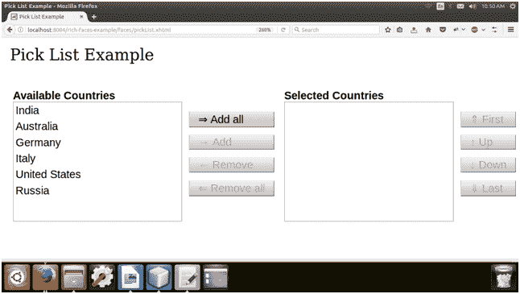
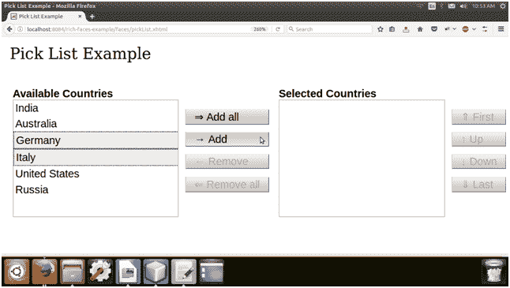
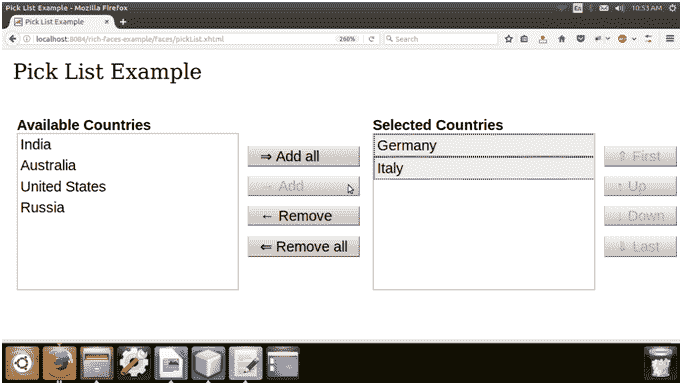

# richfaces〔t0〕

> 原文：<https://www.javatpoint.com/richfaces-rich-picklist>

它用于从列表中选择项目。它允许我们在客户端改变所选项目的顺序。我们可以在源列表和目标列表中添加和删除项目，反之亦然。但是，需要注意的是，服务器端的项目源不会修改。

## 样式类和外观参数

下表包含选项列表的样式类和相应的外观参数。

| 班级 | 功能 | 皮肤参数 | 映射的 CSS 属性 |
| 。射频拾波器 | 它用于定义选项列表控件本身的样式。 | 没有皮肤参数。 |  |
| 。rf-pick-src-cptn，。rf-pick-tgt-cptn | 这些类定义了选项列表控件的源标题和目标标题的样式。 | 标题文本颜色标题字体 | 彩色字体大小 |
| 。射频拾波器 | 它用于为选项列表控件的项目列表定义样式。 | 没有皮肤参数。 |  |
| 。射频识别 hdr | 它用于定义项目列表标题的样式。 | headerBackgroundColor header textcolor | 背景色 |
| 。射频选择 | 它用于为选项列表控件中的选项定义样式。 | 常规文本颜色常规大小字体 | 彩色字体大小 |
| 。rf 拾取器 | 它用于为选项列表控件的选定选项定义样式。 | 常规文本颜色 | 边框颜色 |
| 。射频-拾取-dflt-lbl | 它用于为选项列表控件的默认标签定义样式。 | 没有皮肤参数。 |  |
| .rf-pick-btn | 它用于定义选项列表控件按钮的样式。 | headerBackgroundColor panel bordercolor | 背景色边框-左侧色 |
| 。rf 拾取 BTN dis | 当选项列表控件被禁用时，它用于定义按钮的样式。 | 没有皮肤参数。 |  |
| 。rf-pick-lst-scrl | 它用于定义列表滚动条的样式。 | 没有皮肤参数。 |  |

* * *

## 例子

在下面的例子中，我们实现了< **rich:选项列表** >组件。本示例包含以下文件。

### JSF 档案

**//选项列表. xhtml**

```java

<?xml version='1.0' encoding='UTF-8' ?>
<!DOCTYPE html PUBLIC "-//W3C//DTD XHTML 1.0 Transitional//EN""http://www.w3.org/TR/xhtml1/DTD/xhtml1-transitional.dtd">
<ui:composition 
xmlns:h="http://java.sun.com/jsf/html"
xmlns:f="http://java.sun.com/jsf/core"
xmlns:ui="http://java.sun.com/jsf/facelets"
xmlns:a4j="http://richfaces.org/a4j"
xmlns:rich="http://richfaces.org/rich">
<f:view>
<h:head>
<title>Pick List Example</title>
</h:head>
<h:body>
<h:form>
<h:outputText value="Pick List Example"/><br/><br/>
<rich:pickList value="#{pickList.list}"
sourceCaption="Available Countries"
targetCaption="Selected Countries"
listWidth="170px"
listHeight="120px"
orderable="true">
<f:selectItems value="#{pickList.countryList()}" var="capital" itemValue="#{pickList}" itemLabel="#{pickList.countryName}" />
</rich:pickList>
</h:form>
</h:body>
</f:view>
</ui:composition>

```

### 托管 Bean

**//PickList.java**

```java

import java.util.ArrayList;
import java.util.List;
import javax.faces.bean.ManagedBean;
import javax.faces.bean.RequestScoped;
@ManagedBean
@RequestScoped
public class PickList {
String CountryName;
List<String> list;
public List<String> countryList() {
ArrayList<String> list = new ArrayList<>();
list.add("India");
list.add("Australia");
list.add("Germany");
list.add("Italy");
list.add("United States");
list.add("Russia");
return list;
}
public String getCountryName() {
return CountryName;
}
public void setCountryName(String CountryName) {
this.CountryName = CountryName;
}
public List<String> getList() {
return list;
}
public void setList(List<String> list) {
this.list = list;
}
}

```

输出:

  

* * *