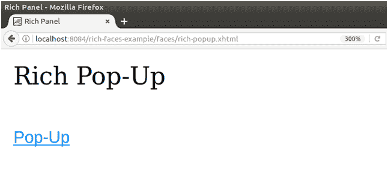

# richfaces〔t0〕

> 原文：<https://www.javatpoint.com/richfaces-rich-popuppanel>

该组件提供了一个出现在网页前面的弹出面板。它可以在屏幕上定位，拖动到新的位置，并由用户重新调整大小。

它不需要任何强制属性。

## 样式类和外观参数

下表包含弹出面板的样式类(选择器)和相应的皮肤参数。

| 班级 | 功能 | 皮肤参数 | 映射的 CSS 属性 |
| 。射频 PP BTN | 它用于定义弹出式面板按钮的样式。 | 没有皮肤参数。 |  |
| 。rf-pp-shade | 它用于定义呈现模式弹出面板时覆盖页面的底纹样式。 | 没有皮肤参数。 |  |
| . RF-PP-CNT | 它用于为弹出面板的容器定义样式。 | panel border color general background color | 边框背景 |
| 。rf-pp-hdr | 它用于定义弹出面板标题的样式。 | headerBackgroundColor | 背景 |
| . RF-PP HDR CNT | 它用于定义标题内容的样式。 | 标题文本颜色标题字体 | 彩色字体粗细 |
| . rf-pp-cnt | 它用于定义弹出面板内容的样式。 | 通用系列字体通用尺寸字体 | 字体大小背景 |
| . rf-pp-cnt-scrlr | 它用于定义弹出面板滚动条的样式。 | 一般背景颜色 | 背景 |
| 。射频-pp-hndlr | 它用于定义弹出式面板边框的样式。边框处理程序用于重新调整面板的大小。 | 没有皮肤参数。 |  |
| 。射频-pp-hndlr-t。射频-pp-hndlr-b。射频-pp-hndlr-l。射频-pp-hndlr-r。射频-pp-hndlr-tl。射频-pp-hndlr-tr。射频-pp-hndlr-bl。射频-pp-hndlr-br | 这些类为边框处理程序的上、下、左、右、左上、右上、左下和右下边缘定义样式。 | 没有皮肤参数。 |  |

* * *

## 例子

在下面的例子中，我们实现了< **rich:popupPanel** >组件。本示例包含以下文件。

### JSF 档案

**// rich-popup.xhtml**

```java

<?xml version='1.0' encoding='UTF-8' ?>
<!DOCTYPE html PUBLIC "-//W3C//DTD XHTML 1.0 Transitional//EN""http://www.w3.org/TR/xhtml1/DTD/xhtml1-transitional.dtd">
<ui:composition 
xmlns:h="http://java.sun.com/jsf/html"
xmlns:f="http://java.sun.com/jsf/core"
xmlns:ui="http://java.sun.com/jsf/facelets"
xmlns:a4j="http://richfaces.org/a4j"
xmlns:rich="http://richfaces.org/rich">
<f:view>
<h:head>
<title>Rich Pop-Up</title>
</h:head>
<h:body>
<h:form>
<h:outputText value="Rich Pop-Up"/><br/><br/>
<h:commandLink value="Pop-Up">
<rich:componentControl target="popup" operation="show" />
</h:commandLink>
<rich:popupPanel id="popup" modal="false" autosized="true" resizeable="false">
<f:facet name="header">
<h:outputText value="Pop-Up Message" />
</f:facet>
<f:facet name="controls">
<h:graphicImage valueimg/close.png" style="cursor:pointer" onclick="#{rich:component('popup')}.hide()" height="10px" width="10px"/>
</f:facet>
<p>
This is a pop-up message.
</p>
</rich:popupPanel>
</h:form>
</h:body>
</f:view>
</ui:composition>

```

输出:



点击后弹出链接。


* * *