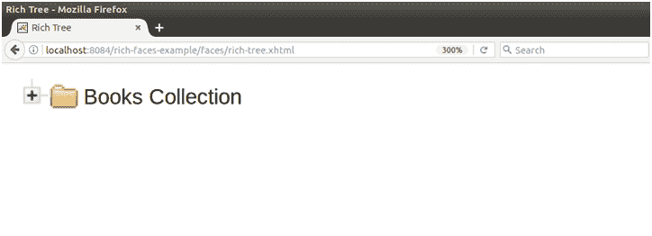

# richfaces〔t0〕

> 原文：<https://www.javatpoint.com/richfaces-rich-tree>

该组件用于创建层次树。它使用< **rich:treeNode** >作为子组件。

我们可以根据自己的需求创建定制树。RichFaces 提供了所有可用的组件来相应地创建树。

它需要值属性来绑定用于创建树的数据模型。数据模型必须是**org . rich faces . model . tree node**接口、**org . rich faces . model . tree datamodel**接口或**javax . swing . tree . tree node**接口。

## 样式类和外观参数

下表包含树节点的样式类和相应的外观参数。

| 班级 | 功能 | 皮肤参数 | 映射的 CSS 属性 |
| .rf-thorn | 它用于定义树节点的样式。 | 通用系列字体通用尺寸字体 | 字体系列字体大小 |
| .rf-trn-lbl | 它用于定义树节点标签的样式。 | 没有皮肤参数。 |  |
| -trn-cnt 电台 | 它用于定义树节点内容的样式。 | 没有皮肤参数。 |  |
| .rf-trn-sel | 它用于为选定的树节点定义样式。 | 附加背景颜色 | 背景 |
| 。rf-trn-ldn | 它用于在加载时定义树节点的样式。 | 附加背景颜色 | 背景 |
| .rf-trn-hnd | 它用于定义树节点句柄的样式。 | 没有皮肤参数。 |  |
| .rf-trn-hnd-lf | 它用于定义叶节点句柄的样式。 | 没有皮肤参数。 |  |
| 。rf-trn-hnd 型油菜 | 它用于定义折叠节点句柄的样式。 | 没有皮肤参数。 |  |
| 。rf-trn-hnd-exp | 它用于定义扩展节点句柄的样式。 | 没有皮肤参数。 |  |
| 。射频-trn-hnd-ldn-fct | 它用于定义树节点句柄的加载方面的样式。 | 没有皮肤参数。 |  |
| .rf-thorn-ico | 它用于定义树节点图标的样式。 | 没有皮肤参数。 |  |
| . rf-trn-ico-lf 型 | 它用于定义叶节点图标的样式。 | 没有皮肤参数。 |  |
| 。射频-trn-ico-colps | 它用于定义折叠节点图标的样式。 | 没有皮肤参数。 |  |
| 。射频-trn-ico-exp | 它用于为展开节点的图标定义样式。 | 没有皮肤参数。 |  |
| 。射频-trn-ico-cst | 它用于定义自定义节点图标的样式。 | 没有皮肤参数。 |  |

* * *

## 例子

这里，在下面的例子中，我们实现了< **rich:tree** >组件。本示例包含以下文件。

### JSF 档案

**//富树. xhtml**

```java

<?xml version='1.0' encoding='UTF-8' ?>
<!DOCTYPE html PUBLIC "-//W3C//DTD XHTML 1.0 Transitional//EN""http://www.w3.org/TR/xhtml1/DTD/xhtml1-transitional.dtd">
<ui:composition 
xmlns:h="http://java.sun.com/jsf/html"
xmlns:f="http://java.sun.com/jsf/core"
xmlns:ui="http://java.sun.com/jsf/facelets"
xmlns:a4j="http://richfaces.org/a4j"
xmlns:rich="http://richfaces.org/rich">
<f:view>
<h:head>
<title>Rich Tree </title>
</h:head>
<h:body>
<h:form>
<rich:tree value="#{tree.rootNodes}" var="tree">
<rich:treeNode>
<h:outputText value="#{tree.data}" />
</rich:treeNode>
</rich:tree>
</h:form>
</h:body>
</f:view>
</ui:composition>

```

### 托管 Bean

**//Tree.java**

```java

import javax.faces.bean.ManagedBean;
import javax.faces.bean.RequestScoped;
import org.richfaces.model.TreeNodeImpl;
@ManagedBean
@RequestScoped
public class Tree extends TreeNodeImpl {
private Tree stationRoot;
private Tree rootNodes;
private Object data;

public Tree() {
super();
}
public Tree(boolean leaf, Object data) {
super(leaf);
this.data = data;
}
public Object getData() {
return data;
}
@Override
public String toString() {
return super.toString() + ">>" + data;
}
public Tree getRootNodes() {
if (rootNodes == null) {
String[] author_collection = {"Ravindra Nath Tagore - Geetanjali",
"David Bowie - Let's Dance",
"Paulo Coelho  - Alchemist",
"Kim Carnes - Bette Davis Eyes",
"KC & the Sunshine Band - Give It Up"};
stationRoot = new Tree(false, "Books Collection");
for (int i = 0; i < author_collection.length; i++) {
Tree child = new Tree(true, author_collection[i]);
stationRoot.addChild(i, child);
}
rootNodes = new Tree();
rootNodes.addChild(0, stationRoot);
}
return rootNodes;
}
}

```

输出:



展开根树后，它显示所有树节点，如下所示。


* * *