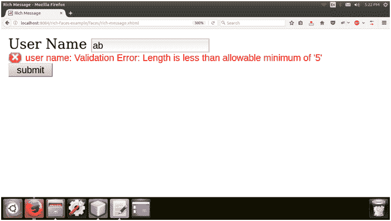

# richfaces〔t0〕

> 原文：<https://www.javatpoint.com/richfaces-rich-message>

该组件用于呈现消息。我们可以定制这条信息的应用。工具提示属性用于提供有关消息的更多信息。

该组件与 JSF < **h:消息** >相同，但有一些附加属性。

### 样式类和外观参数

| 类别(选择器) | 类(选择器)函数 | 皮肤参数 | 映射的 CSS 属性 |
| . rf-msg | 它用于定义消息本身的样式。 | 通用系列字体通用尺寸字体 | 字体系列字体大小 |
| . RF msg 错误 | 它用于定义错误消息的样式。 | 错误颜色 | 颜色 |
| . rf-msg-ftl | 它用于定义致命消息的样式。 | 错误颜色 | 颜色 |
| . rf 味精-inf | 它用于定义信息消息的样式。 | 常规文本颜色 | 颜色 |
| . rf 味精-wrn | 它用于定义警告消息的样式。 | 警告文本颜色 | 颜色 |
| . RF-msg-确定 | 它用于定义基本 OK 消息的样式。 | 常规文本颜色 | 颜色 |
| . rf-msg-sum、. rf-msg-det | 这些类定义了消息摘要或详细信息的样式。 | 没有皮肤参数。 |  |

* * *

## 例子

这里，在下面的例子中，我们正在实现< **rich:message** >组件。本示例包含以下文件。

### JSF 档案

**// rich-message.xhtml**

```java
<ui:composition 
xmlns:h="http://java.sun.com/jsf/html"
xmlns:a4j="http://richfaces.org/a4j"
xmlns:rich="http://richfaces.org/rich"
xmlns:f="http://java.sun.com/jsf/core"
xmlns:ui="http://java.sun.com/jsf/facelets">
<f:view>
<h:head>
<title>Rich Message </title>
</h:head>
<h:body>
<h:form>
<h:outputText value="User Name " />
<h:inputText label="user name"
id="user-name"
required="true"
value="#{user.name}">
<f:validateLength minimum="5" maximum="20" />
</h:inputText>
<rich:message for="user-name" ajaxRendered="true"/>
<h:commandButton value="submit"/>
</h:form>
</h:body>
</f:view>
</ui:composition>

```

### 托管 Bean

**//User.java**

```java
import javax.faces.bean.ManagedBean;
import javax.faces.bean.RequestScoped;
@ManagedBean
@RequestScoped
public class User {
String name;
public String getName() {
return name;
}
public void setName(String name) {
this.name = name;
}
}

```

输出:



* * *